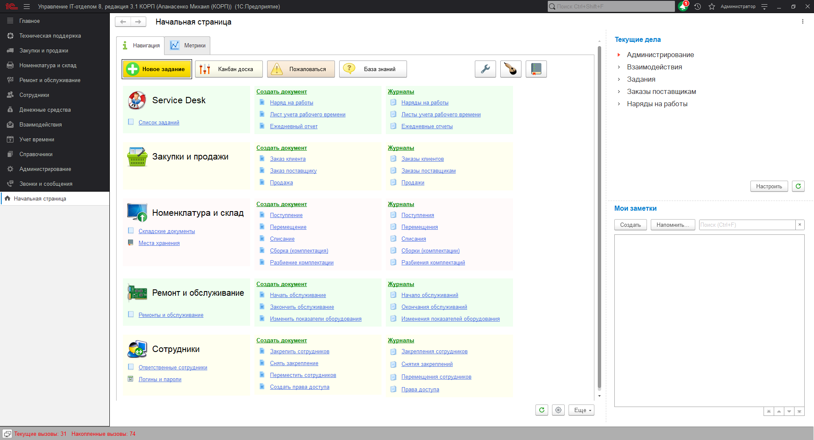

# Первое знакомство с конфигурацией

Конфигурация "Управление IT-отделом 8" является многофункциональным и очень гибким решением, которое способно подстроиться под любую специфику использования. В программе есть заложенная в процессе разработки предопределенная логика работы, которая основывается на методологии `ITIL`. В связи с этим из коробки функционал конфигурации работает, опираясь на данные правила. Но это не значит, что изменить ничего нельзя. Как раз наоборот, в Ваших руках есть возможность самостоятельно подстроить под себя функционал, так как код конфигурации полностью открыт за исключением модуля, отвечающего за правомерное использование программы. Перед началом полноценной настройки, давайте познакомимся с базовыми возможностями программы, которые будут рассмотрены в документации данного раздела. 

## Содержание главы:
* Интерфейс конфигурации
    * Персональные настройки
    * Изменение стиля оформления конфигурации пользователя
    * Настройка индивидуальных параметров для каждого пользователя
* Прочие возможности
    * Схемы зданий, помещений, сетей
    * Возможность прикрепления произвольных файлов
    * Дополнительные реквизиты и сведения объектов
    * Справочник "Комиссии"
    * Подключение к Power BI с помощью OData

