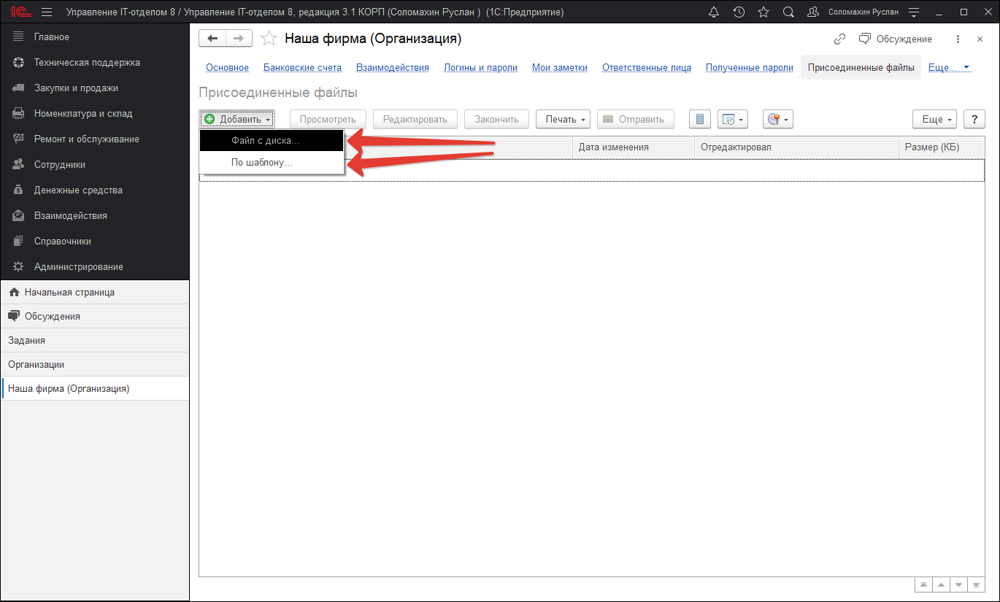

# Возможность прикрепления произвольных файлов

Часто бывает необходимо прикреплять файлы к объектам конфигурации. Например, счет от поставщика очень удобно прикрепить в заказ, или договор с контрагентом к элементу справочника **"Контрагенты"** или **"Договоры контрагентов"**. Такая возможность в конфигурации есть, это гиперссылка присоединенные файлы, которая позволяет прикреплять вложения в виде файлов ко всем объектам программы. При этом это можно осуществлять как вручную, так и программа сама может прикреплять вложенные во входящее письмо файлы к заданию, а также наоборот прикреплять к исходящему письму. На скриншоте внизу представлен данный функционал. 

В любом документе или справочнике, где есть гиперссылка ***"присоединенные файлы"*** выделенная на скриншоте, возможно использовать прикрепление других файлов. С помощью кнопки "Добавить" можно прикрепить файл как с локального диска, так и из стандартного раздела конфигурации "шаблоны файлов", которые находятся разделе "Главное"-"Файлы".

> **Список необходимых ролей для работы.**
> * [x] Добавление и изменение папок и файлов

