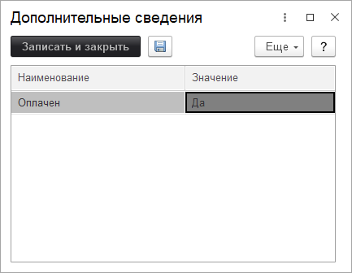

# Дополнительные реквизиты и сведения объектов

В конфигурации реализован механизм дополнительных реквизитов и свойств.
Данный механизм позволяет дополнить типовые объекты своими свойствами в зависимости от Ваших потребностей. Таким образом, можно без изменения конфигурации добавить в функционал дополнительные реквизиты в объекты. Пример, необходимости доп. реквизитов. Допустим документ "Заказ поставщику" в вашей организации согласовывают Иванов, Петров и Сидоров. Как не запутаться в том, кто согласовал заявку, а кто нет? Легко, скажите Вы. Я запомню! А если таких заявок 100 одновременно? Это надо как-то фиксировать в программе, чтобы не запутаться. Добавлять в комментарий заявки? Не информативно... В данном случае необходимо добавить дополнительные реквизиты: Согласовано Ивановым, Согласовано Петровым, Согласовано Сидоровым типа Булево (Да/Нет). Тогда в заказе на дополнительной одноименной закладке появятся эти реквизиты и Вы с легкостью сможете их изменять, как обычные реквизиты.

Для добавления и редактирования дополнительных реквизитов и свойств перейдите в: ***"Администрирование" > "Общие настройки" > "Дополнительные реквизиты и сведения"***, где активировать соответствующие галочки.

В данной форме можете добавить дополнительные реквизиты или сведения.
Дополнительные реквизиты и дополнительные сведения используются в наборах свойств. Практически все дополнительные реквизиты и сведения объектов можно вывести в отчетах и списках. При выборе вида дополнительного свойства нужно руководствоваться следующими соображениями:

* **Дополнительные реквизиты** являются неотъемлемой частью «объекта со свойствами». Они хранятся в табличной части объекта и доступны тем же пользователям, которым доступен и сам «объект со свойствами». Дополнительные реквизиты редактируются в форме объекта наряду с его остальными реквизитами.

* **Дополнительные сведения** предназначены для хранения сведений об объекте, которые не являются неотъемлемой частью объекта. Дополнительные сведения, как правило, доступны для просмотра и/или редактирования пользователям, которые не имеют доступа к самому «объекту со свойствами». Дополнительные сведения редактируются в отдельной форме, которую можно открыть из формы «объекта со свойствами».

При создании элемента дополнительных реквизитов или сведений обязательно необходимо выбрать тип, который будет присвоен создаваемому объекту. Например, при выборе типа значения **Значения свойств объектов** или **Значения свойств объектов (иерархия)**, можно задать список возможных значений дополнительного реквизита или сведения. Для этого нужно воспользоваться командой на **панели навигации** дополнительного реквизита или сведения. Также для удобства, значения могут быть объединены в группы свойств.

После добавление данных для нашего примера в документе "Заказ поставщику" появятся дополнительные реквизиты, на закладке "Дополнительные реквизиты":

***Пример.***

Добавим реквизит "Должность" в справочник "Физические лица" и выведем его в форме списка справочника отдельной колонкой.

Для этого, сначала добавим новый дополнительный реквизит "Должность" для справочника "Физические лица". В разделе "Дополнительные реквизиты и сведения" переходим по гиперссылке "Дополнительные реквизиты". В форме списка объектов выделяем справочник "Физические лица" и нажимаем на "Добавить" - "Новый":

В открывшейся карточке создания нового дополнительного реквизита указываем наименование реквизита **"Должность"**, а в качестве **"Типа значения"** указываем тип **"Должность"**:

Далее необходимо в карточке физического лица заполнить добавленный дополнительный реквизит:

Добавим колонку "Должность" в форму списка справочника "Физические лица". Для этого в форме списка справочника необходимо нажать на кнопку **"Еще"** и выбрать команду **"Изменить форму"**. В открывшейся форме "Настройка формы" необходимо в списке элементов формы выделить элемент **"Ссылка"** и нажать на кнопку **"Добавить поля"**:

В списке полей для размещения на форме необходимо активировать добавленное поле **"Должность (Физические лица)"** и нажать на кнопку "ОК". С помощью кнопок **"Переместить вверх"/"Переместить вниз"** можно передвинуть расположение данного поля в требуемое место:

После нажатия кнопки **"ОК"** в форме "Настройка формы" проверяем результат:

> **Список необходимых ролей для работы.**
> * [x] Добавление и изменение дополнительных реквизитов и сведений;
> * [x] Изменение дополнительных сведений;
> * [x] Чтение дополнительных сведений.