# Схемы зданий, помещений, сетей

## Местоположения и схемы

### Местоположения

В конфигурации есть возможность ведения схем зданий, помещений, сетей и т.д. Данные схемы создаются внутри объекта конфигурации **"Местоположение"**, которое в свою очередь может быть связано с местом хранения, организацией, подразделением. Это позволяет визуально отразить расположение зданий, кабинетов, рабочих мест. Для перехода к созданию схемы нужно открыть раздел **"Справочники"-"Местоположения"** и в форме списка нажать кнопку **"Создать"**, чтобы добавить новый элемент справочника.   

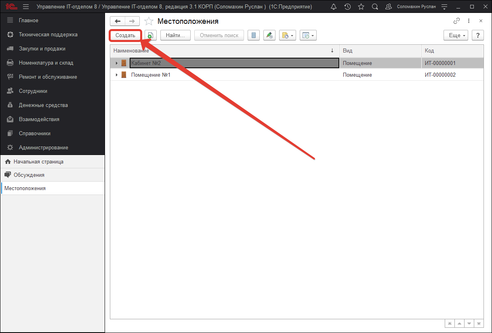

Откроется форма создания нового местоположения. В шапке формы располагаются основные реквизиты, которые необходимо заполнить:

* **Родитель** - реквизит, которые позволяет создавать вложенную иерархию местоположений. Таким образом можно организовать многоуровневую вложенность: Здание 1, Корпус 1, Крыло 1, Этаж 1, Кабинет 1. Реквизит не является обязательным поэтому его можно не заполнять.
* **Код** - автоматический реквизит, отвечающий за нумерацию местоположений.
* **Наименование** - обязательный к заполнению реквизит, который отражает название местоположения в произвольной форме.
* **Вид** - реквизит, указывающий вид данного местоположения. По умолчанию доступен набор стандартных видов: здание, корпус, коридор, помещение, территория, этаж. Предопределенные виды местоположения можно расширить путем создания нового, для этого в форме выбора вида необходимо нажать кнопку "Создать".  

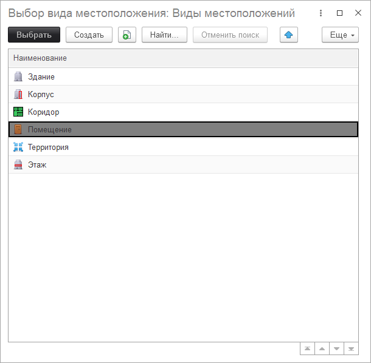

###  Закладка "Схема"

На данной закладке располагается визуальный редактор построения схемы местоположения. Чтобы приступить к созданию необходимо активировать кнопку "Редактирование", которая сделает активным для редактирования окно редактора.

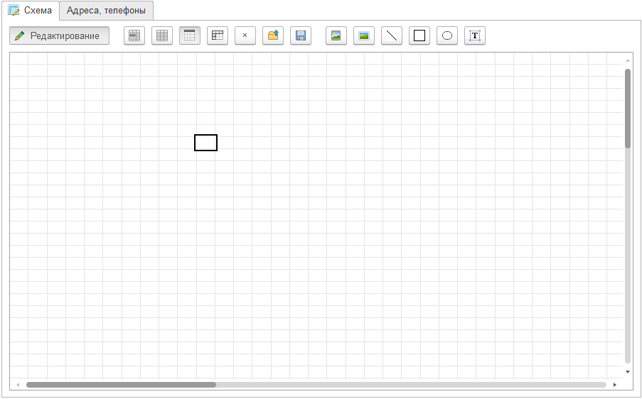

Данный редактор имеет панель кнопок, позволяющих осуществлять определенные действия, а также создавать объекты. Предназначение каждой кнопки интуитивно понятно, однако рассмотрим каждую поподробней *(слева направо)*.

* **Объединить текущую область** - объединяет выделенные ячейки редактора в одну цельную область, может быть полезно при подписании элементов схемы. 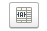
* **Разъединить текущую область** - осуществляет разъединение ранее объединенной области редактора. 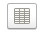
* **Настройки отображать сетку** - включает или выключает сетку редактора. 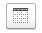
* **Отображать заголовки** - включает или выключает отображение заголовков столбцов и строк редактора. 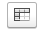
* **Очистить схему** - полностью очищает заполненную объектами область редактора. 
* **Загрузить схему** - позволяет загрузить с локального диска готовый вариант схемы местоположения, которая представлена в файле mxl. 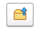
* **Сохранить схему** - позволяет сохранить на локальный диск готовый вариант схемы для последующей загрузки.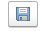
* **Вставить изображение** - позволяет вставить в схему готовое изображение из набора картинок.

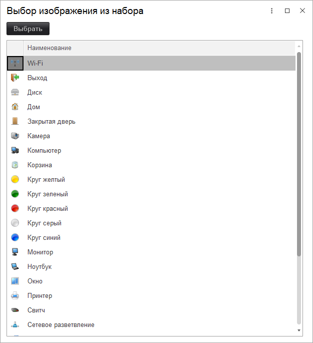

* **Вставить изображение из файла** - вставляет в схему готовое изображение взятое с локального диска компьютера. 
* **Вставка геометрических фигур (линия, квадрат, эллипс)** - вставляет в схему одну из выбранных геометрических фигур. 
* **Вставить текст** - позволяет добавлять в схему любой текст. 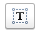

В правой части формы располагаются две закладки "Места хранения" и "Карточки номенклатуры". Закладка "Места хранения" необходима для установки связи между объектами схемы и конкретным местом хранения. Так, например, в схеме здания можно конкретному кабинету назначить определенное место хранения с помощью кнопки "Назначить место хранения". Закладка "Карточки номенклатуры" связывает участвующие в схеме элементы с фактической номенклатурой конфигурации.

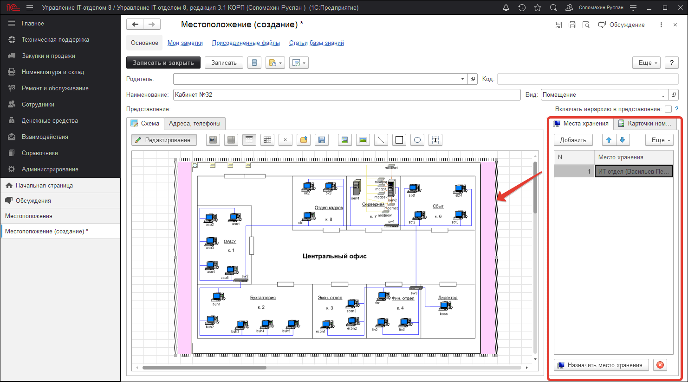

### Закладка "Адреса, телефоны"
Данная закладка предназначена для хранения контактной информации местоположения. Здесь указываются: номера телефонов, факс, фактический адрес нахождения, а также связанный телеграмм аккаунт (если такой имеется).

> **Список ролей, которые позволяют создавать схемы помещений.**
> * [x] Добавление изменение заказов поставщикам;
> * [x] Места хранения и помещения;
> * [x] Ремонт и обслуживание;
> * [x] Добавление изменение сотрудников;
> * [x] Чтение сотрудников;
> * [x] Администрирование.
