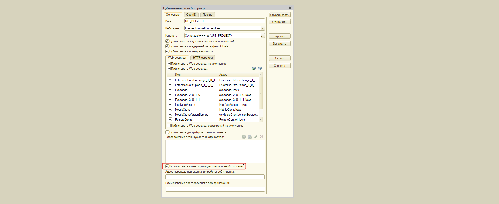
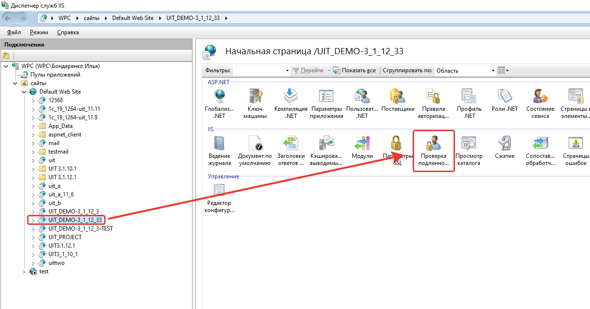
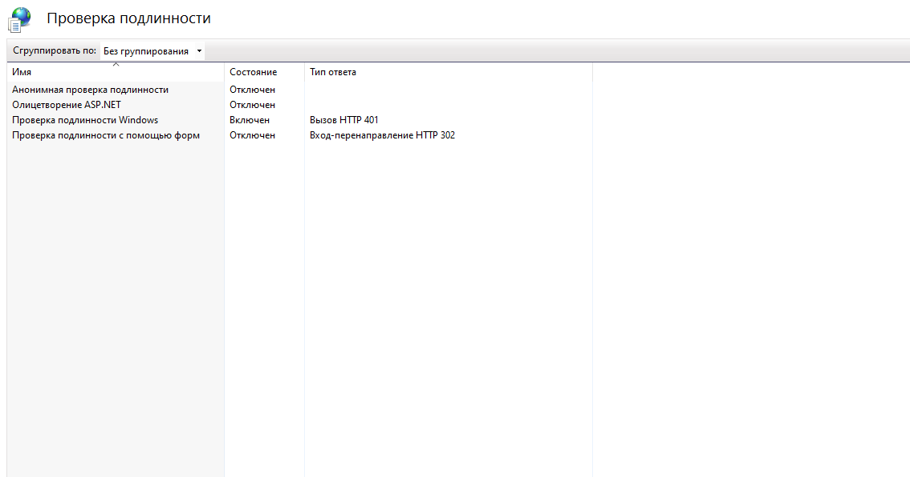

# Настройка IIS для доменной авторизации в личном кабинете и веб-клиенте
 
Доменная авторизация позволяет выполнять сквозную авторизацию идентифицируясь под своей текущей учётной записью домена.  
При такой авторизации не нужно вводить логин и пароль пользователя, сквозная авторизация сама выполняет эту проверку. В этой статье мы разберём основные настройки конфигурации и веб-сервера IIS, при которых работает доменная авторизация личного кабинета и веб-клиента.

!!!
Важно! Мы не гарантируем работу доменной авторизации, если веб-сервер IIS ранее уже был настроен. Может быть так, что какие-то персональные настройки будут мешать работе доменной авторизации.
!!!

1. Убедитесь, что компьютер находится в домене и вход в систему выполнен под учётной записью домена.

## Настройка публикации.

2. При публикации информационной базы на веб-сервер IIS должна быть установлен параметр "Использовать аутентификацию операционной системы". Если вы ещё не опубликовывали информационную базу на веб-сервере, то ознакомьтесь с пошаговой инструкцией.

## Настройка IIS. Проверка подлинности Windows.

1. Перейдите в диспетчер служб "IIS", в списке сайтов найдите опубликованную ранее информационную базу. 
2. Перейдите в настройки "Проверка подлинности для сайтов и приложений". 
3. В открывшемся списке необходимо включить "Проверка подлинности Windows", при этом отключить все остальные проверки подлинности. 
4. Если в списке доступных проверок подлинности нет проверки подлинности Windows, то необходимо перейти в "Компоненты Windows" -> Службы IIS -> Службы интернета -> Безопасность -> активировать "Проверка подлинности Windows"

## Настройка "Управление IT-отделом 8".

1. Перейдите в настройки пользователя, для которого нужно настроить доменную авторизацию, по пути: Администрирование -> настройки пользователей и прав -> пользователи -> нужный пользователь. 
2. На закладке "Главное" активируйте настройку "Аутентификация операционной системы", Выберите домен и пользователя домена. 
3. Перейдите в настройки личного кабинета по пути: Администрирование -> Личный кабинет -> Закладка "Настройки" -> Закладка "Дополнительно" -> убрать галочку с настройки "Использовать собственную авторизацию". Эта настройка отключит добавленную нами форму авторизации личного кабинета.

### Готово. Теперь доменная авторизация работает.