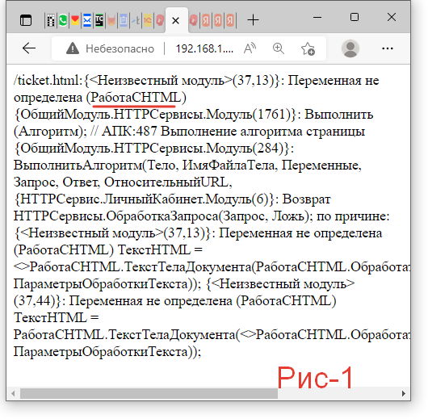
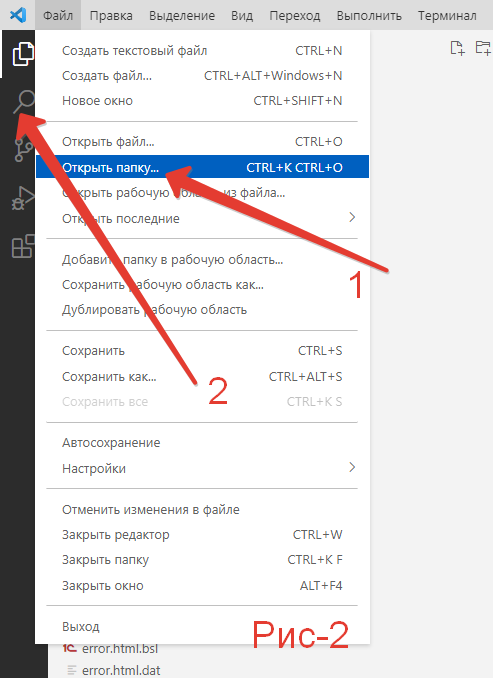
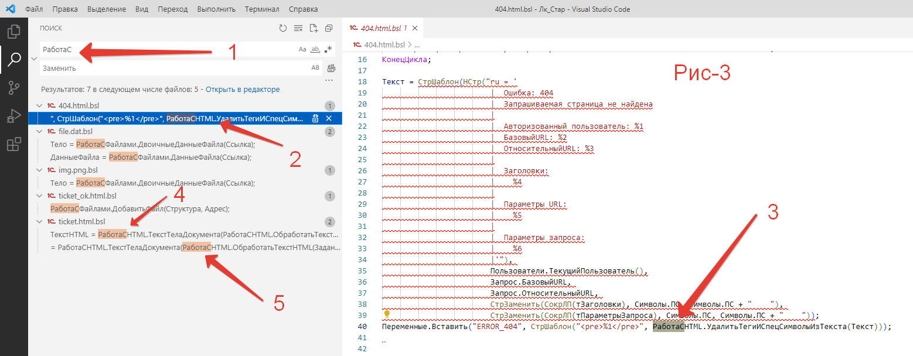

# Если внесённые самостоятельно доработки перестали работать. (релиз 3.1.13.5)  

При разработке иногда приходится менять названия модулей, процедур и т.д. И если Вами были выполнены собственные доработки использующие ссылки на эти объекты, то Ваш код работать не будет. Его надо исправить.

!!!
Важно! Если вы не вносили своих правок, то вам ничего не нужно делать. У тех, кто использует типовой функционал, уже внесены все необходимые правки.
!!!

Вот пример такой ситуации. При выпуске релиза версии 3.1.13.5 была произведена подготовка к разработке нового функционала, который плотно использует HTML. В связи с этим был измене модуль РаботаСHTML, на несколько модулей РаботаСВебСервер и т.д.

Личный кабинет нашего продукта, используемый клиентом, был изменен самим клиентом. И с давних пор не обновлялся. Если же обновлялась вся конфигурация, то просто сохранённые настройки личного кабинета загружались по новой. Но при описанных выше изменениях, личный кабинет клиента перестал работать, выдав ошибку (Рис-1) при просмотре заданий.

Рассмотрим, что же надо сделать:

1. Распаковываем ZIP архив с настройками личного кабинет.

2. Запустим Visual Studio Code и в меню **«Файл»** выполним **«Открыть папку …»** (Рис-2.1) указав папку с распакованными настройками.

3. Перейти в раздел поиска и написать [РаботаС] (Рис-3.1), можно было и РаботаСHTML.

4. Мы видим несколько найденных позиций в разных файлах. (Рис-3.2, Рис-3.4, Рис-3.5)

5. Выбрав первую позицию, справа видим строку, где произошла ошибка (Рис-3.3). Ранее было написал, что модуль был заменен на несколько. 

6. Ищем на какой модуль менять. В конфигураторе программы в пункте меню «Правка» -> «Глобальный поиск» ищем строку *«УдалитьТегиИСпецСимволыИзТекста»*. На (Рис 4) видно, что данная функция находится в модуле "РаботаСВебСервер".

7. Возвращаемся в Visual Studio Code меняем «РаботаСHTML» на "РаботаСВебСервер", сохраняем файл.

8. По двум следующим позициям если функции отличаются повторяем п.6 и п.7. Если ранее найденные только п.7 (Для данного примера сразу напишу, что функция *«ТекстТелаДокумента»* находится в модуле *"РаботаСВебКлиентСервер"*, а *«ОбработатьТекстHTML»* в "РаботаСВебСервер").

На этом работоспособность личного кабинета восстановлена.