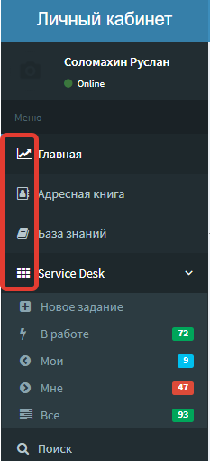
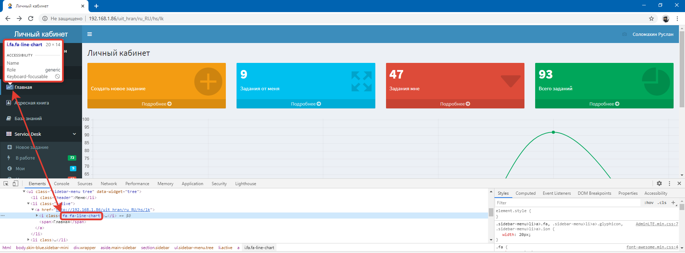
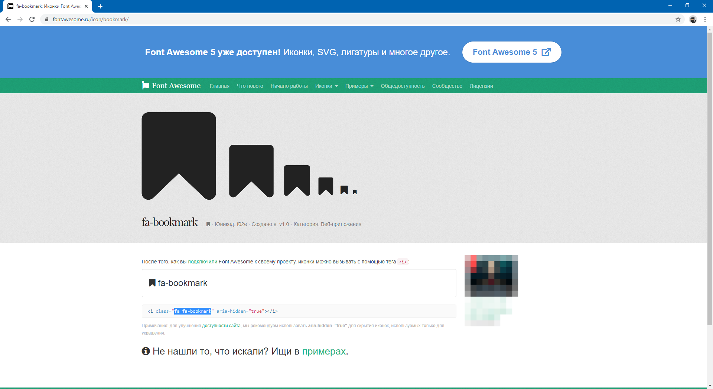
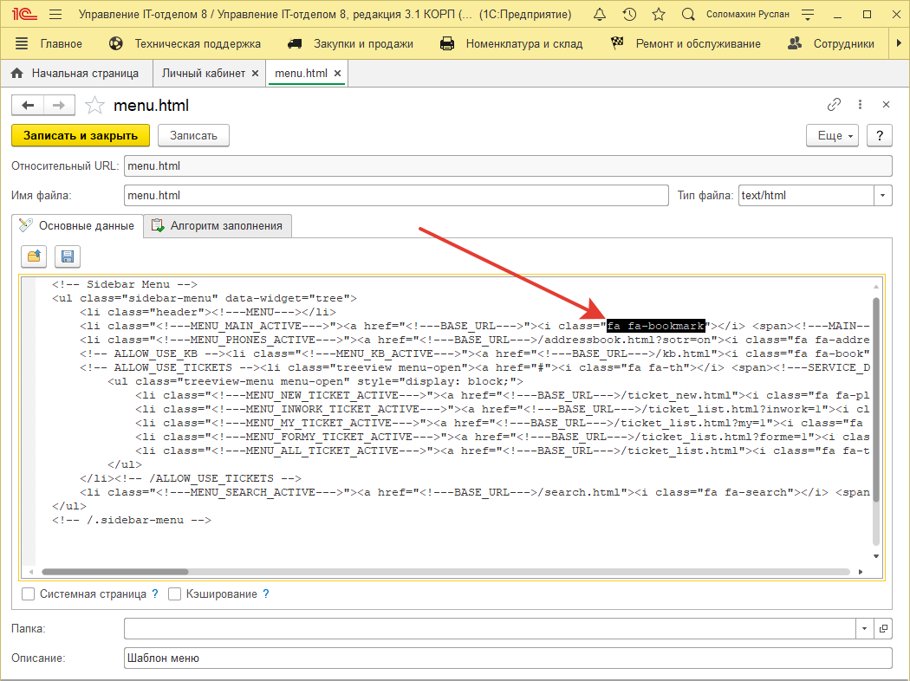
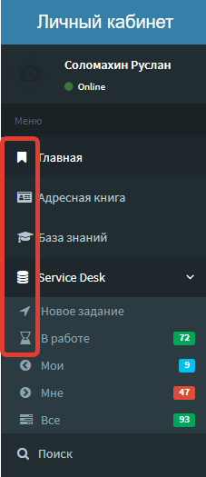

# Изменение изображений в личном кабинете  

Конфигурация поддерживает работу с опубликованными http-сервисами, одним из которых является личный кабинет. Данный сервис зачастую используется для доступа клиентов в качестве интернет портала технической поддержки. В связи с этим возникает необходимость в изменении оформления личного кабинета под корпоративный стиль компании или просто частичное изменение изображений в функционале. Хорошая новость заключается в том, что все это реализуемо и в данном уроке рассмотрим пример замены изображений функциональных кнопок личного кабинета.  
## Изменение иконок  
Чтобы приступить к изменению изображений личного кабинета нужно разобраться откуда берутся данные иконки (картинки). Как описано в обучающем курсе "Личного кабинета" код и данные берутся из центральной базы, но иконки являются исключением. Набор иконок личного кабинета относятся к набору шрифтов и значков сервиса Font Awesome. Это значит, что они не хранятся в центральной базе, а только прописаны в коде той или иной страницы ЛК в виде такой строчки: **"fa fa-arrow-circle"**. Такой подход уменьшает размер хранимых данных личного кабинета в базе и облегчает процесс изменения.
Приступим, например, необходимо изменить иконки главного меню личного кабинета.

Для этого в центральной базе переходим в раздел "Администрирование"-"Личный кабинет" и открываем для редактирования файл menu.html. В данном файле находится html-разметка основного меню. Теперь для того, чтобы точно убедиться где конкретно находится та или иная иконка, в браузере просмотрим код элемента и узнаем class иконки.

Как видно из скриншота иконка пункта меню "Главная" имеет class**fa fa-line-chart**, который является названием самой иконки. Теперь на сайте Font Awesome выбираем необходимую картинку и копируем ее class.

Далее в ранее открытом файле menu.html находим старую иконку по определенному классу(fa fa-line-chart) и заменяем на новую и жмем кнопку **"Записать и закрыть"**

Результатом проделанных манипуляций будет следующего вида главное меню личного кабинета.

Подобные действия аналогичны для большинства иконок личного кабинета.