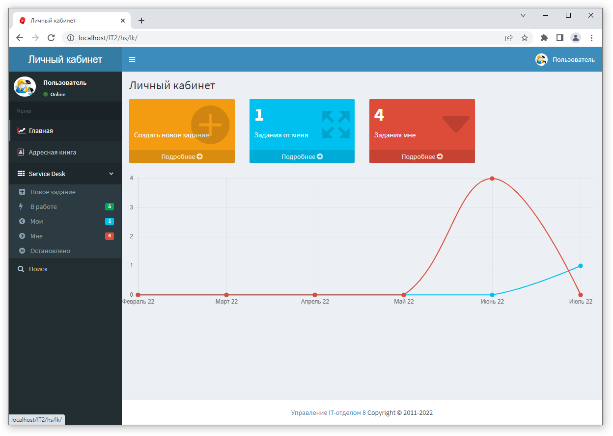

# Личный кабинет пользователя через браузер

Для начала, как это все выглядит:

Справочник "Личный кабинет" предназначен для хранения информации о логике работы личного кабинета по протоколу HTTP. Доступ к личному кабинету пользователь имеет по ссылке http://адрес_сервера_1с.ru/имя_публикации/hs/lk/
Где:
адрес_сервера_1с - это имя сервера где установлен сервер 1С, либо HTTP-адрес сервера.
имя_публикации - имя под которым вы опубликовали конфигурацию. Так же необходимо, чтобы у пользователя были права: ==Чтение личный кабинет==.

## Алгоритм работы личного кабинета
Пользователи входят в браузере по ссылке выше, вводят свой логин и пароль, попадают в личный кабинет и работают в личном кабинете, причем алгоритм работы, страницы и прочее вы можете добавить/изменить самостоятельно.  
HTML-страницы формируются автоматически, анализируя запрос от пользователя. Т.е. если пользователь введет адрес или перейдет в личном кабинете по ссылке, например: http://адрес_сервера_1с.ru/имя_публикации/hs/lk/folder1/folder2/file.html?param=1  
То для построения страницы пользователю система выполнит следующий алгоритм:  
Все, что после lk, т.е. /folder1/folder2/file.html?param=1 будет разбито на блоки и по шагам выполнено:

1. В справочнике "Личный кабинет" будет предпринята попытка найти папку folder1 в корне справочника, далее если это путь длинный, то будет попытка найти следующую папку.
2. Путь длинный, встретили folder2 в пути, ищем внутри папки folder1 папку folder2.
3. Если папка folder2 будет найдена, то далее в этой папке будет попытке найти элемент file.html
4. Если на шагах 1-3 ничего не найдено, то пользователю будет показана страница с кодом 404 (страница не найдена), которая находится в разделе "Настройки" справочника "Личный кабинет" и при этом процесс будет остановлен. Если же файл будет найден в иерархии, то этот шаг игнорируется.
5. С найденным элементом на шаге 3 - если этот файл картинка, то она будет отправлена пользователю по HTTP с кодом 200 (страница найдена) и процесс остановлен, если это страница html, то возьмем текст с вкладки "Основные данные" справочника "Личный кабинет" - этот текст будет основой для будущей странички, назовем этот текст "шаблон", а текстовые данные с закладки "Алгоритм заполнения" назовем "алгоритм".
6. Берем шаблон и проверим его на наличие фрагментов вида <!---include(path/to/file.html)--->. Этот фрагмент означает, что необходимо вместо него вставить файл, который находится по адресу в справочнике личный кабинет "path/to/file.html". Полученный после замены текст будет новым шаблоном.
7. Проверяем шаблон на то, что он содержит фрагменты текста вида <!---MY_TEXT--->, если такие фрагменты содержатся, то будет предпринята попытка поиска переменной на вкладке "Локализация" в настройках строки вида MY_TEXT=Это текст. Если MY_TEXT будет найдена, в настройках локализация, то вместо <!---MY_TEXT---> будет вставлено то, что будет указано в локализации. Полученный после замены текст будет новым шаблоном.
8. Теперь возьмем алгоритм и выполним его встроенной командой Выполнить(Алгоритм) на языке 1С. В этом алгоритме можно использовать переменные:
    1. Тело - HTML-шаблон страницы, если он не используется берется алгоритм;
    2. Переменные - глобальная структура, куда могут быть помещены свои значения и использоваться при построении страниц;
    3. Запрос - объект HTTP-запрос, который выполнил пользователь в браузере;
    4. Ответ - ответ, который мы можем переопределить;
    5. ОтносительныйURL - путь вида folder1/folder2/file.html?param=1 из примера;
    6. ОтносительныйURLПеренаправления - если определить эту переменную, то вместо вывода чего-то пользователю будет дан ответ с кодом 302 (перенаправление на другу страницу) и в этой переменной указывается адрес страницы перенаправления;
    7. ИмяФайла - имя файла из примера (т.е. file.html);
    8. Путь - путь к файлу из примера (folder1/folder2/);
    9. ЯзыковыеДанные - глобальная структура с языковыми константами;
    10. POST - структура, где хранятся данные переданные через HTTP (например файлы).
9. После выполнения алгоритма можем получить обновленное шаблон документа, который далее автоматически будет проанализирован.
10. Повторно проверяем шаблон на то, что он содержит фрагменты текста вида <!---MY_TEXT--->, которые могли быть внесены выполнение алгоритма и если такие фрагменты содержатся, то будет предпринята попытка поиска в глобальной структуре Переменные или в языковых данных в настройках строки вида MY_TEXT=Это текст. Если MY_TEXT будет найдена, то вместо <!---MY_TEXT---> будет вставлено то, что будет указано либо в Переменные либо в локализации. Полученный после замены текст будет готовым HTML-документом.
11. Готовый HTML-документ будет показан пользователю. Это и будет готовая страничка.

Важно понимать, что если в теле HTML-документа вы добавите, например, картинку вида ``, то текст будет показан, а браузер при следующем обращении увидит, что надо показать картинку и запросит у вас по пути "/path/to/picture.png"эту картинку, но это уже будет следующим запросом! Т.е. отдавать что-то другое отличное от ОтносительныйURL не надо! Это будет сделано автоматически.

Если вы не поняли принцип из описания, посмотрите примеры и описания в справочнике. Следующие страницы делайте по аналогии, и вы поймете принцип работы.

Это алгоритм действий, которые будут выполнены для вывода HTML-документа пользователю и **самое замечательное в этом то, что можно добавлять свои страницы и менять поведение системы в зависимости от того, что необходимо именно Вам!**

## Свой функционал

Для создания своих страниц нет никаких препятствий. Необходимо добавить страницу с какой-то информацией? Есть новости, которыми можно было бы поделиться с пользователями? Не вопрос! Добавляйте новые элементы в справочник "Личный кабинет", оформляйте логику работы, добавляйте ссылки на эти страницы в меню, и пользователи будут все видеть.

## Обучающее видео "Личный кабинет"
!!!
Внимание! функциональность личного кабинета через браузер доступна начиная с версии 3.1.2.1
!!!

[Ссылка на видео](https://rutube.ru/video/39f554c0ad5cf81e2e15838614c1bf41/)

|**Список ролей для работы с подсистемой "Личный кабинет"**|
|----------------------------------------------------------|
| Добавление изменение настроек личного кабинета           |
| Чтение личный кабинет                                    |
