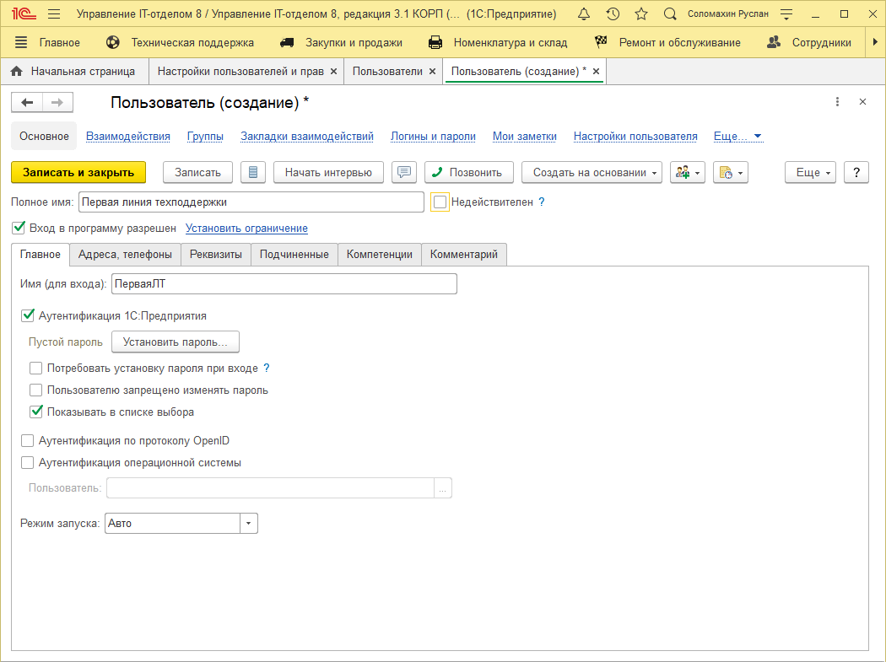
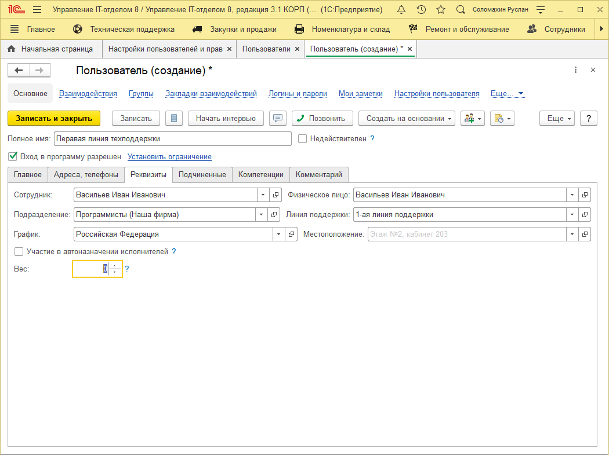
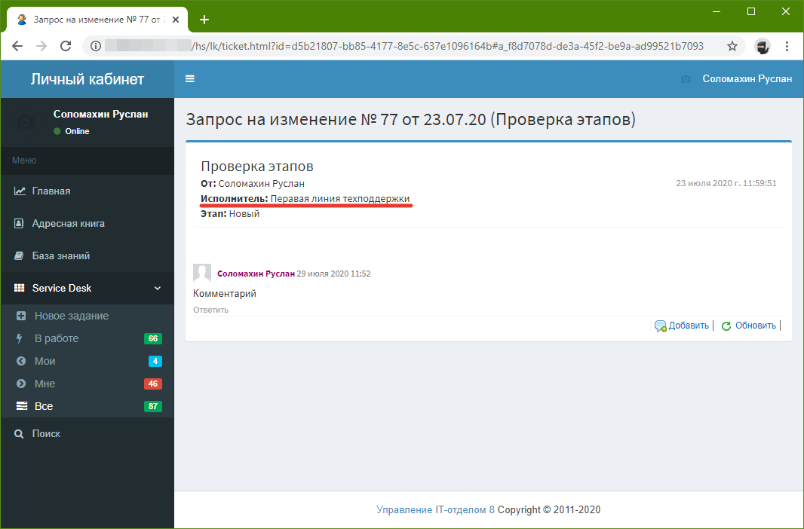

# Обезличивание пользователя личного кабинета

Зачастую предусмотренный в конфигурации механизм http-сервиса "Личный кабинет" используется для организации доступа клиентов (в части подачи заявок Service Desk). Это связано с тем, что подключения личного кабинета не считаются нашей системой лицензирования, что дает возможность одновременно использовать личный кабинет неограниченному числу пользователей. В связи с этим появляется потребность в обезличивание пользователя личного кабинета, который является специалистом одной из линий поддержки. В конфигурации это происходит следующим образом:

1. Необходимо завести нового пользователя (или изменить ранее созданного) в реквизите "Полное имя" указать обезличенное наименование, например, первая линия техподдержки.

1. Далее перейдем на закладку "Реквизиты", где необходимо заполнить реквизит "Сотрудник". В данном реквизите укажем сотрудника нашей организации с полным ФИО, который будет привязан к этому пользователю. Это важно для того, чтобы Вы всегда были в курсе того, какой сотрудник привязан к данному пользователю.

В результате получаем,для инициаторов обращений в личном кабинете пользователь обезличен и отображается как "Первая линия техподдержки", но для руководителя всегда виден привязанный к пользователю сотрудник.

