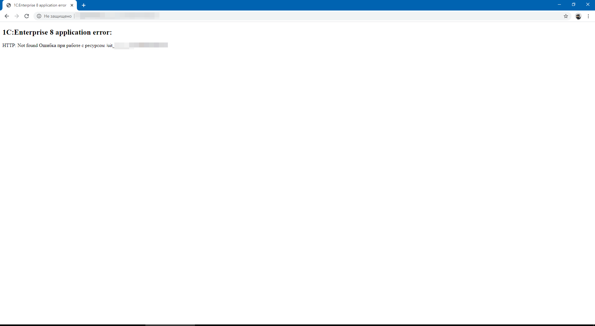
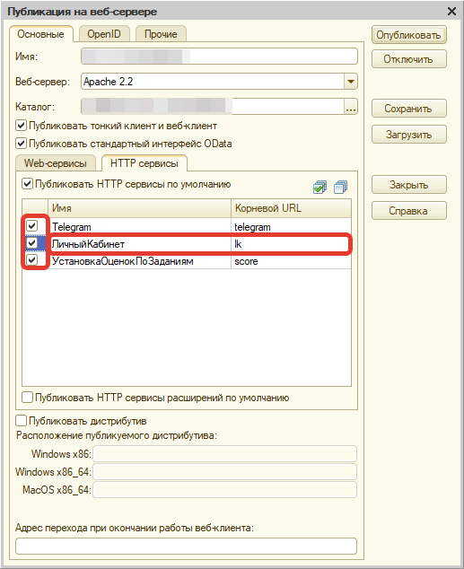

# Ошибка 1C:Enterprise 8 application error

Зачастую пользователи конфигурации сталкиваются с проблемой доступа к личному кабинету в виде ошибки **1С:Enterprise 8 application error.** Большинство сразу приходит к выводу, что проблема заключается в базе или самой конфигурации. Это и понятно, так как значение заголовка ошибки "Ошибка приложения 1С:Предприятие 8" на русском не дает никаких объяснений.

Но на самом деле это не так и сейчас разберемся почему? Как видно на скриншоте, расположенном выше, текст **HTTP:Not found** говорит о том, что http-сервис не найден. Единственной причиной воспроизведения данного сообщения может быть только неправильная публикация базы(**неопубликованный http-сервис "Личный кабинет"**). Для решения проблемы необходимо открыть конфигурацию в режиме "Конфигуратор". Далее перейти в ***"Конфигуратор"-"Администрирование"-"Публикация на веб-сервере"*** и на закладке "http-сервисы" установить все чек-боксы, включая **"Личный кабинет"**.

В конце все, что остается, это заново переопубликовать базу и перезапустить веб-сервер (Apache или IIS).