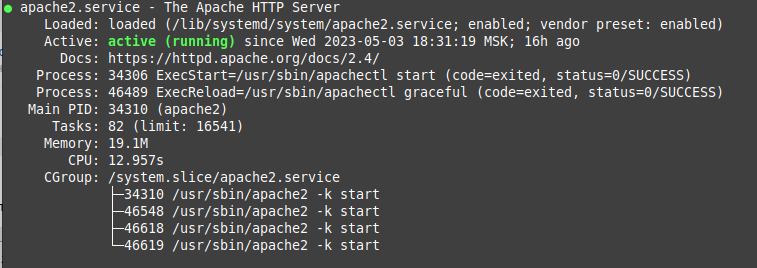
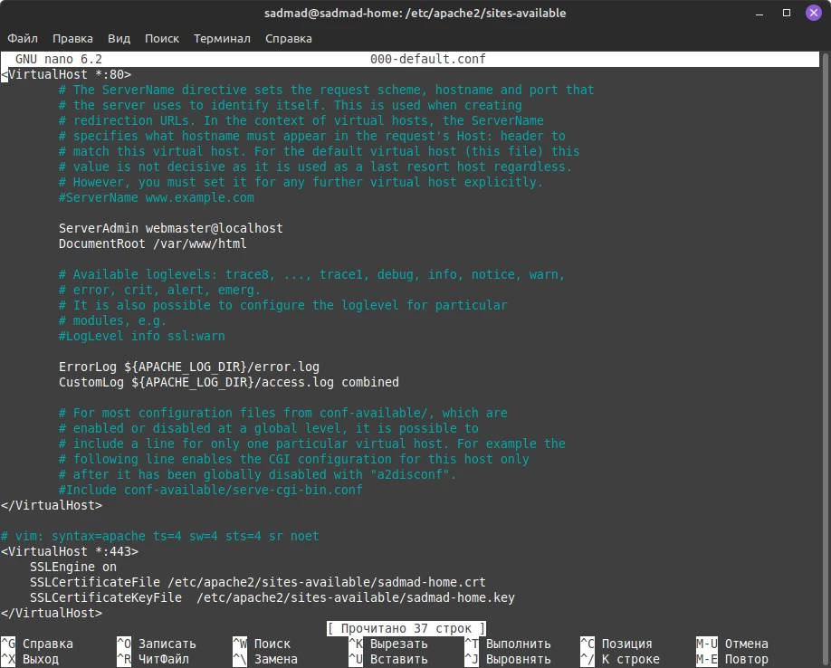
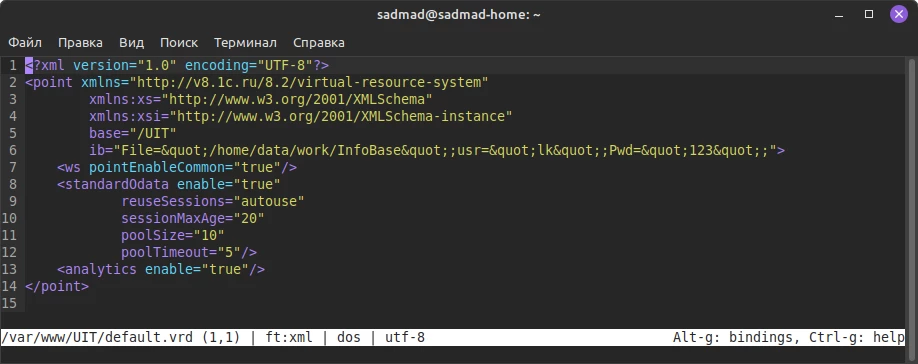
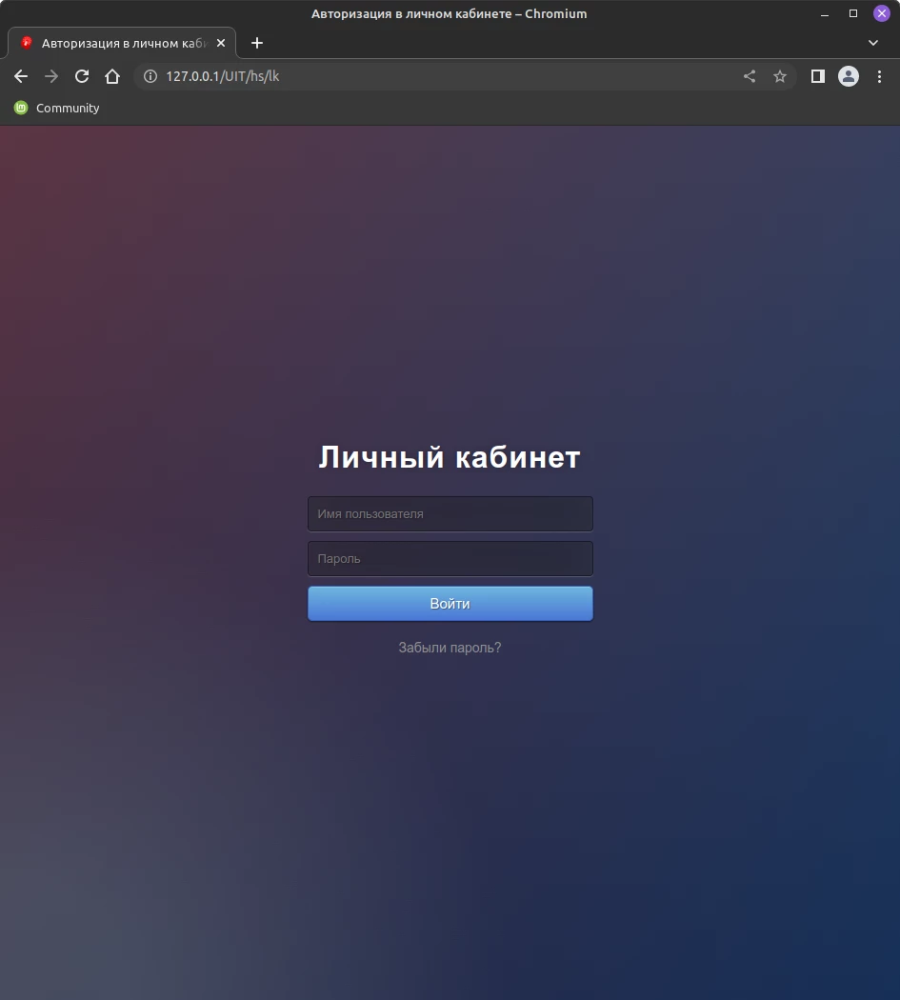

# Публикация личного кабинета со включенной собственной авторизацией на *nix

В данной статье описано как убрать окно авторизации 1С платформы перед входом в личный кабинет на ОС Linux.

## Что понадобится?
1. Машина с Linux

2. Платформа 1С

3. Консольный текстовый редактор (например nano)

4. Веб-сервер Apache

5. сертификаты для подключения по https.

## Apache – начало
Если в системе еще не установлен Apache, то необходимо это сделать следующим образом:

sudo apt install apache2 -y

Ждем окончания выполнения операции. Если все хорошо, то проверяем, что сервер запущен:

service apache2 status

Если все хорошо, то должна быть подобная картина:



## Генерация сертификата
Перейдем теперь к генерации самоподписанного сертификата(если нет другого). Для этого переходим в директорию, где хотим сохранить сертификаты(например /etc/ssl/certs) и выполняем следующую длинную команду:

openssl req -x509 -nodes -days 365 -newkey rsa:2048 -keyout <SERVER>.key -out <SERVER>.crt

Вместо <SERVER> следует указать имя компьютера, на котором выпущены сертификаты.

 Во время выполнения команды будет задано несколько вопросов. Для "Common Name (e.g. server FQDN or Your bane)" нужно также указать имя сервера. Остальные поля заполняются произвольно (кроме "Country name" - здесь можно оставить по умолчанию).

## Публикуем базу и сервисы
Для публикации базы нам в первую очередь нужно перейти в каталог с установленной платформой:

cd /opt/1C/v8.3/x86_64/<Номер платформы>

И выполнить собственно публикацию для серверной базы:

sudo ./webinst -publish -apache24 -wsdir <ИМЯ ПУБЛИКАЦИИ> -dir /var/www/<ИМЯ ПУБЛИКАЦИИ> -connstr “Srvr=<ИМЯ СЕРВЕРА;Ref=<ИМЯ БАЗЫ>” -confpath /etc/apache2/apache2.conf

Или для файловой базы:

sudo /webinst -publish -apache24 -wsdir <ИМЯ ПУБЛИКАЦИИ> -dir /var/www/<ИМЯ ПУБЛИКАЦИИ> "File=<ПУТЬ_К_БАЗЕ>;" -confpath /etc/apache2/apache2.conf

Для файловой базы так же нужно установить права доступа:

chown -R apache:apache <ПУТЬ_К_БАЗЕ>

Если все сделали правильно, должны увидеть сообщение Publication successful.

Следующий шаг — подключаем сертификаты к нашему серверу. Для этого переходим в каталог с публикацией:

cd /etc/apache2/sites-available

и с помощью любого редактора открываем файл настроек:

sudo nano 000-default.conf

В самый конец файла добавляем следующие строки:

<VirtualHost *:443>

SSLEngine on

SSLCertificateFile <ПУТЬ_К_ФАЙЛУ_СЕРТИФИКАТА>

SSLCertificateKeyFile <ПУТЬ_К_ФАЙЛУ_КЛЮЧА>

</VirtualHost>

Должно получиться примерно так: 



Публикуем веб-сервисы и личный кабинет
Публикация web-сервисов и личного кабинета с собственной формой авторизации будет значительно проще, чем публикация базы. Для этого нам нужно всего отредактировать один файл: «/var/www/<ИМЯ_ПУБЛИКАЦИИ>/default.vrd»

Пример команды:

sudo nano /var/www/UIT/default.vrd

И привести его к виду:
```
<?xml version="1.0" encoding="UTF-8"?>

<point xmlns="http://v8.1c.ru/8.2/virtual-resource-system&quot;

xmlns:xs="http://www.w3.org/2001/XMLSchema&quot;

xmlns:xsi="http://www.w3.org/2001/XMLSchema-instance&quot;

base="/UIT"

ib="File=&quot;/home/data/work/InfoBase&quot;;usr=&quot;lk&quot;;Pwd=&quot;123&quot;;">

<ws pointEnableCommon="true"/>

<standardOdata enable="true"

reuseSessions="autouse"

sessionMaxAge="20"

poolSize="10"

poolTimeout="5"/>

<analytics enable="true"/>

</point>
```


Тут следует обратить внимание на две строки:

ib="File=&quot;/home/data/work/InfoBase&quot;;usr=&quot;lk&quot;;Pwd=&quot;123&quot;;">

В этой строке у нас указана опубликованная файловая база и параметры служебного пользователя, который нужен для работы собственной авторизации с именем «lk» и паролем «123».

А также, что вместо кавычек внутри строки используется &quot;

Снова перезапускаем Apache и проверяем. Если все правильно, то мы получим доступ к личному кабинету




