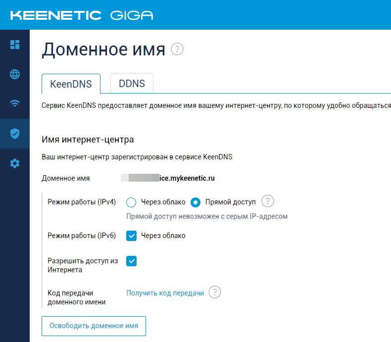
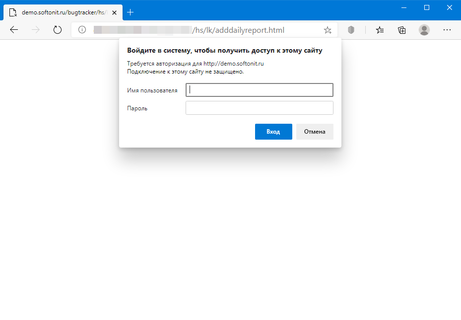
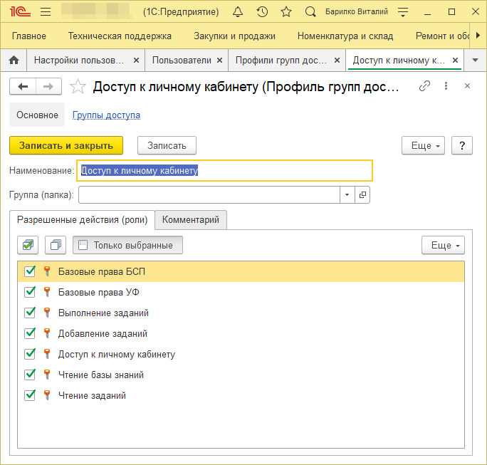
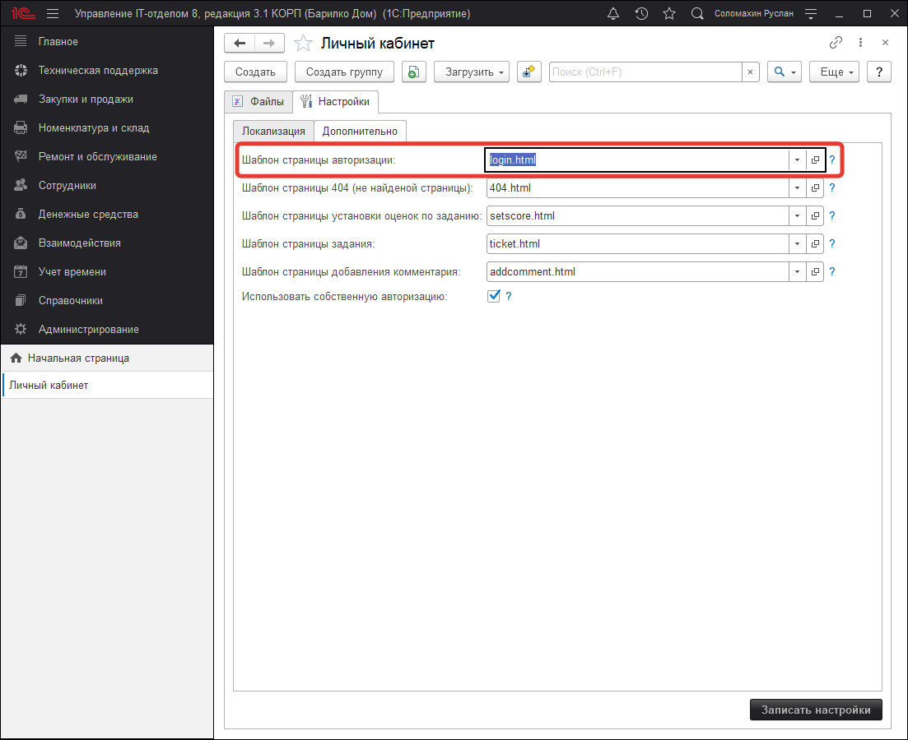
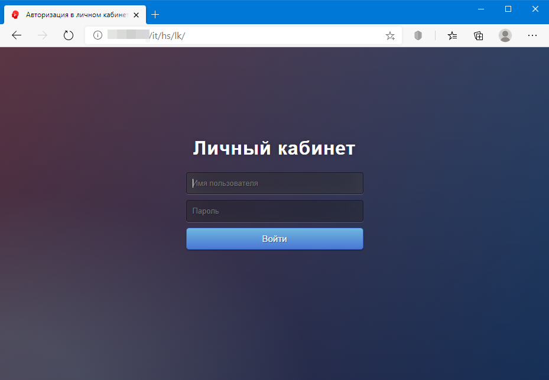
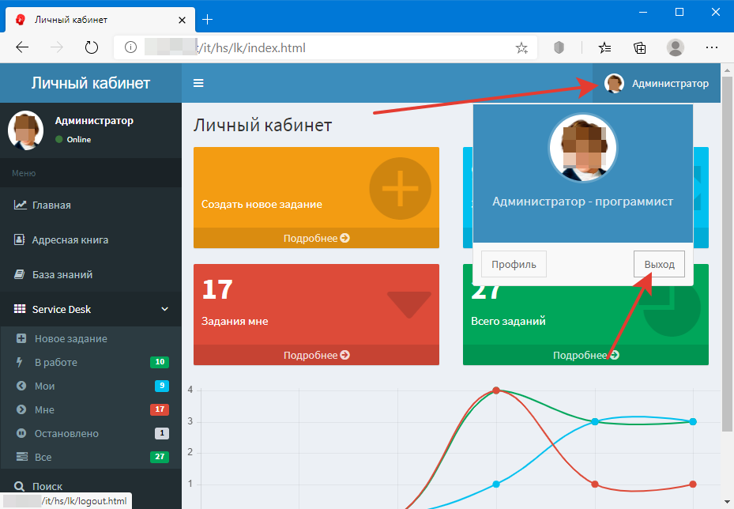

# Собственная авторизация и выход из нее в личном кабинете

Итак, мы хотим настроить Личный кабинет, чтобы его можно было запускать из браузера.  
Для начала давайте рассмотрим принцип работы вообще HTTP-сервисов.  
По сути, это доступ к информационной базе 1С через WEB и он был создан для того, чтобы отвечать на запросы из вне.  
Схема работы примерно следующая:  
**Пользователь <-> Браузер (Chrome, FireFox, Opera...) <-> Наш сервер с веб-сервером Apache или IIS <-> 1C**
Обратите внимание, что браузер посылает запросы нашему веб серверу. Т.е. Наш сервер должен быть доступен из того места где мы посылаем запрос.  
Если это локальная сеть, то через браузер мы можем работать только в локальной сети. Если же мы хотим вообще из любого места подключаться к нашему личному кабинету, то необходимо, чтобы ваш веб-сервер был виден из интернета. Для этого понадобиться либо белый IP-адрес, который необходимо взять у провайдера, либо настройка вашего роутера (например, некоторые роутеры типа Keenetic умеют давать доступ через свои сервера к вашей внутренней сети и присваивая вашему роутеру определенный адрес типа my1c.zyxel.com).  
Вот как можно настроить через роутер Keenetic:  

После того как вы разберетесь с вопросом белого или серого IP-адреса, необходимо настроить личный кабинет.
Выше мы уже рассмотрели как установить веб-сервер [Apache](https://softonit.ru/FAQ/courses/?COURSE_ID=1&LESSON_ID=591) или [IIS](https://softonit.ru/FAQ/courses/?COURSE_ID=1&LESSON_ID=592).
Теперь необходимо опубликовать базы и найти VRD-файл, который отвечает за публикацию вашей базы 1С через веб.
Нам необходимо снять авторизацию средствами 1С с личного кабинета, чтобы не было вот этого окна при попытке открыть личный кабинет в браузере:

В нашем личном кабинете своя красивая форма авторизации, которая так же безопасна, как и эта и прекрасно позволит авторизоваться пользователю. Безопасна она так же потому, что использует проверку логина и пароля таким же образом, что и сама 1С.

1. Для того чтобы убрать эту форму и заменить своей новой страницей авторизации необходимо скопировать файлы первичной публикации информационной базы в новый созданный каталог (папку) в директории: C:\inetpub\wwwroot\ (для веб-сервера IIS) или C:\www\ (для веб-сервера Apache).
2. Если публикация осуществлялась на веб-сервер IIS, тогда это два файла default.vrd и web.config, если база публиковалась на Apache, значит нужно скопировать только `default.vrd.` После того как необходимые файлы скопированы в созданную папку в нужной директории, необходимо внести правки в скопированный **VRD-файл.**
3. Как это сделать можно найти в статье [Настройка личного кабинета и установка оценок по заданию](https://softonit.ru/FAQ/courses/?COURSE_ID=1&LESSON_ID=594) в данной статье описываются настройки старой публикации (старая страница авторизации), эти же настройки необходимо применить, но только для скопированных файлов.
4. В конце статьи по ссылке выше описывается также процесс создания системного пользователя "OcenkiZadanii", на текущий момент он уже не актуален. Сейчас же **нам необходимо создать нового пользователя "lk", задать ему пароль и назначить ему вот такие права:**

**А так же вписать в настройки скопированного VRD-файла вход от имени этого пользователя.** Не переживайте, все равно в результате собственной авторизации пользователь устанавливается какой надо, ему будут видны только те объекты, к которым у него есть доступ. Также необходимо убедиться в том, что в настройках самого личного кабинета указана необходимая страница авторизации. Для этого откроем центральную базу и перейдем в раздел "Администрирование"-"Личный кабинет"-"Настройки"-"Дополнительно". В реквизите "Шаблон страницы авторизации" должно быть указан файл login.html, который формирует новую страницу авторизации.

В результате получим вот такую симпатичную форму вместо стандартной:

А так же возможность сменить авторизацию и войти под другим пользователем:

Стандартная форма авторизации, такого сделать не позволит.

!!!
Функционал собственной авторизации доступе начиная с версии 3.1.8.1
!!!
