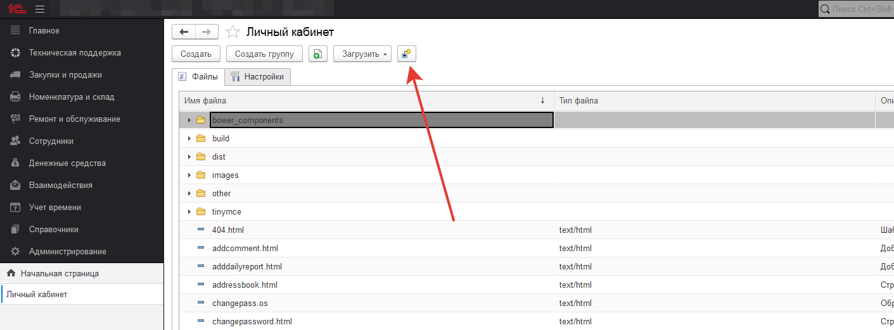
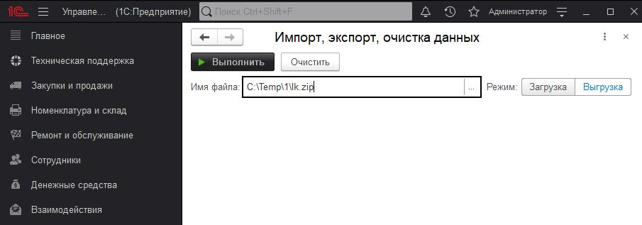
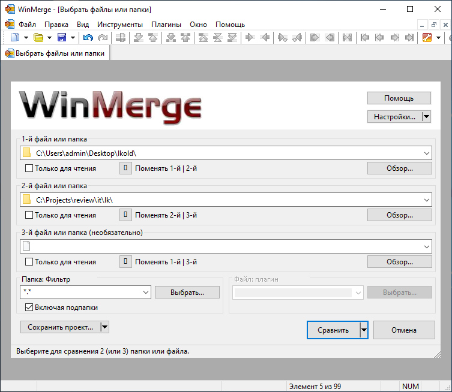
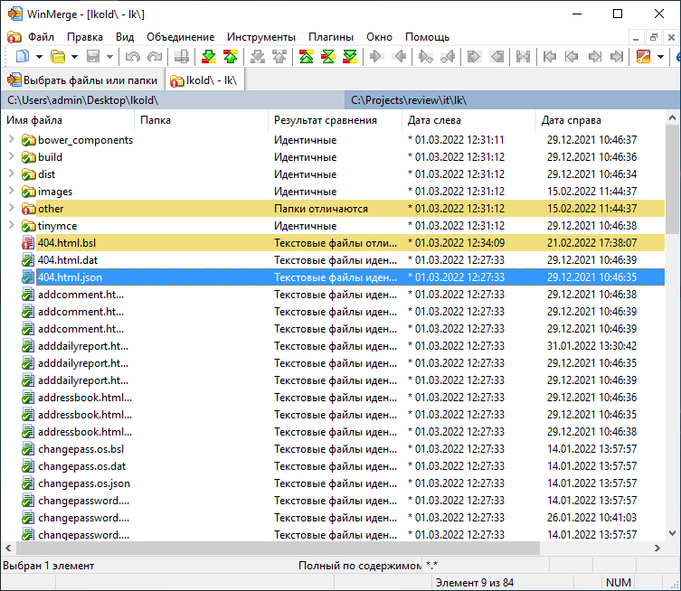
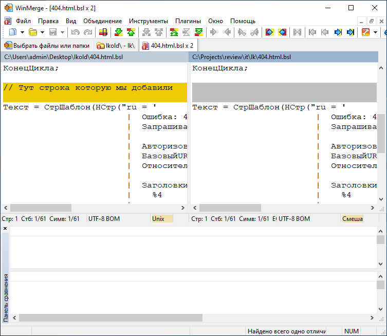

# Сохранение доработок пользователей в личном кабинете при обновлении конфигурации

Возможно в процессе работы Вам может понадобиться изменить что-то в личном кабинете.
Вы вносите правки в личный кабинет, вас все устраивает, но выпускается новое обновление и вы теряете все ваши доработки.
Что делать в такой ситуации?
Давайте рассмотрим алгоритм, что нужно сделать, чтобы восстановить собственные доработки, после обновления конфигурации.

!!!
Важно! Если вы не вносили своих правок в личный кабинет, то вам ничего не нужно делать, обновленный личный кабинет заполнится автоматически. Если же доработки были, то вам нужно воспроизвести алгоритм ниже на своей базе.
!!! 
## Алгоритм
1. До обновления выполните сохранение измененного личного кабинета. Администрирование > Личный кабинет и как на рисунке ниже нажать на кнопку.

Далее, откроется окно, выберите путь, куда хотите сохранить личный кабинет.

2. После сохранения вы получите zip-архив в котором будет резервная копия вашего личного кабинета до обновления.

3. Обновите конфигурацию. При обновлении, личный кабинет будет так же обновлен и ваши доработки будут затерты.

4. Сохраните в обновленной конфигурации личный кабинет так же, как и в п.1

5. Распакуйте старый личный кабинет и новый личный кабинет в разные папки и сравните эти папки в программе, которая умеет сравнивать директории на наличие изменений. Мы советует использовать программу [WinMerge](https://winmerge.org/?lang=ru). Она удобная и простая (хотя это, конечно, на любителя).

6. После этого в обновленной базе, в личном кабинете восстанавливаем свои правки исходя из того, что вы увидели в сравнении, адаптируя свои правки под новый код при необходимости.