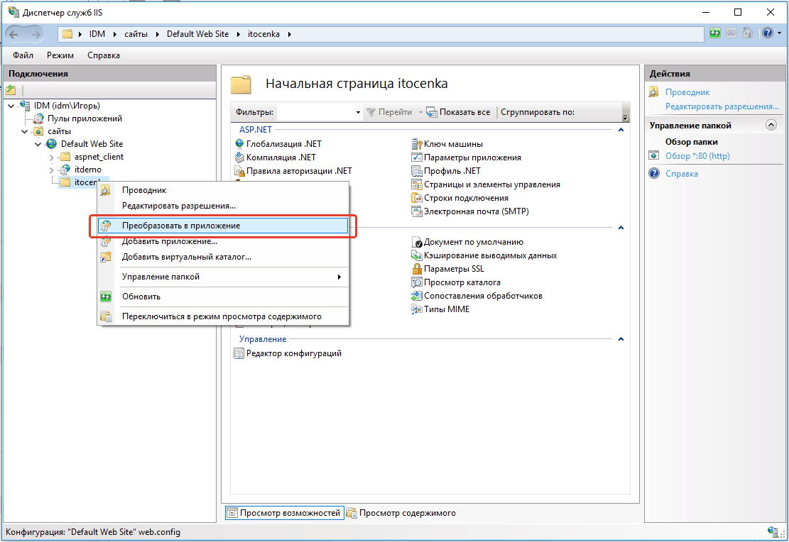
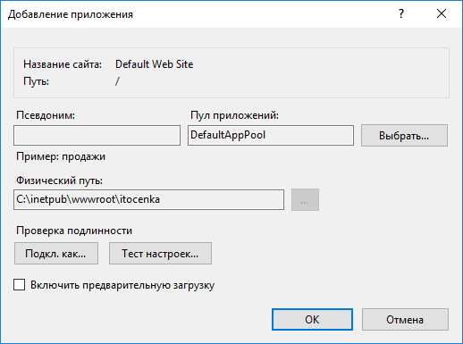
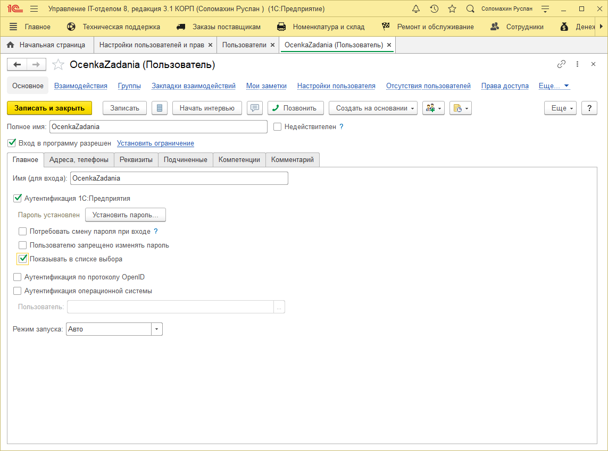
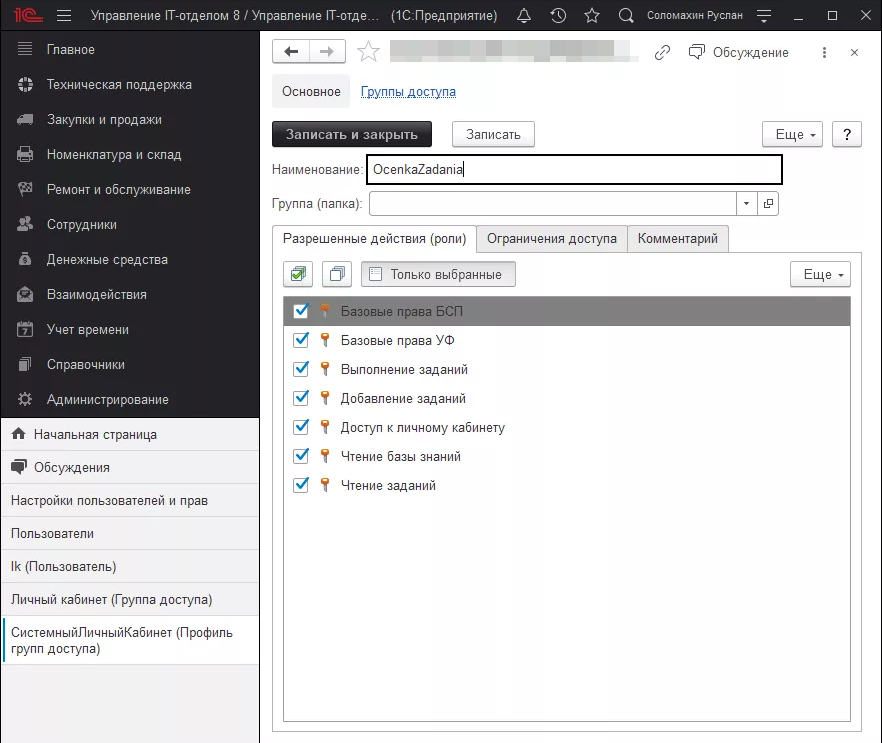
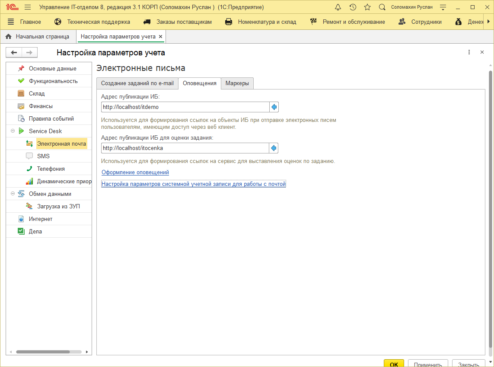
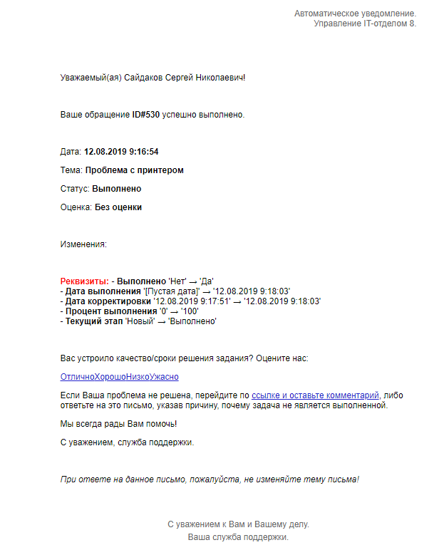
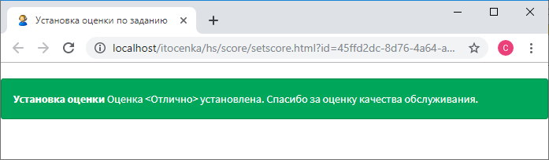
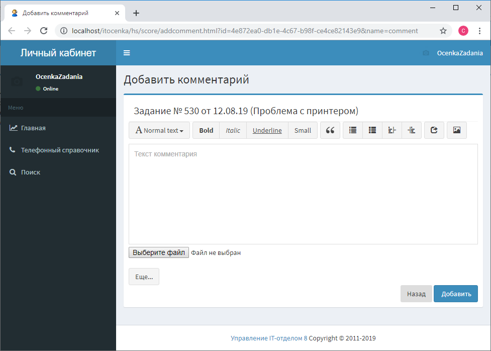
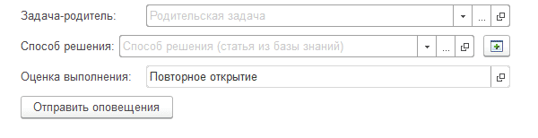
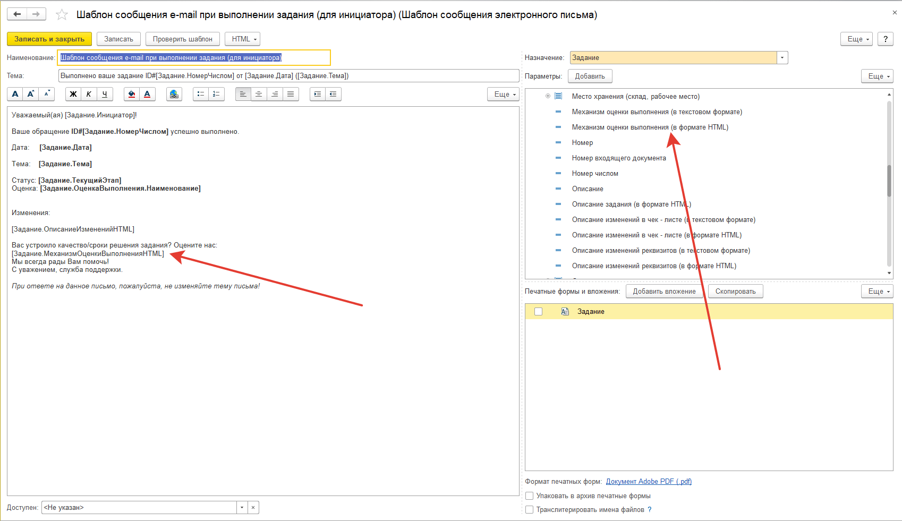

# Установка оценок по заданию в личном кабинете

## Установка оценки через личный кабинет

Если Вы используете способ установки оценки задания в письме Через личный кабинет (эту настройку можно найти в Администрирование > Настройки параметров учета > Service Desk > Оценка заданий), то для работы механизма оценок необходимо:  

* [x] Предварительно опубликовать ИБ на web-сервере (см. [Публикация конфигурации на веб - сервере Apache](https://softonit.ru/FAQ/courses/?COURSE_ID=1&LESSON_ID=591&LESSON_PATH=1.2.590.591) и [Публикация конфигурации на веб - сервере IIS](https://softonit.ru/FAQ/courses/?COURSE_ID=1&LESSON_ID=592&LESSON_PATH=1.2.590.592));
* [x] Произвести дополнительную настройку веб - сервера (добавить вторую публикацию этой ИБ, указать служебного пользователя);
* [x] Указать настройки в самой ИБ.

### Если веб -сервер Apache

**1.1. Если используется веб - сервер Apache:** выполним дополнительную настройку сервера Apache, которую начинали при публикации конфигурации ранее в уроке "[Публикация конфигурации на веб - сервере Apache](https://softonit.ru/FAQ/courses/?COURSE_ID=1&LESSON_ID=591&LESSON_PATH=1.2.590.591)".  
После публикации ИБ необходимо внести изменения в конфигурационный файл Apache и создать вторую публикацию ИБ. Для этого идем в папку, куда был установлен Apache (у меня это d:\www\Apache22\), далее ищем папку conf и в ней правим файл httpd.conf, а именно находим строки, добавленные при публикации базы:

```
# 1c publication
Alias "/itdemo" "D:/www/ITDemo/"
<Directory "D:/www/ITDemo/">
    AllowOverride All 
    Options None 
    Order allow,deny  
    Allow from all
    SetHandler 1c-application 
    ManagedApplicationDescriptor "D:/www/ITDemo/default.vrd"
</Directory>
```

Копируем и вставляем этот блок ниже, должно получиться так:
```
 # 1c publication
Alias "/itdemo" "D:/www/ITDemo/"
<Directory "D:/www/ITDemo/"> 
    AllowOverride All
    Options None
    Order allow,deny
    Allow from all
    SetHandler 1c-application
    ManagedApplicationDescriptor "D:/www/ITDemo/default.vrd"
</Directory>

# 1c publication
Alias "/itdemo" "D:/www/ITDemo/"
<Directory "D:/www/ITDemo/">
    AllowOverride All
    Options None
    Order allow,deny
    Allow from all
    SetHandler 1c-application
    ManagedApplicationDescriptor "D:/www/ITDemo/default.vrd"
</Directory>
```
В добавленном блоке меняем следующие строки на свои: 

```
 Alias "/itdemo" "D:/www/ITDemo/"     ->    Alias "/itocenka" "D:/www/ITDemoOcenki/"  
```
- этим мы добавляем еще одну публикацию ИБ по имени «itocenka», которая будет расположена по следующему пути D:\www\ITDemoOcenki

```
<Directory "D:/www/ITDemo/">     ->    <Directory "D:/www/ITDemoOcenki/">   
```

- сам каталог файлов новой публикации;

```
ManagedApplicationDescriptor "D:/www/ITDemo/default.vrd"      ->    ManagedApplicationDescriptor "D:/www/ITDemoOcenki/default.vrd" 
```
- файл описания параметров подключения.
В результате должно получиться так:

```
 # 1c publication
Alias "/itdemo" "D:/www/ITDemo/"
<Directory "D:/www/ITDemo/">
    AllowOverride All
    Options None
    Order allow,deny
    Allow from all
    SetHandler 1c-application
    ManagedApplicationDescriptor "D:/www/ITDemo/default.vrd"
</Directory>

# 1c publication 
Alias "/itocenka" "D:/www/ITDemoOcenki/"
<Directory "D:/www/ITDemoOcenki/">
    AllowOverride All
    Options None
    Order allow,deny
    Allow from all
    SetHandler 1c-application
    ManagedApplicationDescriptor "D:/www/ITDemoOcenki/default.vrd"
</Directory>
```

Далее необходимо создать каталог, который мы только что описали (у меня это D:\www\ITDemoOcenki) и скопировать в него файл `default.vrd` из ранее опубликованной базы. Откроем его на редактирование: 

```
<?xml version="1.0" encoding="UTF-8"?>
<point xmlns="http://v8.1c.ru/8.2/virtual-resource-system"
		xmlns:xs="http://www.w3.org/2001/XMLSchema"
		xmlns:xsi="http://www.w3.org/2001/XMLSchema-instance"
		base="/itdemo"
		ib="File=&quot;D:\Рабочие базы\IT_Демо&quot;;"
		enableStandardOData="true">
	<ws>
		<point name="AddressSystem"
				alias="AddressSystem.1cws"
				enable="true"/>
		<point name="EnterpriseDataExchange_1_0_1_1"
				alias="EnterpriseDataExchange_1_0_1_1.1cws"
				enable="true"/>
		<point name="EnterpriseDataUpload_1_0_1_1"
				alias="EnterpriseDataUpload_1_0_1_1.1cws"
				enable="true"/>
		<point name="EquipmentService"
				alias="EquipmentService.1cws"
				enable="true"/>
		<point name="Exchange"
				alias="exchange.1cws"
				enable="true"/>
		<point name="Exchange_2_0_1_6"
				alias="exchange_2_0_1_6.1cws"
				enable="true"/>
		<point name="InterfaceVersion"
				alias="InterfaceVersion.1cws"
				enable="true"/>
		<point name="KnowledgeDB"
				alias="kdb1.1cws"
				enable="true"/>
	</ws>
	<httpServices>
		<service name="kb"
				rootUrl="kb"
				enable="true"/>
		<service name="УстановкаОценокПоЗаданиям"
				rootUrl="score"
				enable="true"/>
	</httpServices>
</point> 
```

Необходимо в новом файле заменить следующее:

```
base="/itdemo" - > base="/itocenka"
```

В строку подключения добавим пользователя, от имени которого инициаторы смогут выставлять оценки не заходя в саму ИБ (т.е. оценки могут выставлять и те инициаторы, которые даже не работают в конфигурации):

```
ib="File=&quot;D:\Рабочие базы\IT_Демо&quot;;Usr=&quot;OcenkaZadania&quot;;Pwd=&quot;112233123&quot;;"
```

Пользователя «OcenkaZadania» с паролем «112233123» (тут Вы указываете своего "служебного" пользователя) добавим в ИБ позже.
Блок веб - сервисов, а также блок описания http - сервиса «kb» можно удалить. В результате должно получиться так:

```
<?xml version="1.0" encoding="UTF-8"?>
<point xmlns="http://v8.1c.ru/8.2/virtual-resource-system"
		xmlns:xs="http://www.w3.org/2001/XMLSchema"
		xmlns:xsi="http://www.w3.org/2001/XMLSchema-instance"
		base="/itocenka"
		ib="File=&quot;D:\Рабочие базы\IT_Демо&quot;;Usr=&quot;OcenkaZadania&quot;;Pwd=&quot;112233123&quot;;"
		enableStandardOData="true">
	
	<httpServices>		
		<service name="УстановкаОценокПоЗаданиям"
				rootUrl="score"
				enable="true"/>
	</httpServices>
</point>
```

После внесенных изменений необходимо перезапустить Apache и можно переходить к настройкам конфигурации.
**1.2. Если используется веб - сервер IIS:** после публикации ИБ (см. [Публикация конфигурации на веб - сервере IIS](https://softonit.ru/FAQ/courses/?COURSE_ID=1&LESSON_ID=592&LESSON_PATH=1.2.590.592)) в каталоге c:\inetpub\wwwroot\ создадим новый каталог itocenka, скопируем в него содержимое каталога первой публикации c:\inetpub\wwwroot\itdemo\, а именно 2 файла: default.vrd и web.config. Откроем файл default.vrd на редактирование и внесем следующие изменения:

```
base="/itdemo" - > base="/itocenka"
```

### Если веб -сервер IIS

- имя второй публикации ИБ;
В строку подключения добавим пользователя, от имени которого инициаторы смогут выставлять оценки не заходя в саму ИБ:

```
ib="File=&quot;D:\1CBase\ITdemo&quot;;Usr=&quot;OcenkaZadania&quot;;Pwd=&quot;112233123&quot;;"
```
Строка подключения для серверной базы будет выглядеть примерно так:

```
ib="Srvr=&quot;АДРЕС_СЕРВЕРА&quot;;Ref=&quot;НАЗВАНИЕ_БАЗЫ&quot;;Usr=&quot;OcenkaZadania&quot;;Pwd=&quot;1234567890&quot;;"
```

Пользователя «OcenkaZadania» с паролем «112233123» (тут Вы указываете своего "служебного" пользователя) добавим в ИБ позже.
Блок веб - сервисов, а также блок описания http - сервиса «kb» можно удалить. В результате должно получиться так:

```
<?xml version="1.0" encoding="UTF-8"?>
<point xmlns="http://v8.1c.ru/8.2/virtual-resource-system"
		xmlns:xs="http://www.w3.org/2001/XMLSchema"
		xmlns:xsi="http://www.w3.org/2001/XMLSchema-instance"
		base="/itocenka"
		ib="File=&quot;D:\1CBase\ITdemo&quot;;Usr=&quot;OcenkaZadania&quot;;Pwd=&quot;112233123&quot;;"
		enableStandardOData="true">
	
	<httpServices>		
		<service name="УстановкаОценокПоЗаданиям"
				rootUrl="score"
				enable="true"/>
	</httpServices>
</point>
```

Для вновь созданной папки c:\inetpub\wwwroot\itocenka\ необходимо дать полные права для пользователя "IUSR" и группы пользователей "IIS_IUSRS" аналогично, как это было сделано при публикации ИБ.  
Далее, открываем "Диспетчер служб IIS", раскрываем ветку "Default Web Site" и находим добавленную нами новую папку itocenka. В контекстном меню этой папки необходимо выбрать "Преобразовать в приложение":




После внесенных изменений необходимо перезапустить веб - сервер.
1. **Настройка программы:** в самой программе выполним следующее:
2. Создаем нового пользователя «OcenkaZadania»:



Основная роль для этого пользователя "Доступ к личному кабинету", но желательно для него установить следующий набор ролей:



1. В настройках параметров учета (**«Администрирование» - «Настройки параметров учета» - «Service Desk» - «Электронная почта» - «Оповещения»**) в разделе «Service Desk» укажем адреса публикации ИБ:



**Адрес публикации ИБ** – адрес, по которому ИБ доступна пользователям программы через веб клиент, этот адрес будет использоваться для формирования ссылки на документ «Задание» в электронном письме – уведомлении;

**Адрес публикации ИБ для оценки задания** – второй адрес этой же базы, необходимый при формировании ссылок, используемых для установки оценки за выполненное задание.

При окончании работы по заданию, инициатор получает письмо – уведомление:



При нажатии на одну из оценок будет выполнен переход и выставлена оценка (установим оценку «Отлично»):



Если по каким-либо причинам инициатор считает, что задание не выполнено, при клике по следующей ссылке в письме - уведомлении:

_УстрановкаОценок.png)

в окне браузера будет отображена форма ввода комментария:



После отправки комментария в здании будет установлена оценка «Повторное открытие»:



Обратите внимание, что бы пользователь получил письмо с ссылками для установки оценок (Отлично, Хорошо и т.д.) необходимо, чтобы в шаблоне писем в правилах событий при выполнении задания была специальная переменная:



!!!
Внимание! Константа "Адрес публикации ИБ для оценки задания" добавлена в версии 3.0.29.
!!!