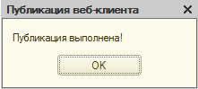

# Публикация на сервере - Apache

Для публикации конфигурации через WEB первоначально необходимо установить IIS, либо Apache в Windows. Мы рекомендуем все-таки использовать Apache, как показывает практика, его установка занимает не так много времени и все сразу начинает работать в отличии от IIS. При этом особых навыков не нужно.

Рассмотрим установку на базе Apache.

1. Скачать с официального сайта сборку локального веб-сервера «XAMPP», содержащую в себе «Apache»: https://www.apachefriends.org/

2. Запускаем установщик и нажимаем «Next»:

3. Выбираем компоненты: «Apache» и «PHP» и нажимаем «Next»:

4. Снимаем галочку установки лишнего софта и нажимаем «Next»:

5. После окончания установки в трее должен появиться такой значок:

6. В трее откройте окно и проверьте состояние Apache. Должно быть вот так:

7. Для автозапуска службы необходимо нажать на кнопку "Config" и поставить галочку на модуль Apache:

*Так же стоит отметить то, что Apache использует по умолчанию 80 порт, и если вас есть другие сервисы (например, IIS), которые использует этот порт, то лучше их отключить, иначе служба не запуститься.*  

8. Для проверки того, что служба веб сервера запущена, в строке адреса браузера необходимо ввести: [http://localhost](http://localhost)

9. Для публикации информационной базы необходимо открыть ИБ в режиме «Конфигуратор»:

10. В меню «Администрирование» необходимо выбрать «Публикация на веб-сервере…»:

В открывшемся окне необходимо будет указать следующие данные:
- Имя – имя ИБ (можно оставить предложенное программой или указать своё);

- Каталог – каталог, где будут размещены данные опубликованной ИБ.

На закладке «НТТР сервисы» необходимо отметить флажками «Публиковать НТТР сервисы по умолчанию», «Telegram», «ЛичныйКабинет» и «УстановкаОценокПоЗаданиям»:

Далее необходимо нажать на кнопку «Опубликовать» и если не было допущено ошибок, программа сообщит:

На запрос программы «При создании новой публикации на Apache рекомендуется выполнить перезапуск веб-сервера. Выполнить перезапуск?» необходимо нажать «Да»:

Чтобы проверить доступность ИБ через веб интерфейс нужно набрать в адресной строке браузера:
[http://localhost/](http://localhost/)<имя ИБ>, где «localhost» - имя компьютера (этот компьютер), а <имя ИБ> имя, указанное при публикации:

Для доступа к ИБ с других компьютеров локальной сети через веб интерфейс необходимо в адресной строке браузера вводить:

http://ip-адрес веб сервера/<ИмяИБ> либо http://имя веб сервера/<ИмяИБ>, например http://192.168.1.3/itdemo или http://serv/itdemo.
Если при попытке подключиться к ИБ с другого компьютера Вы получаете страницу «Не удается отобразить эту страницу» или «Не удается получить доступ к сайту», то, возможно соединение на порт, который был указан при установке Apache, заблокировано брандмауэром Windows.

О том, как настроить Apache для работы с сервисом "Установка оценок по заданию" можно прочитать в уроке: [Использование HTTP-сервиса "Установка оценок по заданию".](https://softonit.ru/FAQ/courses/?COURSE_ID=1&LESSON_ID=594&LESSON_PATH=1.2.590.593.594)

!!!
Важно! Если после публикации ИБ при запуске службы веб-сервера Apache возникают ошибки, проверьте, что в файле httpd.conf указан корректный путь к wsapXX.dll (где XX - версия Apache).

P.S. файл httpd.conf находиться в папке C:\xampp\apache\conf\httpd.conf, которую в указали при установке.
!!!

Например, для версии Apache 2.4 x32 строка в файле httpd.conf может быть такой:

`LoadModule _1cws_module "C:/Program Files (x86)/1cv8/8.3.14.1630/bin/wsap24.dll"`  
а для Apache 2.4 x64 строка должна быть такой:  
`LoadModule _1cws_module "C:/Program Files/1cv8/8.3.14.1630/bin/wsap24.dll"`   
и, соответственно, установлена платформа 1С x64.

Так же Вам может понадобиться [инструкция по публикации ИБ на Apache с использованием SSL (работа по https)](static/Apache_SSL_IT.zip)
