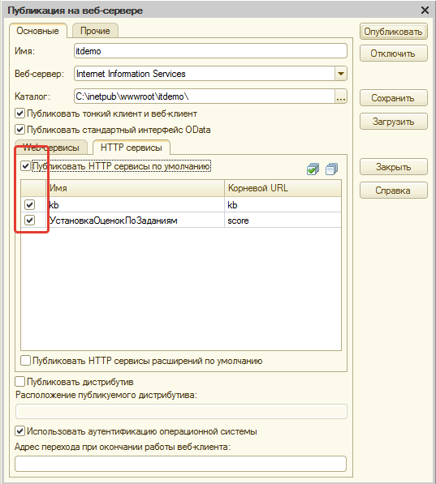

# Публикация на сервере - IIS

## Установка IIS в Windows 10.

Для установки веб-сервера в Windows 10 необходимо в «Программы и компоненты» - «Включение или отключение компонентов Windows» установить флажок для «Службы IIS»:

Далее необходимо раскрыть эту ветку и установить флажок напротив «ASP.NET 4.6» (Либо другую версию):

Нажимаем «ОК», ждем окончания установки и перезагружаем компьютер. Для проверки вводим в адресную строку браузера "http://localhost/" и видим страницу приветствия:

Теперь необходимо дать полный доступ для пользователя «IUSR» и группы пользователей «IIS_IUSRS» к папке с ИБ (для файловой базы):

А также к папке с установленной платформой:

Для публикации необходимо открыть ИБ в режиме «Конфигуратор», запущенный от имени администратора:

В меню «Администрирование» необходимо выбрать «Публикация на веб-сервере…»:

Откроется окно публикации ИБ:

На закладке «HTTP сервисы» необходимо проверить, что для публикации выбраны все сервисы:

Нажимаем кнопку «Опубликовать» и если не было ошибок, то система сообщит об успешной публикации ИБ:

На вопрос о перезапуске WEB – сервера отвечаем «Да».  
После публикации ИБ, по адресу «c:\inetpub\wwwroot\» будет создана папка с именем опубликованной ИБ. На неё также необходимо дать полный доступ для пользователя «IUSR» и группы пользователей «IIS_IUSRS»:

Далее необходимо открыть «Диспетчер служб IIS», для чего можно воспользоваться «поиском в Windows»:

Если версия ОС Windows имеет разрядность х64, а платформа 1С используется разрядности x32, тогда идем в «Пул приложений» - дополнительные параметры для «DefaultAppPool»:

И для параметра «Разрешены 32-разрядные приложения» устанавливаем значение «True»:

Если разрядность ОС и платформы 1С совпадают и являются х64, то параметр «Разрешены 32-разрядные приложения» изменять не нужно.

Раскроем ветку «Сайты» - «Default Web Site», найдем наше опубликованное приложение (имя должно совпадать с именем опубликованной ИБ) и откроем «Сопоставление обработчиков»:

Необходимо убедиться, что обработчик «1С Web-service Extension» существует, в противном случае его необходимо создать:

Свойства обработчика:

Разрешения функции:

После внесенных изменений необходимо перезапустить веб сервер:

Для подключения к ИБ в адресной строке браузера необходимо набрать следующее: http://localhost/&lt;ИмяИБ&gt; либо http://ip веб сервера/ИмяИБ, где ИмяИБ – имя, указанное при публикации ИБ:

## Возможные ошибки

### Ошибка HTTP 500.0 Internal Server Error  
Возможна проблема с дополнительным параметром "Разрешены 32-разрядные приложения". Если платформа 1С 64-битная, то эта настройка должна быть установлена в False.

### Ошибка веб-сервера
При подключении к базе не отображаются картинки и выдается ошибка:

Для решения данной ошибки, перейдите в службы IIS -> Пулы приложений -> ПКМ по DefaultAppPool -> Дополнительные параметры, и установите параметр "Режим управляемого конвейера" на "Classic"

