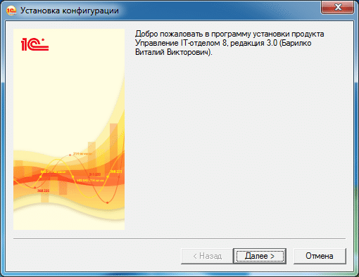
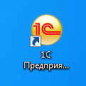
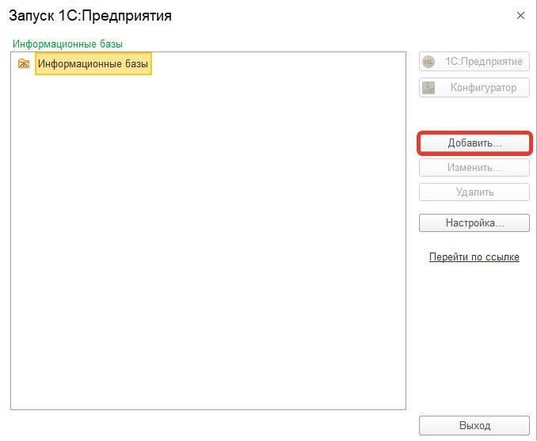
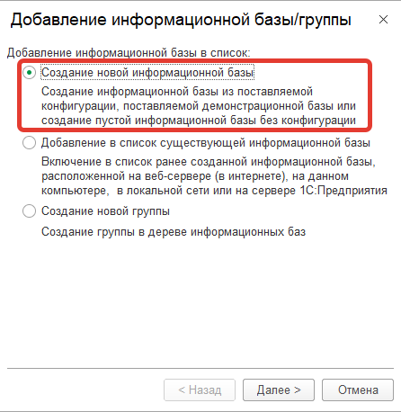
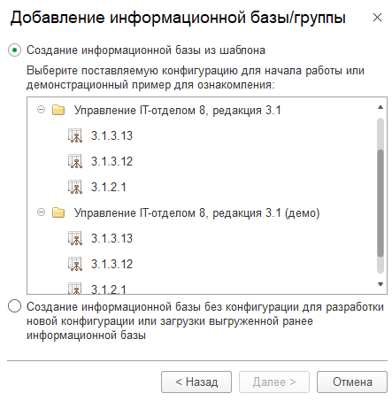
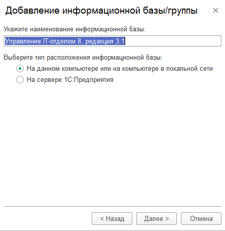
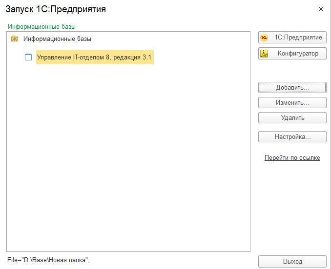

# Установка конфигурации

Для установки конфигурации необходимо иметь платформу `1С:Предприятие 8.3.21.1302` и выше, а так же клиентские лицензии на использование платформы.
Обладателям клиент-серверного варианта 1С:Предприятия необходимы так же ключи на сервер. Если у Вас все это имеется и настроено, то приступим.

Скачиваем архив с дистрибутивом, который был передан Вам по ссылке в электронном письме после покупки. Распаковываем архив в папку.
В результате распаковки будем иметь два файла `setup.exe` и `1cv8.efd`. **Запускаем `setup.exe`**

Нажимаем **"Далее"**, затем снова **"Далее"** и **"Готово"**. На этом этапе мы установили шаблон, по которому 1С создаст для нас конфигурацию. Запускаем 1С:Предприятие. Т.е. платформу, как правило, она находится на рабочем столе или в меню Windows.

Откроется окно, в котором необходимо нажать на кнопку **"Добавить"**:

Далее откроется окно, в котором необходимо выбрать "**Создание новой информационной базы"**:

После этого шага откроется окно, в котором необходимо выбрать какую версию установить. Есть два варианта: пустая, для начала работы или с демо-данными для демонстрации возможностей.

Станем на строку для начала работы и щелкнем на кнопку **"Далее"**.

Назовем конфигурацию как мы хотим и выберем тип расположения информационной базы. Если у вас нет сервера 1С:Предприятия, т.е. клиент-серверного варианта 1С, то выберите первый пункт.

На следующем этапе можем выбрать, в какой папке будет храниться информационная база (для клиент-серверного варианта необходимо указать сервер и имя информационной базы в кластере). После выбора папки, нажимаем **"Далее"** и **"Готово"**.

В результате, в списке информационных баз появится новый пункт:  

Запускаем конфигурацию в режиме 1С:Предприятие. Конфигурация практически установлена, осталось лишь активировать ее тем ключом, который был выслан Вам вместе с дистрибутивом в электронном письме.

[Инструкция по активации конфигурации.](https://softonit.ru/FAQ/courses/?COURSE_ID=1&CHAPTER_ID=0582&LESSON_PATH=1.2.582)