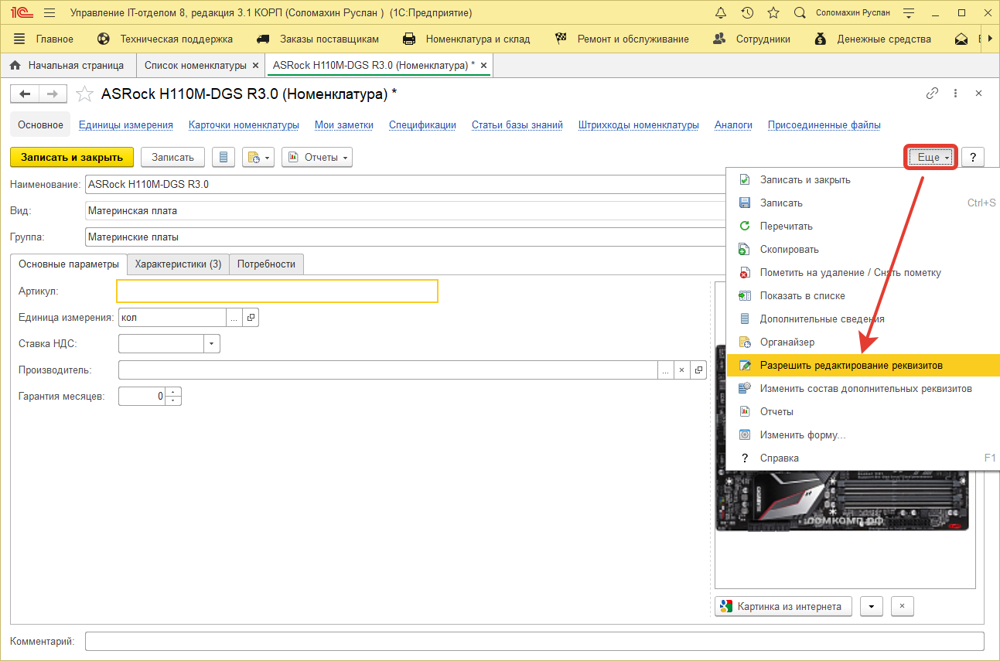

# Как изменить вид номенклатуры в справочнике номенклатуры?

Для изменения некоторых реквизитов уже существующей номенклатуры, например, вид номенклатуры, необходимо открыть карточку номенклатуры и нажать в меню кнопку "Еще > Разрешить редактирование реквизитов", после этого нажмите на кнопку "Проверить и разрешить". Далее все реквизиты станут доступными.

**Список необходимых ролей для работы.**
* [x] Добавление и изменение номенклатуры;
