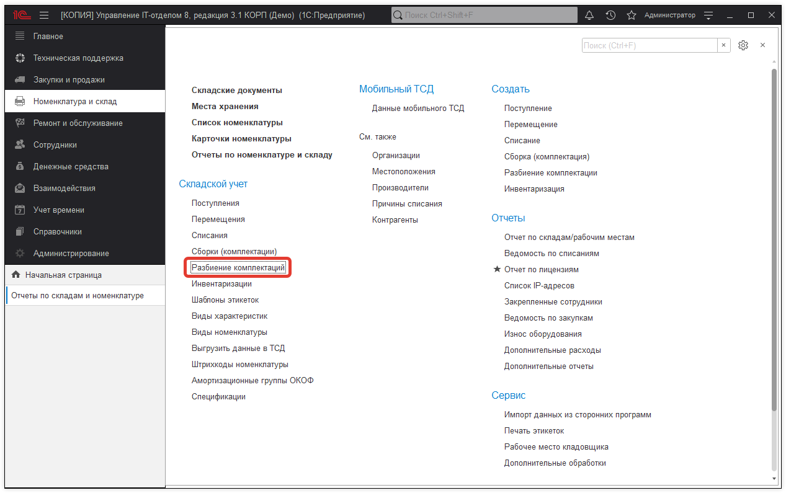
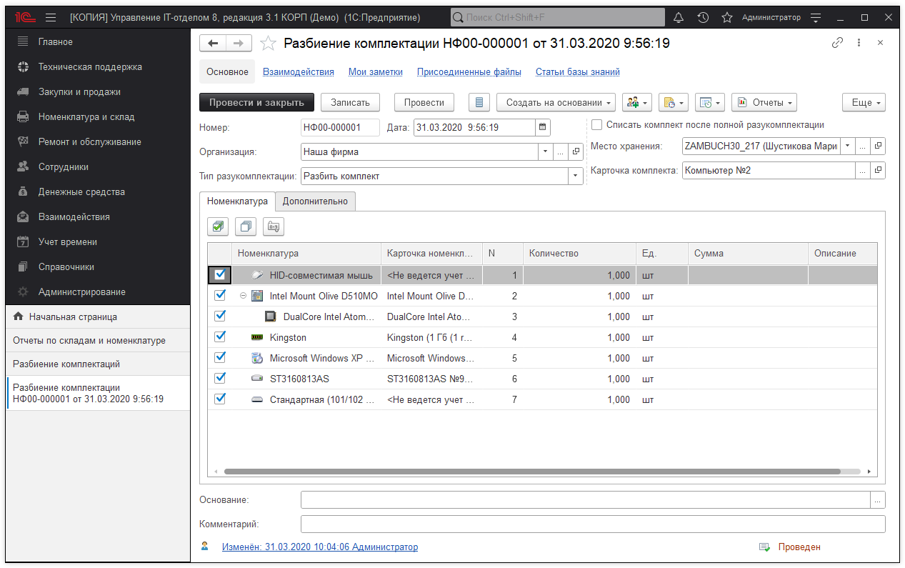

# Как разобрать комплект?

Для того, чтобы разобрать комплект нужно открыть документ "Разбиение комплектации".

Далее нужно заполнить документ. Выбрать организацию и место хранения, где хранится комплект. Особое внимание следует уделить реквизиту документа "Тип разукомплектации". Если в документе "Сборка" не установлена галочка "Объединить все строки верхнего уровня в комплекты", тогда в документе "Разбиение комплектаций", в "Тип разукомплектаций" нужно установить значение "Разбить объединенные комплектующие". При установленной галочке, следует выбирать значение "Разбить комплект". После этого выбрать карточку комплекта, которую нужно разбить.

После этого комплект будет разобран.

**Список необходимых ролей для работы.**
* [x] Добавление и изменение номенклатуры;
* [x] Добавление и изменение складских документов;
* [x] Чтение складских документов.