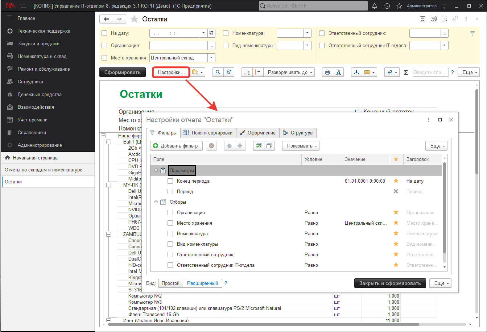
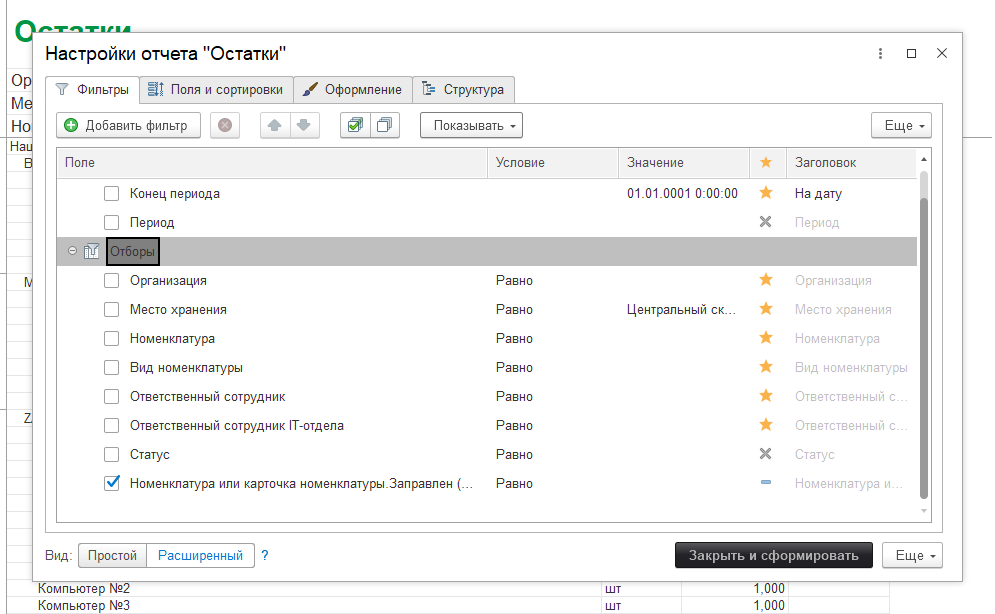
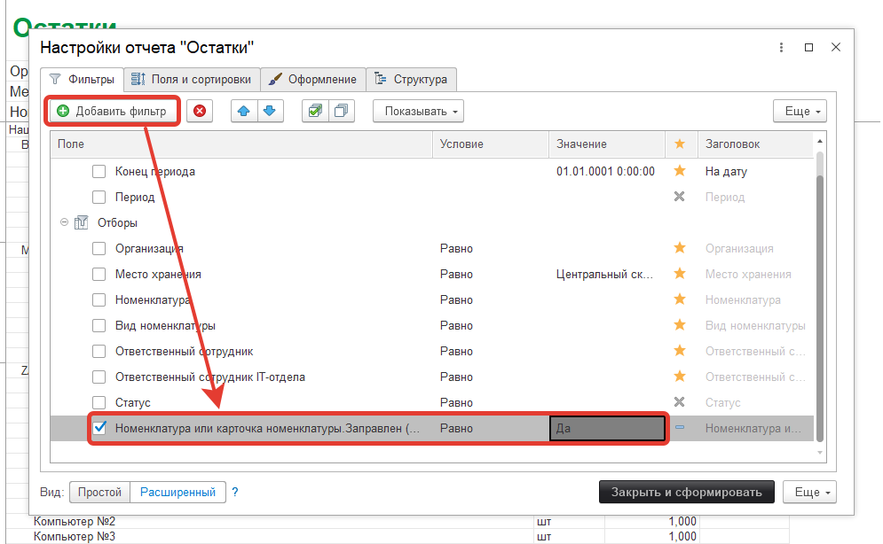
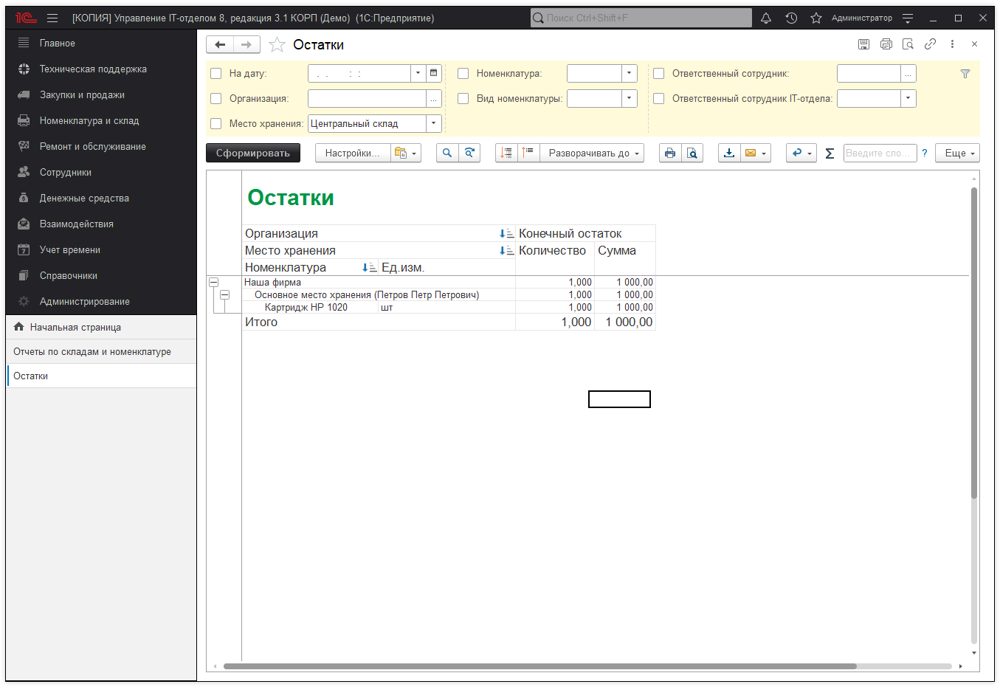

Отчет по заданным характеристикам номенклатуры 
В конфигурации есть возможность формировать отчет по остаткам только по заданной характеристике номенклатуры. Это нужно, когда хочется увидеть, сколько той или иной номенклатуры есть в организации с заданными характеристиками.

Покажем, на примере, как узнать сколько в организации есть заправленных картриджей.

Для этих целей возьмем отчет "Отчет по складам/рабочим местам" и изменим вариант отчета:

При открытии перейдем на закладку "Фильтры":

При нажатии "Добавить фильтр" откроется окно с доступными отборами. Найдем интересующую нас характеристику - для этого в поле введем "Заправлен" (характеристика карточки):

Добавим ее в отбор справа и выберем нужную характеристику "Да". После этого завершим редактирование и сформируем отчет заново. Получим отчет по характеристикам:

**Список необходимых ролей для работы.**
* [x] Добавление и изменение вариантов отчетов;
* [x] Добавление и изменение личных вариантов отчетов;
* [x] Использование универсального отчета;
* [x] Чтение вариантов отчетов.
