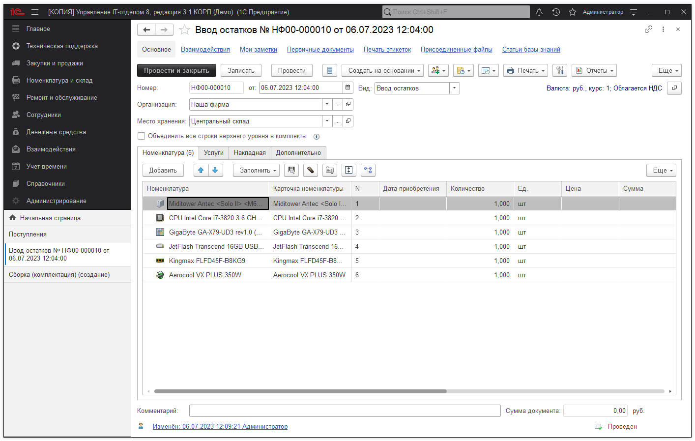
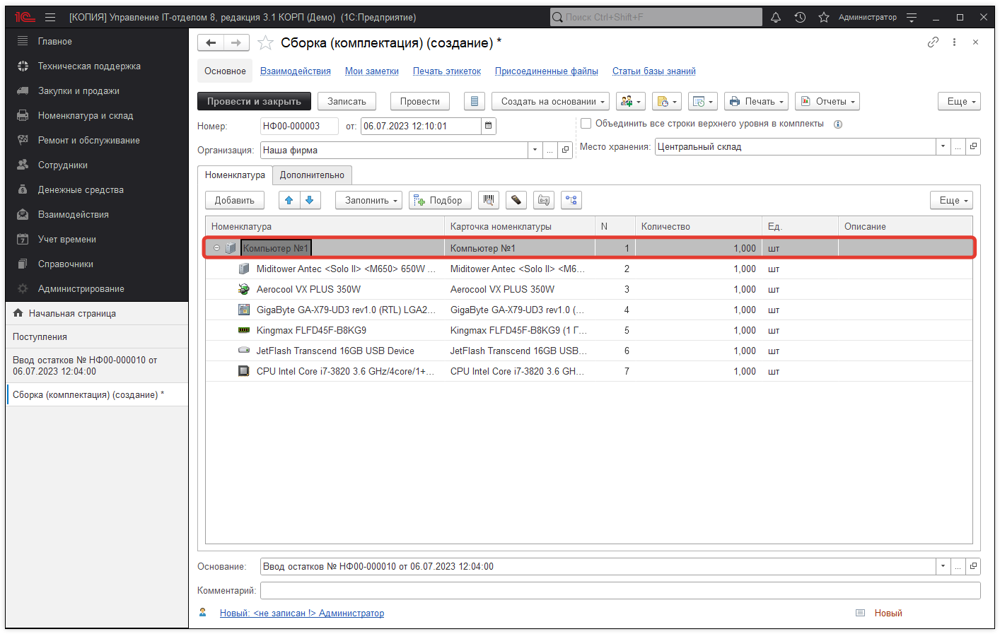
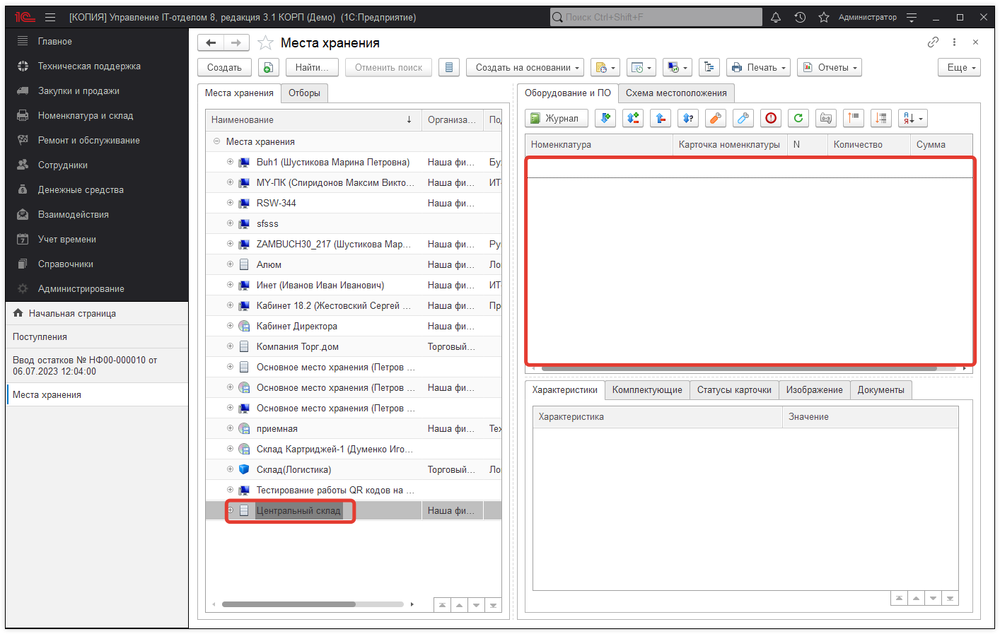
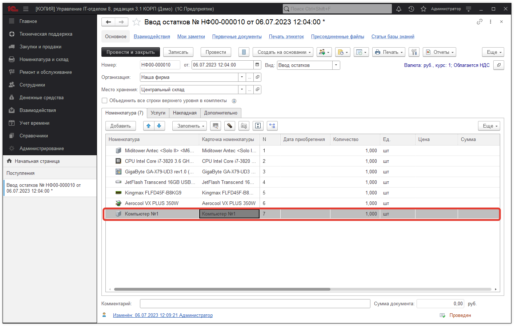
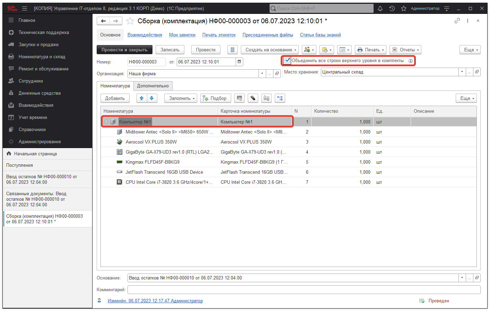
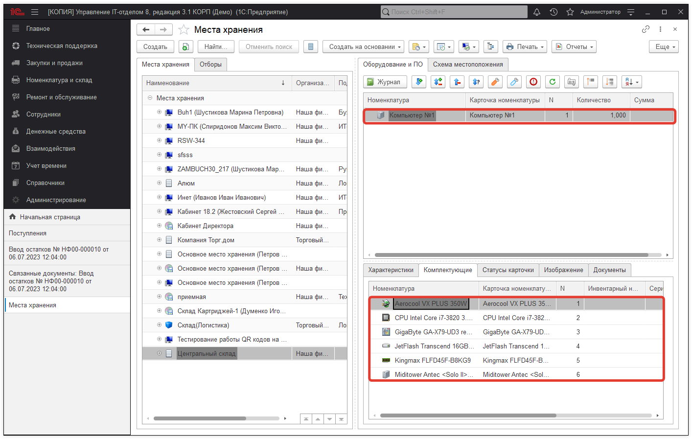
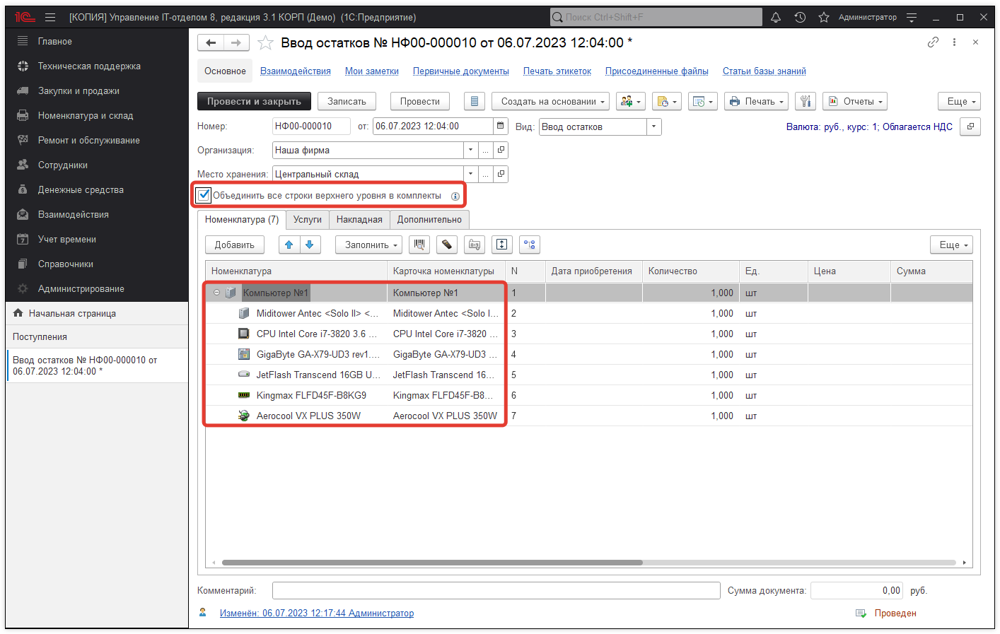

# После сборки комплекта, комплектация не отображается на месте хранения

Часто возникает вопрос: "Почему после сборки комплектации, номенклатура пропадает на месте хранения"? Ответ довольно прост, чтобы избежать данной ситуации, необходимо оприходовать номенклатуру верхнего уровня. Например, у нас есть документ "Поступление" в котором есть комплектующие для сборки компьютера.

На следующем шаге, мы создадим документ **"Сборка"**, в котором соберем комплект. Обратите внимание, что номенклатура верхнего уровня, а именно ***"Компьютер №1 "*** не был оприходован.

В этом случае, вся номенклатура оприходованная документом "Поступление" пропадет с места хранения.

Если же номенклатуру "Компьютер №1" оприходовать вместе со всей номенклатурой, тогда номенклатура не пропадет.

Перепроведем документ "Сборка".

Результатом будет место хранения с созданным комплектом.

Так же, если не оприходовать номенклатуру верхнего уровня и создать комплект, он не будет отображаться в отборах.
Обратите внимание, что если комплектующие для сборки компьютера оприходуются одним документом "Поступление", собрать комплект можно сразу, без использования документа **"Сборка"**.

Ссылка на [видеоинструкцию](https://youtu.be/XB2BHl5eRBU)

