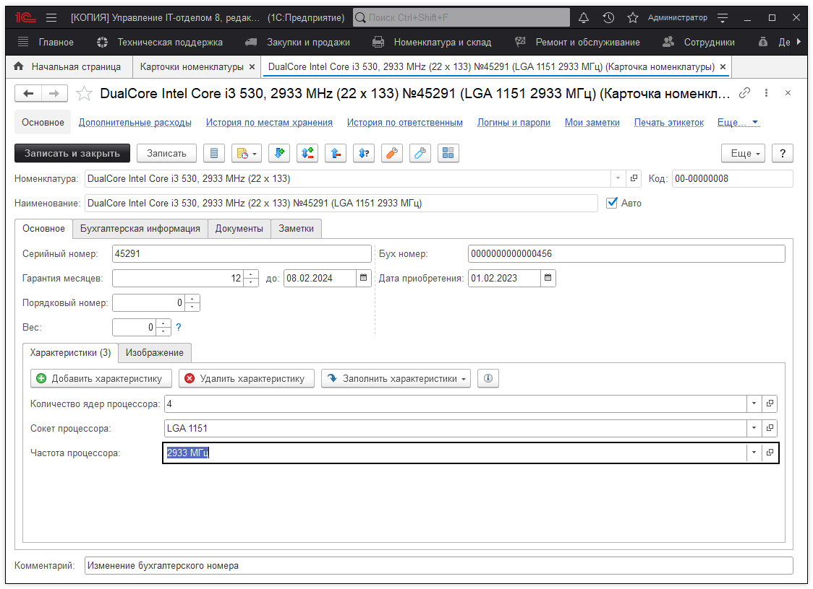

# Карточка номенклатуры

Карточка номенклатуры наряду с самой номенклатурой является одним из главных элементов конфигурации. Карточка имеет владельца - номенклатуру. Одна номенклатура может являться родителем для нескольких карточек. Например, номенклатура "Intel Core i3-9350KF BOX". а дочерние карточки "Intel Core i3-9350KF BOX №1", "Intel Core i3-9350KF BOX №2" ... *(Номенклатура > Карточки номенклатуры)*

Из карточки можно посмотреть всю информацию об оборудовании: серийный и инвентарный номер, бухгалтерскую информацию, когда купили, состояния карточки (ремонты), все документы, где карточка использовалась, штрихкоды, характеристики. Наименование карточки, строится автоматически по формуле, которая задается в настройках конфигурации.