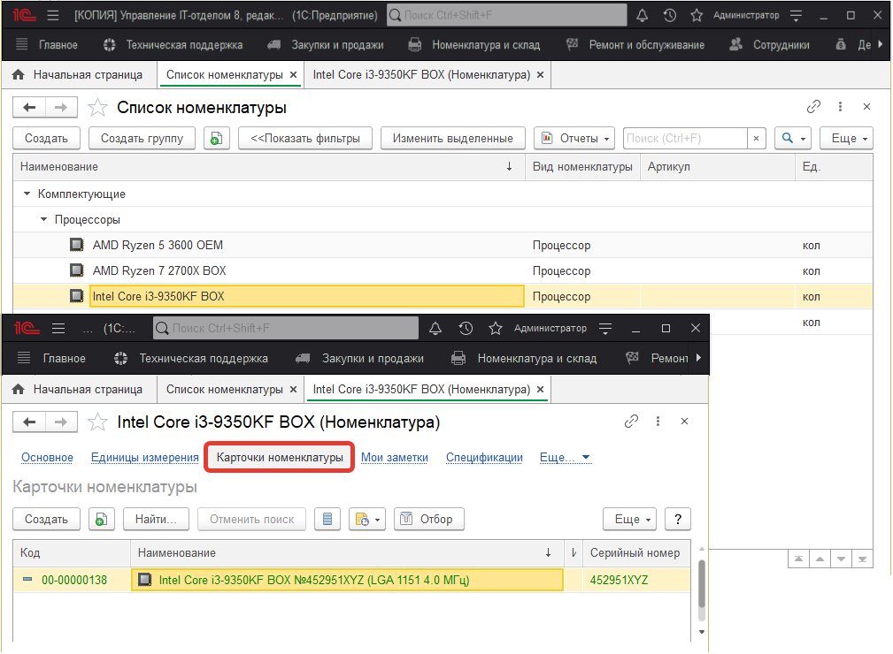
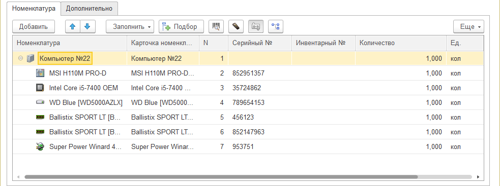

# Концепция комплектов и комплектующих

Хотелось бы начать вот с чего. Все мы прекрасно знаем, что компьютерная техника состоит из разных составляющих - комплектующих. Комплекты - это объекты, которые состоят из комплектующих, причем комплекты могут быть, как виртуальными (рабочее место, системный блок и т.д.), так и вполне конкретными (серверный шкаф, принтер и т.д.).

Рассмотрим и приведем примеры, как это реализовано в конфигурации.
В нашем решении есть два понятия: *номенклатура и карточка номенклатуры*. Вы можете спросить: зачем два справочника, если комплектующая у нас одна? Резонный вопрос.

Дело в том, что зачастую мы хотим увидеть, где была та или иная номенклатура, где она стояла, ремонтировалась ли, имеет ли инвентарный номер и т.д. Но также, у нас много однотипной информации: одинаковые принтеры, мониторы, системные блоки, материнские платы. Если все это вести отдельно, в одном справочнике, то через некоторое время мы получим в номенклатуре кашу из одинаковых названий и невозможно будет нормально сориентироваться в этом. Этот этап нами пройден в далеком 2009 году... Тогда мы придумали концепцию, которая актуальна по сегодняшний день.

Было разделено все на 2 справочника: номенклатура и карточки номенклатуры. В номенклатуре содержится модель комплектующей, а в карточке, сама комплектующая с инвентарными номерами, историей и т.д.

***Чтобы было понятно приведу, пример:***
Номенклатура: ВАЗ 2107
Карточка номенклатуры ВАЗ 2107 А123АА

При этом в документах, выбирая номенклатуру (определенную модель комплектующей или комплекта), мы выбираем карточку, но выбираем не из всего списка карточек, а с отбором по данной номенклатуре:

Все достаточно просто и не запутано.

Как уже было сказано выше: комплекты - это объекты, которые состоят из комплектующих. В конфигурации с ними работать так же просто. На рисунке, который указан выше комплектом является "Компьютер №22" в нем содержатся другие комплектующие. Для того, чтобы внести комплектующую в комплект, необходимо мышкой перетащить комплектующую. Не все объекты могут содержать комплектующие, но об этом мы поговорим позже.

Так же в конфигурации есть возможность [не вести учет по карточкам](https://softonit.ru/FAQ/courses/?COURSE_ID=1&LESSON_ID=665) . Это актуально для некоторого вида спец. комплектующих и расходных материалов. Например: сетевой кабель, мышки, клавиатуры и т.д. Информация о том, где была та или иная мышка, нам зачастую не нужна.