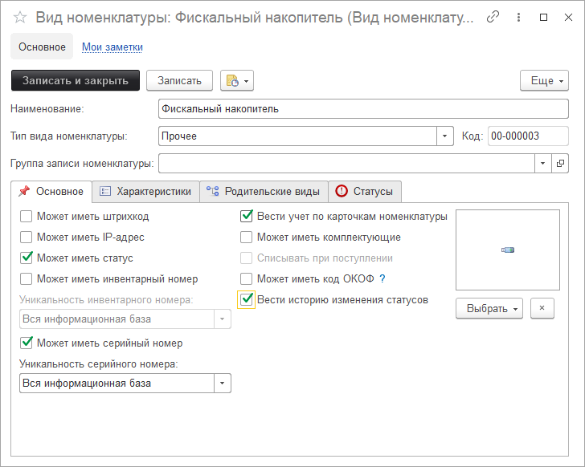

# Статусы карточек номенклатуры

**Статусы карточек номенклатуры**- это механизм, который позволит каждой карточке назначать свой статус, отображать этот статус в форме мест хранения, при просмотре статусов, а так же возможность вести историю изменения статусов.  

**Для чего это нужно?**

Есть такие карточки, по которым статус вести обязательно, пример, ведение учета фискальных накопителей.
У фискального накопителя, может быть несколько статусов, например, таких: не активизирован, активизирован, активизирован (осталось менее месяца), архив закрыт.
Исходя из этого мы можем назначить каждой карточке этого вида номенклатуры свой статус.
Для начала работы создадим вид номенклатуры для статусов карточек:

Обратите внимание, при активации галочки "Может иметь статус" появляется вкладка "Статусы".

Для карточек номенклатуры с этим видом, будет возможность работать с указанными статусами в виде номенклатуры.
Приведем карточку:

А теперь вкладка статусы:

Ну и как эта карточка выглядит в справочнике "Места хранения":

Таким образом статусы позволяют вести учет карточек в каком-то состоянии в определенный момент времени.
Также конфигурация позволит вам автоматически менять статусы, для этого необходимо использовать правила событий.