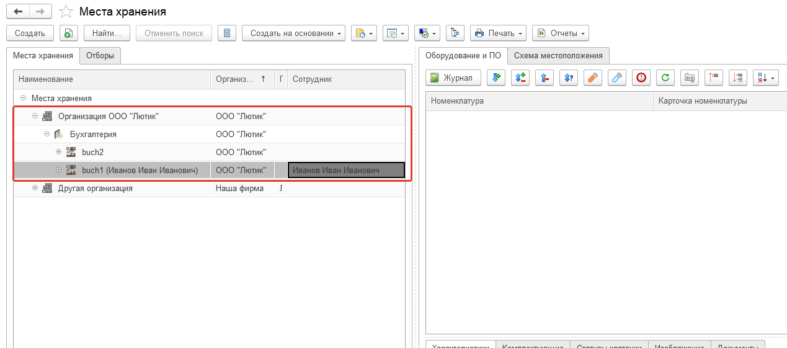
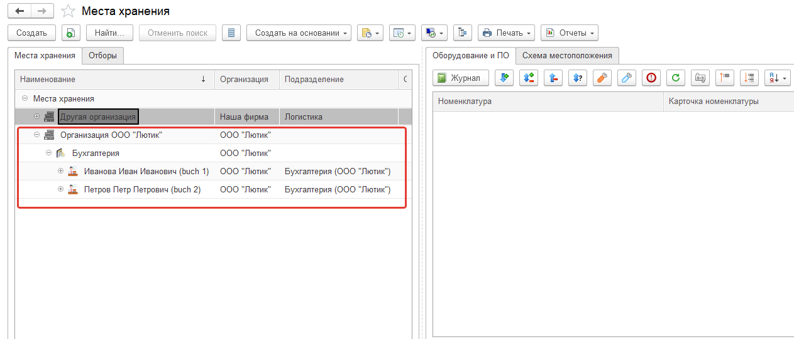
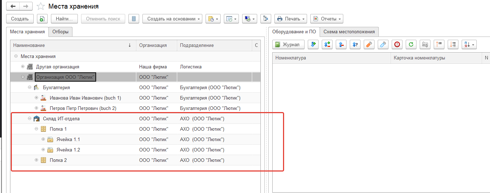

# Концепция именования мест хранения

В нашей конфигурации оборудование "привязывается" к месту хранения, а за этим местом хранения закреплен сотрудник. Т.е. в конфигурации реализована связь:

**Оборудование ⇔ Место хранения ⇔ Сотрудник.**

Есть две схемы именования, придуманные нами и наиболее оптимальные с точки зрения простоты и удобства.
«Номенклатура и склад - Места хранения»

## 1. Обезличенная

Создаем место хранения buch1 в организационной структуре мест хранения. Для создания структуры можно перетащить место хранения в другое место хранения, и оно станет подчиненным. Это удобно если хочется раскидать всех по кабинетам, этажам и т.д.
Т.е. в дереве складов будет что-то типа.


```
Организация, ООО
--Бухгалтерия
----buch1
----buch2
```

Далее открываем закладку сотрудники на рабочем столе, создаем новый документ "Закрепление сотрудников" и привязываем место хранения buch1 к Иванову. Теперь в отчетах у нас фигурирует Иванов.  
При увольнении Иванова, не забываем создать новый документ "Снятие закрепление сотрудников".  
Такая схема хороша тем, что места хранения "обезличены", т.е. грубо говоря, сотрудники увольняются, но место хранения остается, а затем новому сотруднику назначается это место хранения и все.



## 2. По сотрудникам

Т.е. структура будет, примерно такая:


```
Организация, ООО
--Бухгалтерия
----Иванов Иван Иванович (buch1)
----Петров Петр Петрович (buch2)
```

Эта схема удобна тем, что можно не привязывать сотрудников. Из наименования места хранения и так понятно у кого находится оборудование. Но тогда, при увольнении оборудование надо куда-то перемещать с этих мест хранения, а затем не забывать выдать его новому сотруднику.



Какую схему выберите Вы, это уже Ваш выбор.

Так же поддерживается иерархия мест хранения. Т.е. одно место хранения может содержать несколько других, например:


```
Склад ИТ-отдела
--Полка 1
----Ячейка 1.1
----Ячейка 1.2
--Полка 2
```



При первоначальной настройке конфигурации следует уделить этому шагу время и для себя выбрать схему, которая Вам подходит и распределить вложенность мест хранения.
