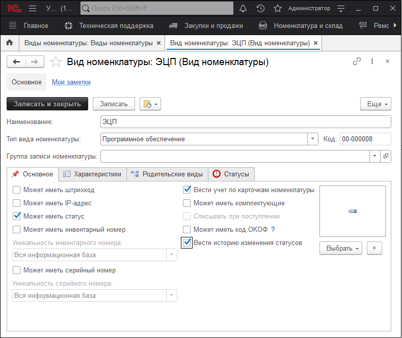
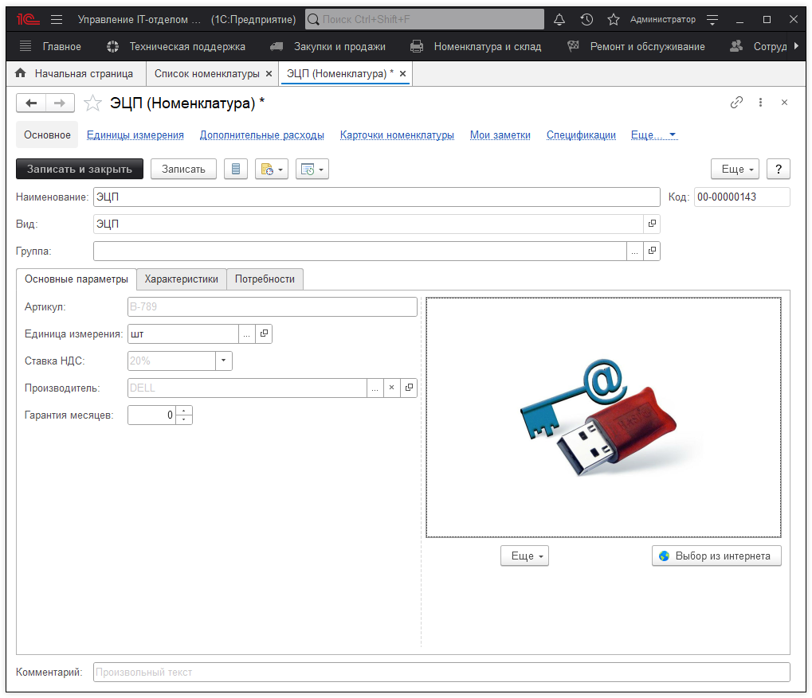
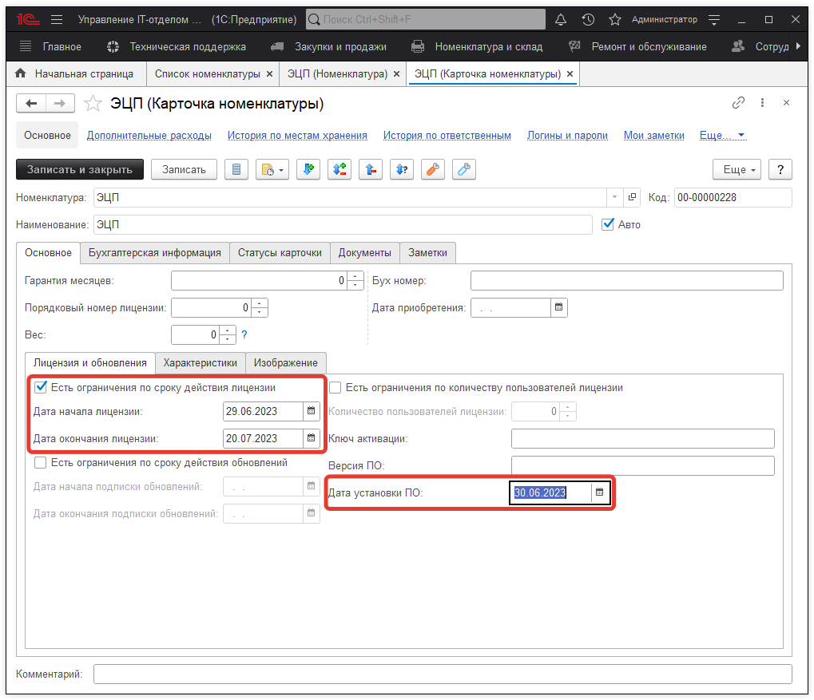
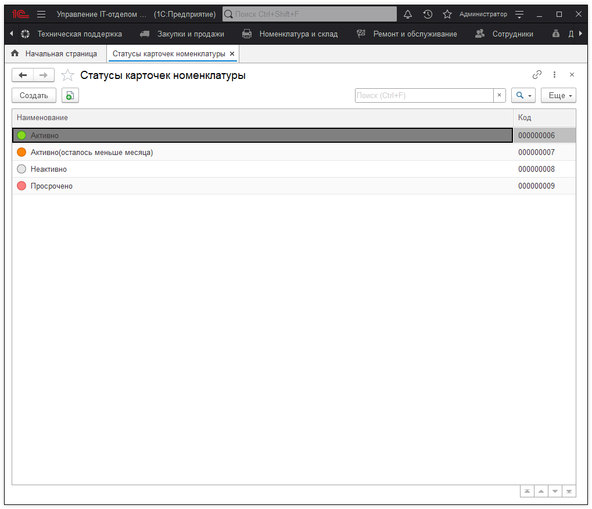
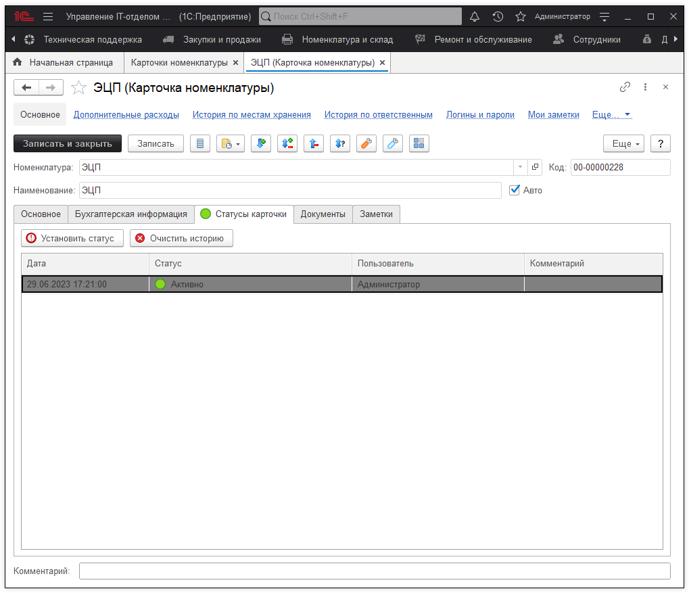
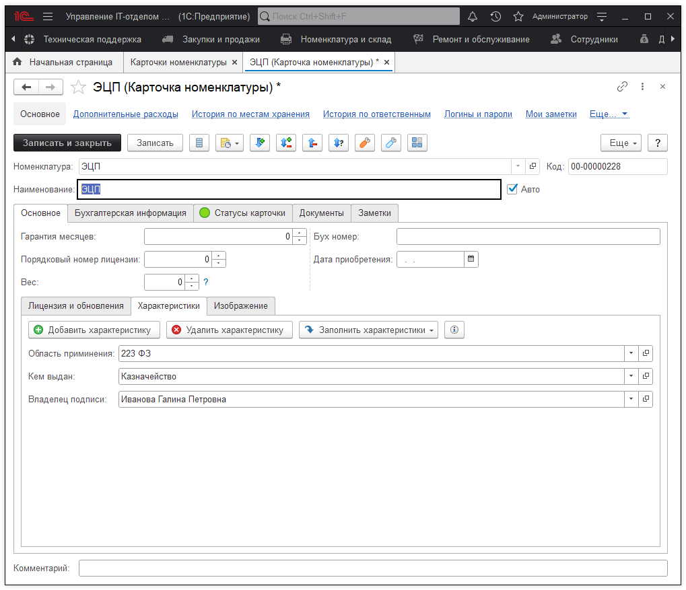
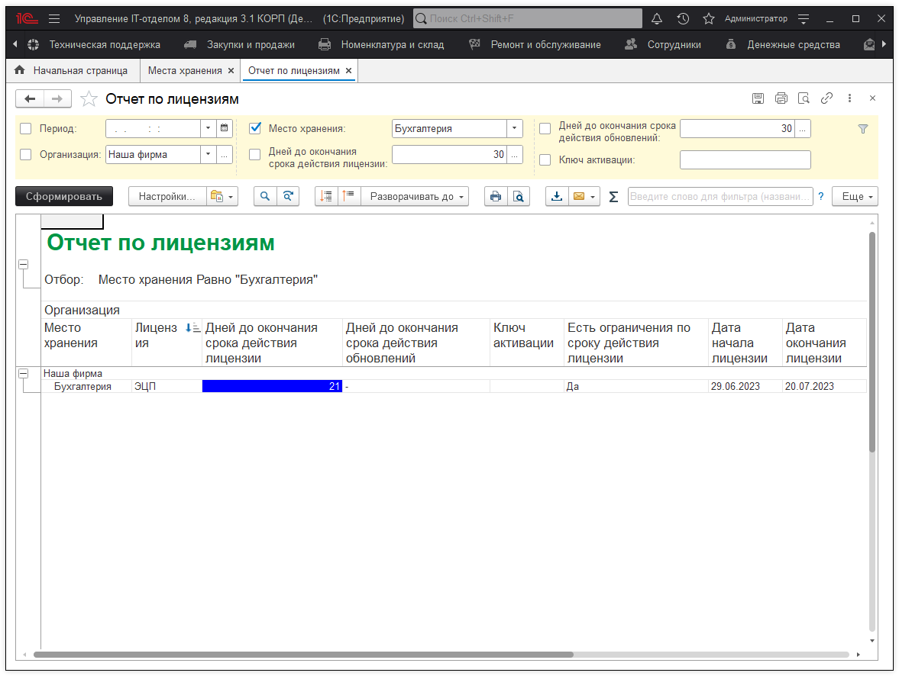
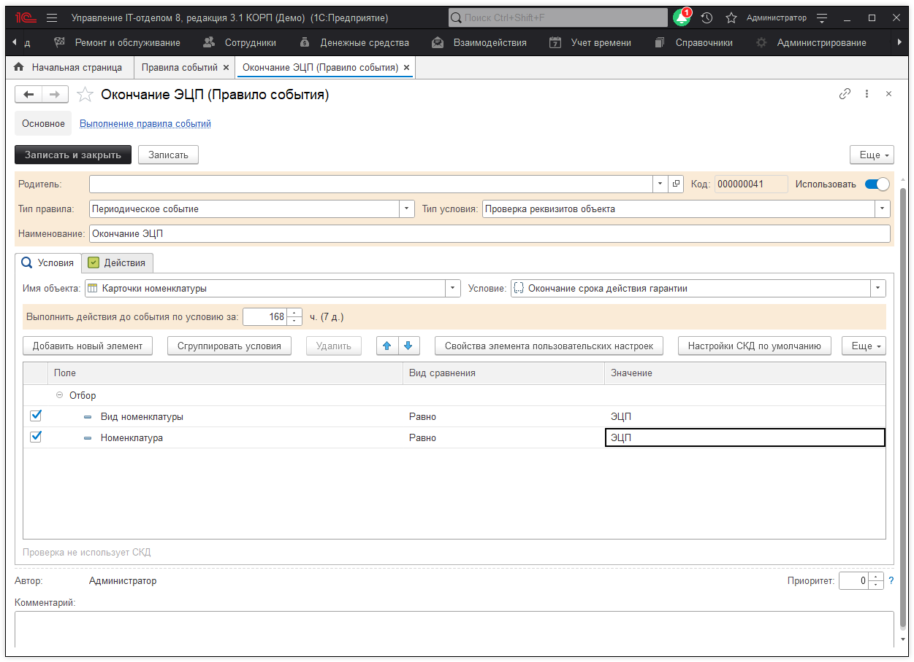

# Как контролировать сроки действия электронных цифровых подписей (ЭЦП)

В большинстве организаций использование ЭЦП (электронно-цифровая подпись) стало неотъемлемой частью работы. Соответственно возникает потребность во введении учета данной номенклатуры, что естественно возможно реализовать в нашей конфигурации. Перед тем, как приступить к рассмотрению практического примера. Давайте определим список важных параметров, которые необходимо контролировать при ведении учета: 

* [x] Срок действия;
* [x] Кем выдан;
* [x] Владелец подписи;
* [x] Область применения.

Теперь давайте приступим. Первое, что необходимо сделать, это создать новый вид номенклатуры, перейдем в раздел *«Номенклатура и склад» -> «Виды номенклатуры»*. Так как наиболее важный параметр, это срок действия ЭЦП, то тип вида номенклатуры выбираем «Программное обеспечение». Данный тип позволит вести контроль сроков действия электронной подписи. Также, чтобы появилась возможность отслеживать ее статус (активно, неактивно, просрочено и т.д.) необходимо отметить чек-бокс **«Может иметь статус»** и **«Вести историю изменения статусов»**, при этом данный вид номенклатуры должен вести учет по карточкам. В результате должно получиться следующее:

Следующим шагом будет создание новой номенклатуры с видом «ЭЦП» в разделе «Номенклатура и склад».

Далее нужно создать карточку номенклатуры. В поле «Номенклатура» указываем новую номенклатуру «ЭЦП», на закладке «Лицензия и обновления» устанавливаем чек-бокс «Есть ограничения по сроку действия лицензии». После чего, становятся доступные поля для указания срока действия нашей электронно-цифровой подписи. Также можем указать реквизит «Дату установки ПО», если нам необходимо учитывать дату установки данного ключа.

Так как мы хотим отслеживать в каком состоянии (т.е. активна или просрочена) данная подпись, тогда перейдем к созданию статусов. В разделе «Справочники» откроем справочник «Статусы карточек номенклатуры» и нажмем кнопку «Создать». Вводим наименование статуса, например, «Активно» и выбираем из набора картинку для данного статуса. Таким образом создаем весь необходимый список статусов для учета ЭЦП. В результате получаем список, состоящий из активно, активно (осталось меньше месяца), неактивно, просрочено. Благодаря этим статусам легко определить в каком состоянии на текущий момент находится подпись. Например, активно (осталось меньше месяца) говорит о том, что пора бы заняться продлением данной подписи, ведь скоро заканчивается срок ее действия. 

После того, как все статусы готовы, возвращаемся в карточку ЭЦП и переходим на вкладку «Статусы карточки». Где с помощью кнопки «Установить статус» установим актуальный на текущий момент статус (активно) для этой электронной подписи. В дальнейшем этот статус следует изменять вручную.

И так, на данный момент мы настроили отслеживание срока действия подписи, теперь необходимо добавить дополнительные параметры. Все также в карточки ЭЦП открываем вкладку «Характеристики» и нажимаем кнопку «Добавить характеристику».  Откроется список предопределенных видов характеристик. Так как по умолчанию характеристики для электронной подписи не предусмотрены их нужно создать. В списке видов характеристик создаем параметры: кем выдан, владелец подписи, область применения. 

В результате проделанных действий, оприходовав данную номенклатуру, будем видеть на месте хранение статус подписи, а также дополнительные характеристики для учета.

С помощью специального отчета «Отчет по лицензиям» можем быстро определить, где установлена та или иная электронная подпись. Увидеть сколько дней осталось до окончания срока действия. При чем за 30 дней до окончания действия, соответствующее поле будет подсвечиваться синим цветом, красным если до окончания действия остается меньше 10 дней. 

Используя правила событий, настроим оповещение на электронную почту, которое сообщало бы нам, что до окончания срока действия электронной подписи осталось 7 дней. Для этого создадим новое правило событий с типом **«Периодическое событие»**. В реквизите **«Имя объекта»** укажем справочник **«Карточки номенклатуры»**, а в условие **«Окончание срока действия лицензии»**. В поле «Выполнить действия до события по условию за» укажем значение 168 часов (7 дней), также в отборах у вида номенклатуры выберем вид «ЭЦП». Далее добавим новое действие, которое будет отправлять оповещения. В результате за семь дней до окончания срока действия электронной подписи мы получим оповещение на электронную почту. Аналогично можно настроить отправку SMS на телефон.

Таким образом осуществляется контроль сроков действия электронно-цифровых подписей (ЭЦП) в конфигурации.
