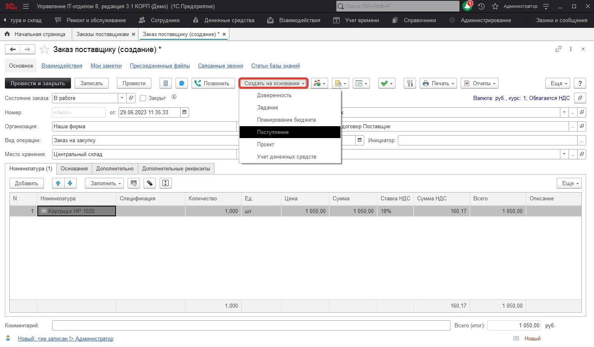
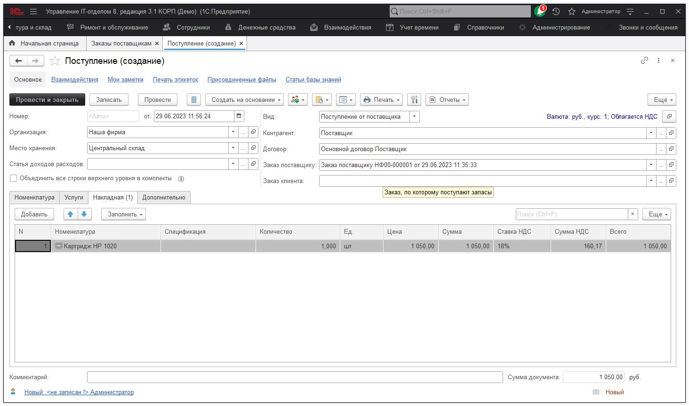
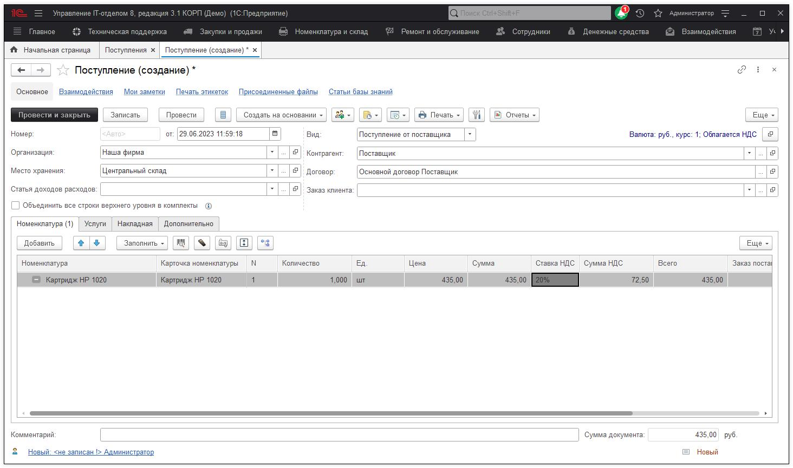

# Как указать для картриджей заправлен он, или нет?

***В процессе ведения учета возникает много вопросов по учету картриджей:***

- А как на складе узнать, что картридж заправленный или нет (сколько пустых сколько заправленных картриджей)?  
- Есть ли у картриджей статус какой-то заправлен или нет?  
- Чтоб допустим при отборе можно было сразу видеть какой пустой?  

Мы предлагаем следующий вариант ведения учета, который, по нашему мнению является самым простым для конечного пользователя.

Вам необходимо для картриджей сделать отдельные места хранения следующей структуры:

И перемещать картриджи, документом [Перемещение](https://softonit.ru/FAQ/courses/?COURSE_ID=1&LESSON_ID=55) из одного места хранения "Заправленные картриджи" в другое "НЕ заправленные картриджи", если картридж стал не заправленным, и, наоборот, если не заправленный картридж - заправили.  

Вместе с тем, Вы всегда сможете узнать общее число картриджей сформировав отчет по остаткам по месту хранения "Картриджи", который объединяет как заправленные, так и не заправленные. Вот настройки для отчета для просмотра всех картриджей:

Сформировав, по месту хранения "Заправленные картриджи" увидим только то, что есть в наличии заправленное и наоборот.

Это что касается картриджей, которые есть в наличии IT-отдела на складе в запасе и на заправке.

**Список, необходимых ролей для работы .**
* [x] Добавление и изменение операций по сотрудникам;
* [x] Чтение сотрудников.
