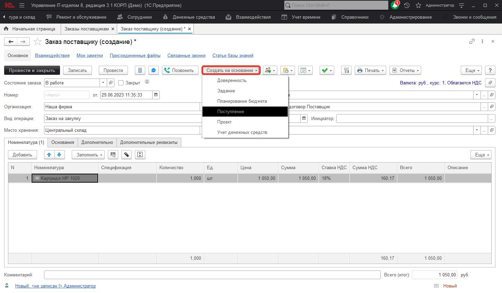
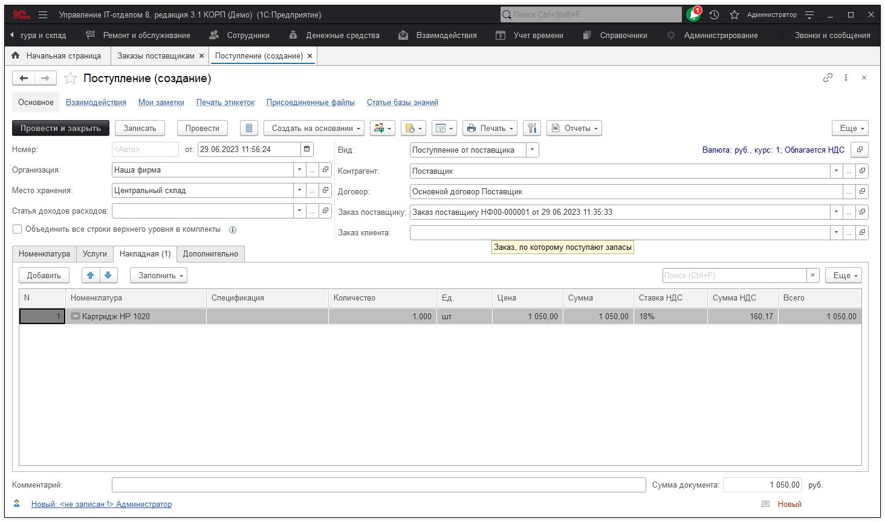
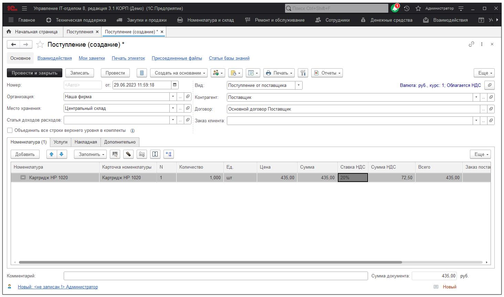

# Методика учета картриджей

В нашем решении - конфигурации Управление IT-отделом 8, можно вести учет картриджей. Рассмотрим каждый пункт по порядку.

## 1. Покупка картриджей

При покупке картриджей, с точки зрения учета, не меняется ничего. Мы аналогично делаем те же документы, как если бы мы покупали что-то другое. Делаем документ "Заказ поставщику", на его основании вводим "Поступление". 

Если покупка без заказа, то "Поступление" делаем сразу *(Номенклатура и склад > Поступления)*.

В результате данного действия на складе "Центральный склад" на остатке появится данный картридж.

## 2. Перемещение картриджей

Тут возможны варианты. Если картридж просто перемещается на новое место хранения без установки в принтер(копир), то мы делаем обычный документ "Перемещение" и перемещаем его на новое место хранения. В таком случае не будет комплектации с принтером. Если же мы хотим установить картридж в принтер, нам необходимо создать документ "Окончание обслуживания".

Если рассмотреть на примере, то пусть картридж, который изображен выше на рисунке мы хотим поставить в принтер, который находится в месте хранения "Рабочее место(касса)". В таком случае заполним документ *(Ремонт и обслуживание > Окончание обслуживания )*.

Заполним место хранения "Рабочее место(касса)" (где будет стоять принтер). Место хранения со склада "Центральный склад" (откуда будем брать Картридж). Реквизит "Обслуживание" равен "Внутреннее обслуживание произведено сразу" (т.е. собственными силами).

Потом подбором добавим принтер "KYOCERA Ecosys M223Dn" на вкладке "Номенклатура". Затем нажмем на кнопку "Установить со склада" и выбрали картридж, после вставки в документ перенесем его внутрь принтера. Получим следующее:

При проведении данного документа картридж будет списан с "Места хранения со склада" и установлен, как комплектующая по отношению к принтеру.

На этом заправка картриджа собственными силами завершена.

## 3. Ведение подсчета заправок картриджей

Данный пункт не обязателен, но возможность вести учет количества заправок возможен. Для этого воспользуйтесь документом (Ремонт и обслуживание > Изменение показателей оборудования)   ["Изменение показателей оборудования"](https://softonit.ru/FAQ/courses/?COURSE_ID=1&LESSON_ID=77)

С его помощью можно вести учет числовых показателей оборудования, таких как: количество заправок картриджей, количество отпечатанных листов и т.д. Т.е. это какой то числовой показатель, который будет накапливается со временем. Для просмотра сколько всего раз был заправлен картридж воспользуйтесь отчетом " Показатели оборудования "

## 4. Списание картриджей.

Списание картриджей ничем не отличается от обычного списания оборудования. Воспользуйтесь документом "Списание".

## 5. Замена картриджа, который установлен в принтере (пустой) на другой, который находится на складе (заправленный)

Данная операция похожа на то, что описано в п.2. Единственное изменение, мы так же заполняем реквизит "Место хранения со склада" (куда отправить после смены пустой картридж). И добавляем подбором в документ пустой картридж с событием "Со склада". Получаем следующее:

В рисунке, который приведен, верхний картридж пустой и был установлен в принтере, мы его перемещаем на "Место хранения на склад" (вкладка Дополнительно). Указывая событие "На склад". Новый картридж добавляем, нажав на кнопку "Установить со клада", событие "Со склада".

## 6. Картридж заправляет подрядная организация.

Если заправкой занимается другой контрагент, то все, что указано выше необходимо повторить, единственное отличие - это необходимо изменить реквизит обслуживание на "Обслуживание контрагентом", или "Обслуживание контрагентом произведено сразу" .

## 7. Увеличиваем количество заправок картриджа (не обязательно).

Если вы ведете учет количества заправок картриджей, то Вам необходимо создать документ ["Изменение показателей оборудования"](https://softonit.ru/FAQ/courses/?COURSE_ID=1&LESSON_ID=77), в которому указать в поле значение "1", которая соответствует одной заправке картриджа. В дальнейшем если вести учет количества заправок можно проанализировать сколько раз заправлялся картридж.

**Список необходимых ролей для работы.**
* [x] Добавление и изменение складских документов;
* [x] Чтение складских документов;
* [x] Добавление и изменение обслуживания и ремонтов;
* [x] Чтение обслуживания ремонтов.