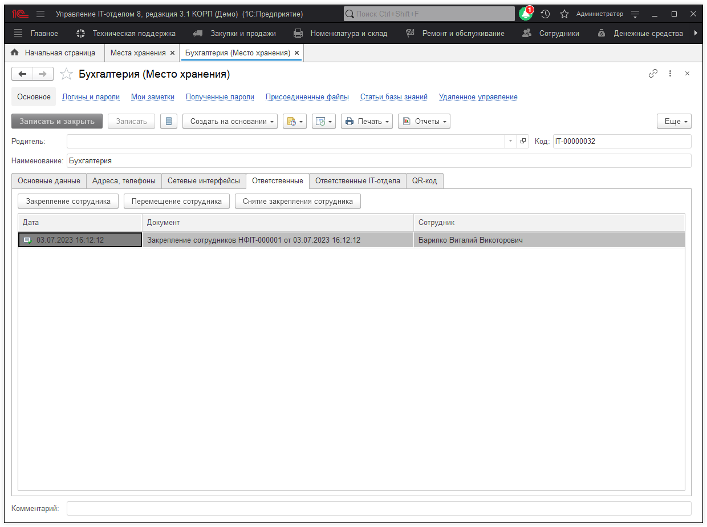
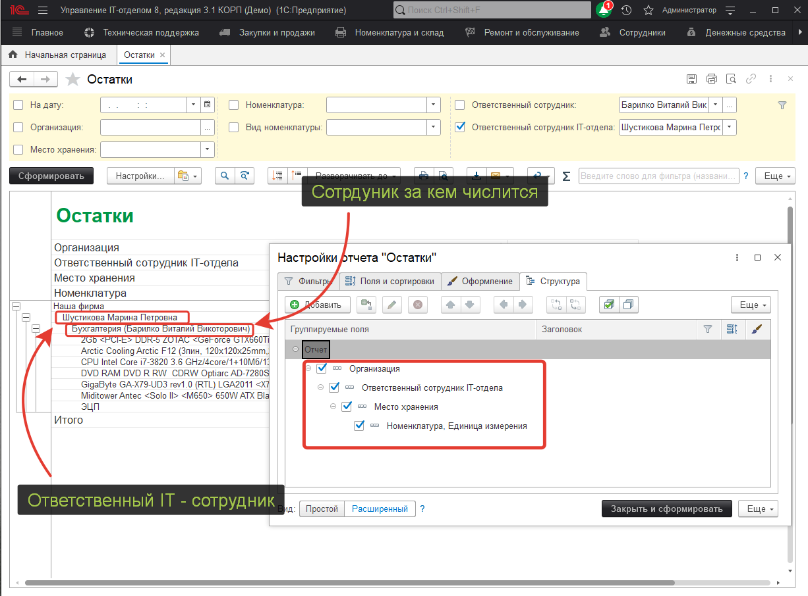

# Ответственное хранение у закрепленного сотрудника и сотрудника IT

Итак, все оборудование, как мы выяснили ранее закрепляется за ответственным сотрудником, кому оно выдается, но как задать и увидеть зоны ответственности сотрудника IT-отдела?
Часто оборудование делят еще и по зонам ответственности сами ИТ-шники. Например, за техником Николаем закрепляется **"Бухгалтерия"** и **"Приемная"**, а техник Сергей отвечает за обслуживание "Отдела продаж". Как быть в таком случае и можно ли так сделать?
Отвечаем: можно!  
Для этого откроем место хранения, которое мы хотим закрепить за сотрудником IT-отдела:  

Как видим тут две вкладки:  
1) Ответственные - это те, кто по факту принимает оборудование на ответственное хранение    
2) Ответственные IT-отдела - те, кто обслуживает со стороны IT-подразделения это рабочее место и это его зона ответственности.  

Понятное дело, если вы хотите закрепить ответственного, это делаете на одной вкладке, если назначить ответственного со стороны IT - на другой.

Следующий вопрос: как посмотреть, все оборудование за которое отвечает IT-шник?
Все так же как и в любом другом случае. Открываем отчет "Отчет по складам/рабочим местам" и настраиваем его:

В этом отчете видно и ответственного со стороны IT-отдела, и материально ответственного лица, а также место хранения.

**Список необходимых ролей для работы.**
* [x] Добавление и изменение операций по сотрудникам;
* [x] Чтение сотрудников.