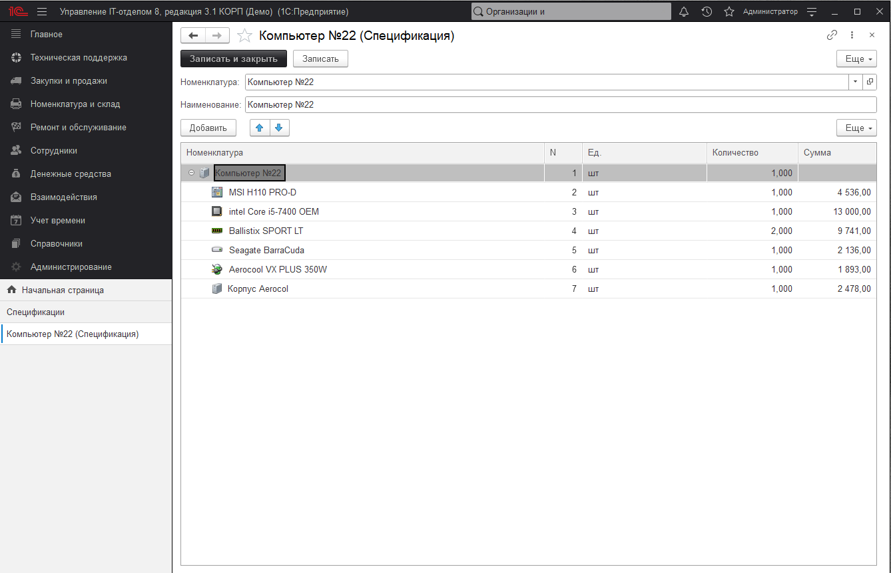
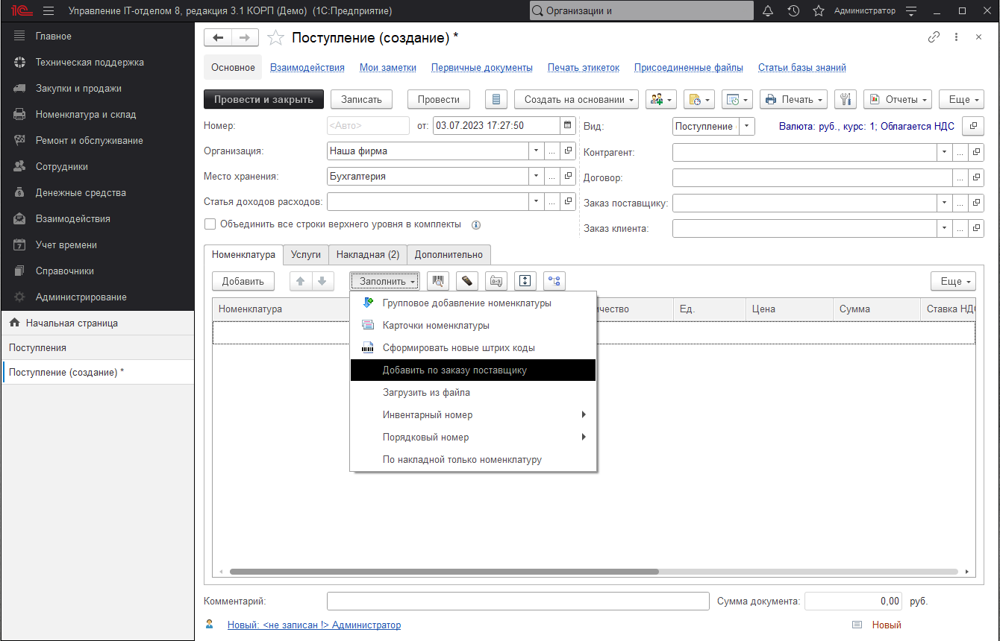
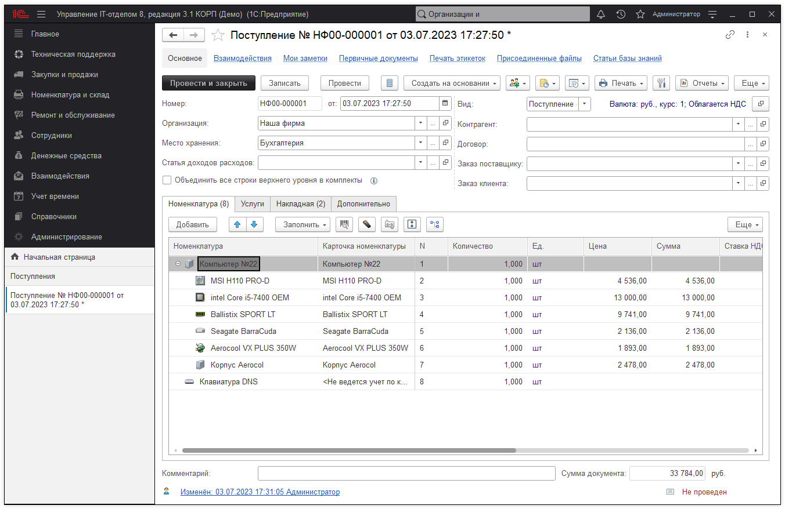
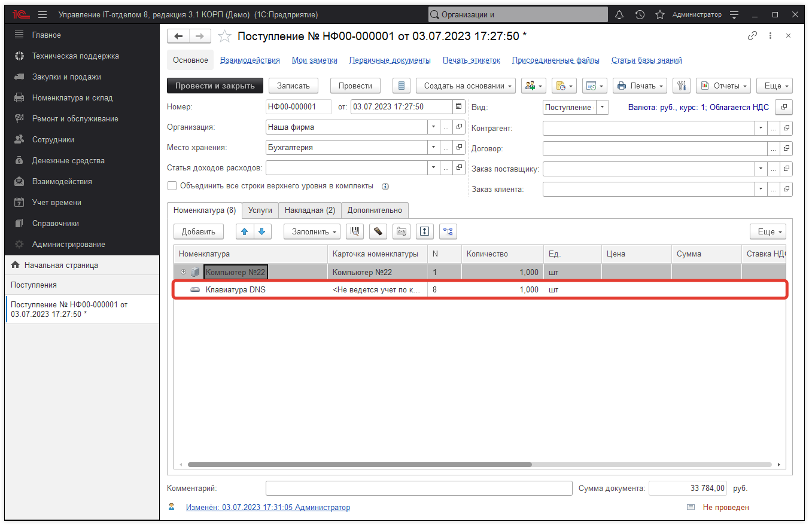

# Работа со спецификациями и накладными

Довольно часто, нужно оприходовать большое количество системных блоков, ноутбуков. Причем необходимо сделать это со всеми комплектующими. Раньше, необходимо было создавать номенклатуру, карточку номенклатуры для каждой позиции, что приводило к значительным временным затратам. Теперь, в конфигурации появилась возможность заполнения документа "Поступления" шаблоном, в котором описана вся необходимая номенклатура. В роли этого шаблона выступает справочник **"Спецификация"**.

В документе "Поступление", на вкладке "Накладная" необходимо заполнить номенклатуру, выбрать спецификацию, по которой будет заполняться табличная часть "Номенклатура". Так же на основании "Накладной" может создаваться номенклатура без спецификации.

После того, как "Накладная" заполнена, нужно выполнить команду **"Заполнить"->"По накладной номенклатуру"**.

Итогом будет дерево номенклатуры, построенное согласно спецификации. 

Номенклатура без спецификации также создается.

Данный механизм существенно упростит внесение большого количества номенклатуры в конфигурацию, а также сократит количество выполняемых действий.

**Список необходимых ролей для работы.**
* [x] Добавление и изменение номенклатуры;
* [x] Добавление и изменение складских документов;
* [x] Чтение складских документов.
