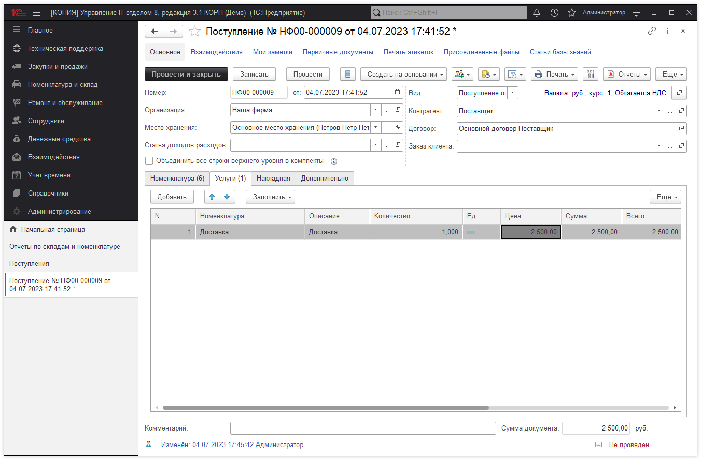
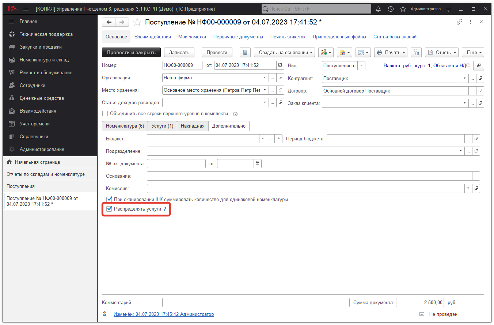
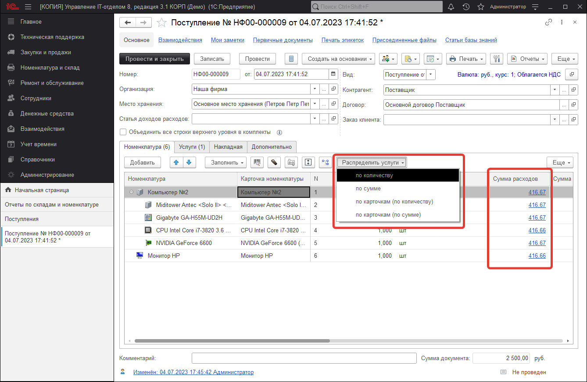
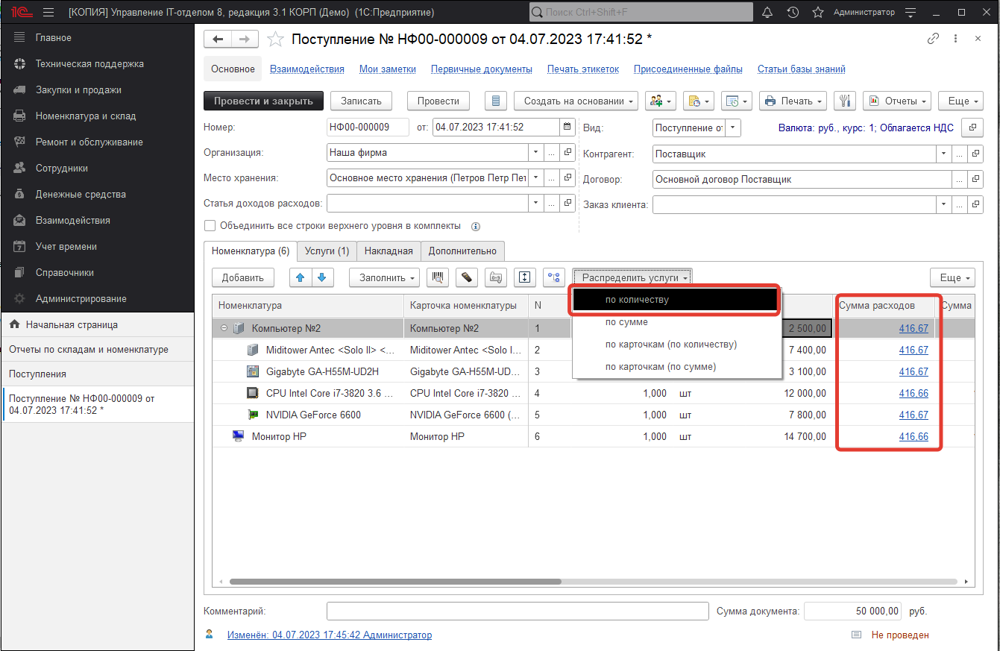
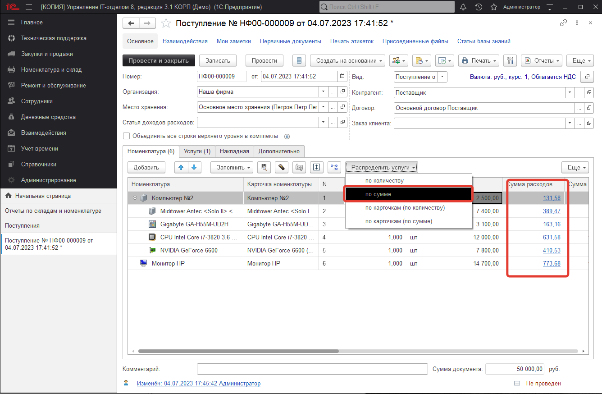
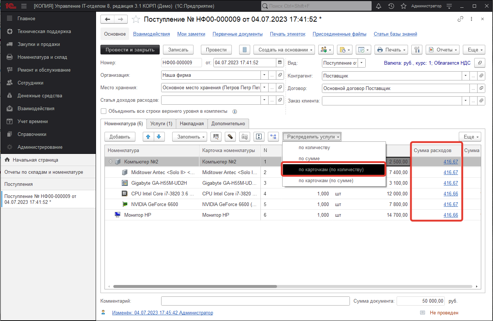
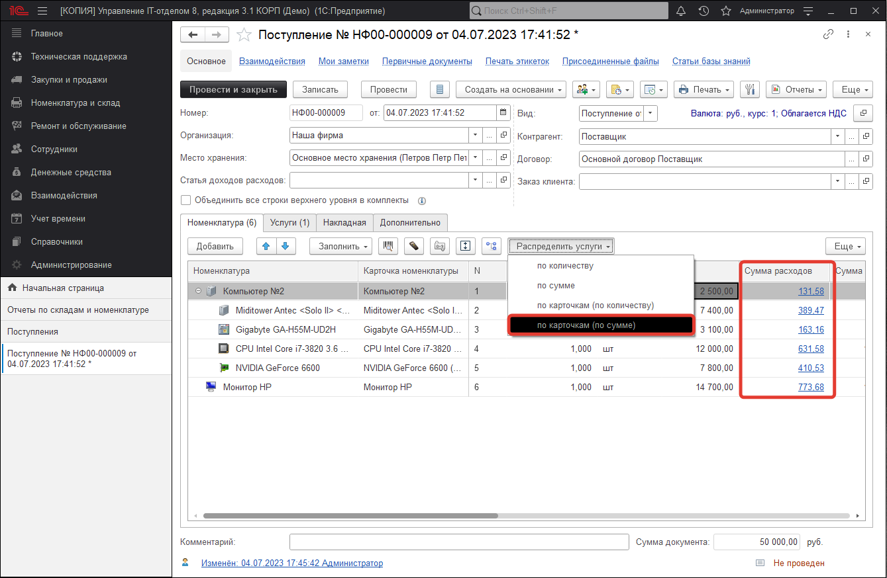
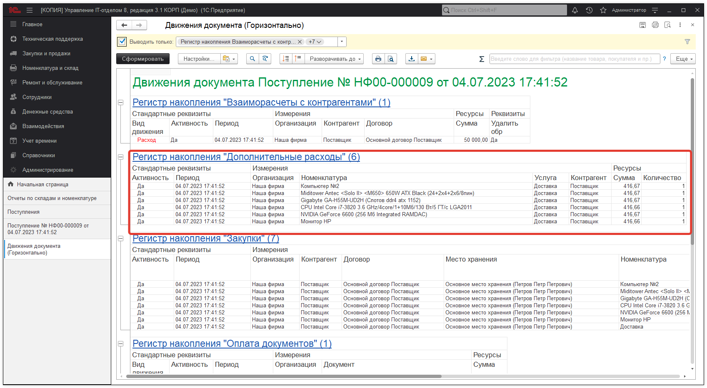
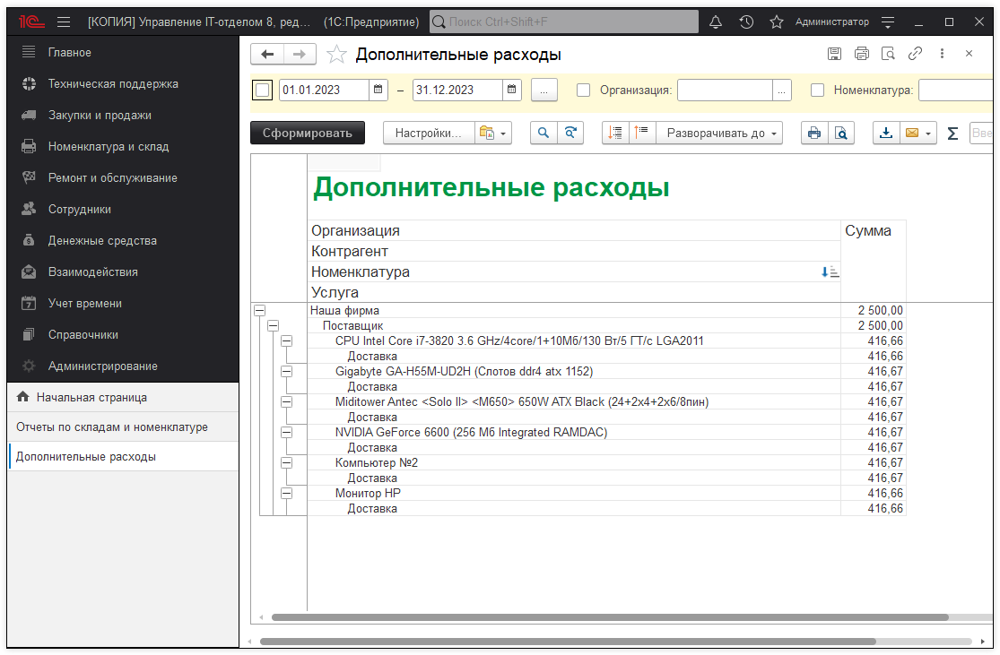
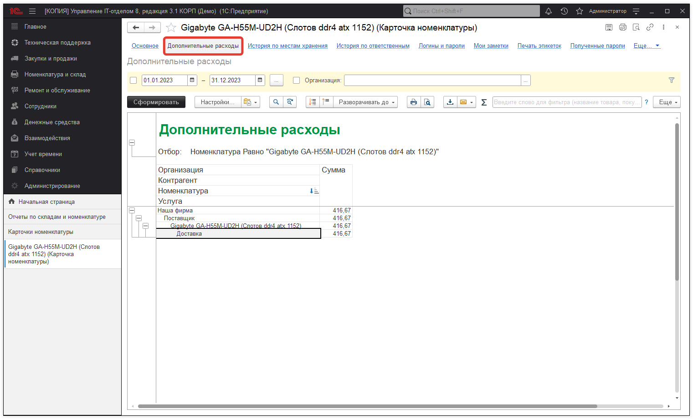

# Учет дополнительных расходов

**Требования:**
* версия программы **3.1.4.5** и выше.

Программа позволяет вести учет дополнительных расходов, а также распределять данные расходы по позициям номенклатуры. Данный механизм доступен для документов **"Поступление", "Начало обслуживания", "Окончание обслуживания"**.

Рассмотрим отражение дополнительных расходов на примере документа **"Поступление"**. Например, при приобретении нового оборудования была оказана дополнительная услуга *"Доставка"* стоимостью 2500 руб.

Для того, чтобы распределить стоимость данной услуги по приобретаемой номенклатуре, необходимо на закладке *"Дополнительно"* установить флаг *"Распределять услуги"*:

После включения этого флага, на закладке "Номенклатура" станет доступна группа команд *"Распределить услуги"* и колонка *"Сумма расходов"*:

Группа команд *"Распределить услуги" *содержит следующие команды:

* ***по количеству*** - при данном способе распределения стоимость услуг будет распределена между номенклатурными позициями пропорционально количеству номенклатуры (см. Рис.4);
* ***по сумме*** - при данном способе распределения стоимость услуг будет распределена между номенклатурными позициями пропорционально стоимости номенклатуры (см. Рис.5);
* ***по карточкам (по количеству)*** - при данном способе распределения стоимость услуг будет распределена только между теми номенклатурными позициями, по которым ведется учет по карточкам, пропорционально количеству номенклатуры (см. Рис.6);
* ***по карточкам (по сумме)*** - при данном способе распределения стоимость услуг будет распределена только между теми номенклатурными позициями, по которым ведется учет по карточкам, пропорционально стоимости номенклатуры (см. Рис.7).

Способ распределения стоимости услуг *"по количеству"*:

Способ распределения стоимости услуг *"по сумме"*:

Способ распределения стоимости услуг *"по карточкам (по количеству)"*:

Способ распределения стоимости услуг *"по карточкам (по сумме)"*:

Стоит также отметить, что заполнение *"Суммы расходов"* возможно и *"вручную"*, программа будет проверять, чтобы общая сумма расходов не превышала стоимости услуг.

После проведения документа откроем отчет по движениям документа *("Еще - Отчеты - Движения документа")* и увидим, что распределенная стоимость услуг отражена в регистре *"Дополнительные расходы"*:

Для просмотра информации о дополнительных расходах предназначен отчет *"Дополнительные расходы"*, который расположен в разделе *"Номенклатура и склад"*.

В формах элементов справочников *"Номенклатура"* и *"Карточки номенклатуры"* с помощью команды *"Дополнительные расходы"* доступен тот же отчет, но уже с отбором по элементу справочника, откуда данный отчет был сформирован:

