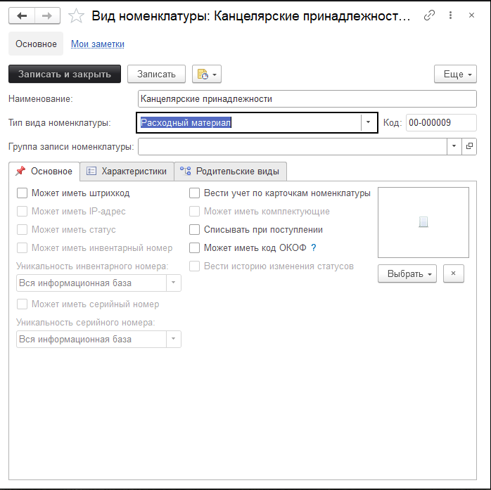
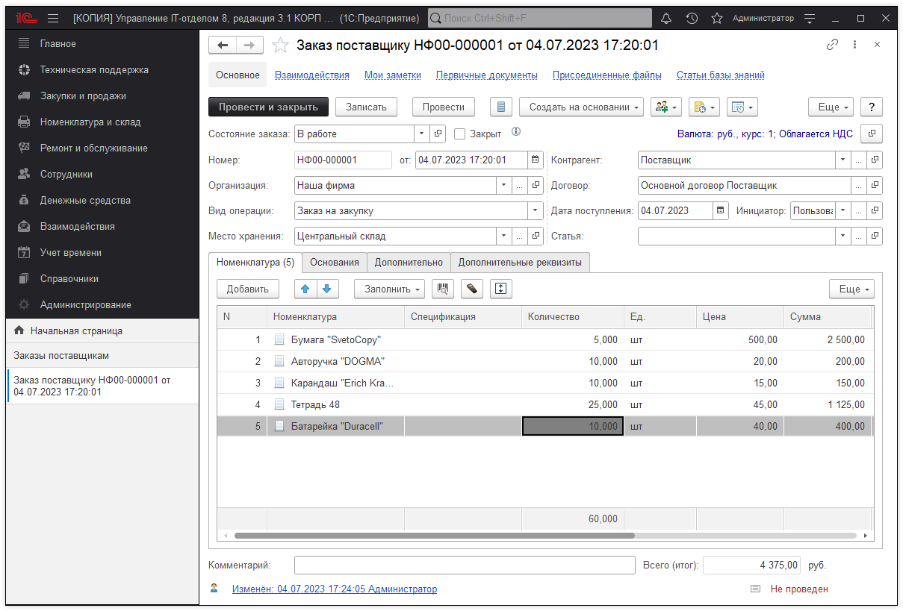
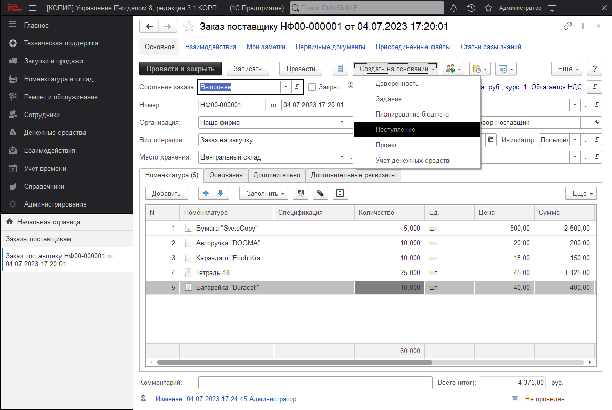
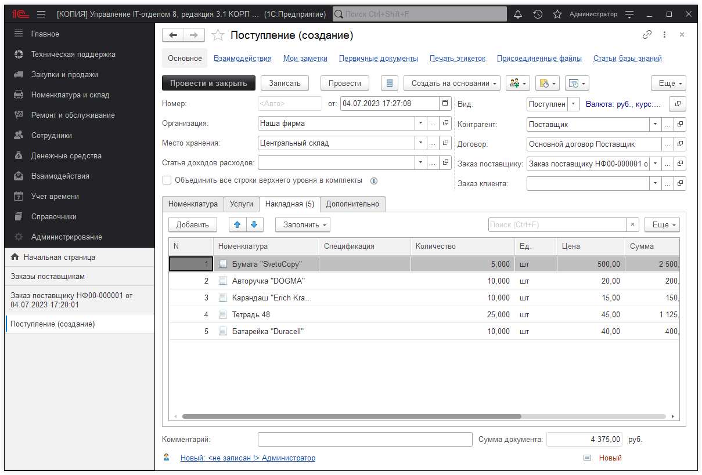
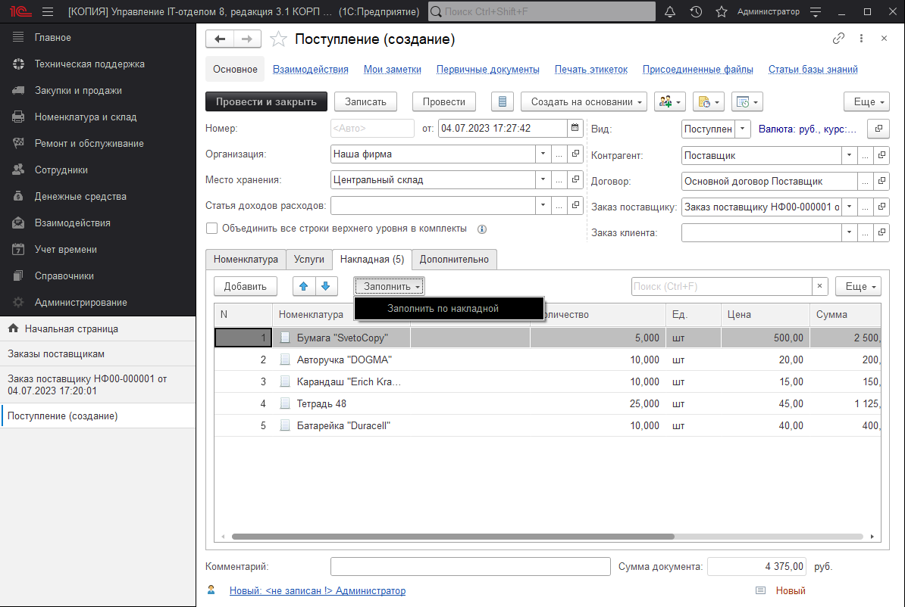
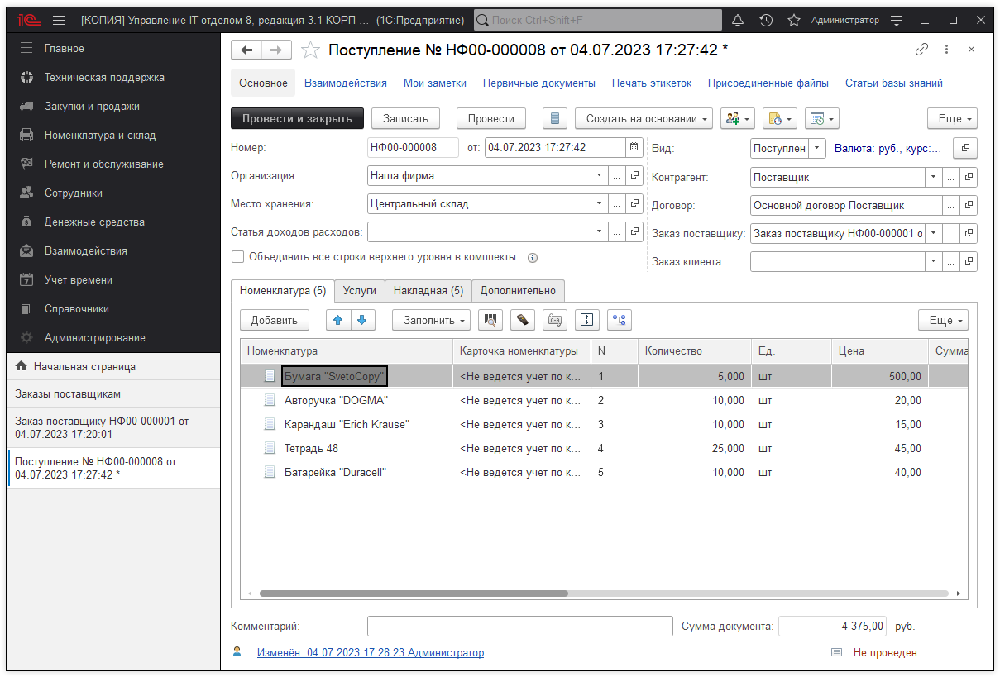
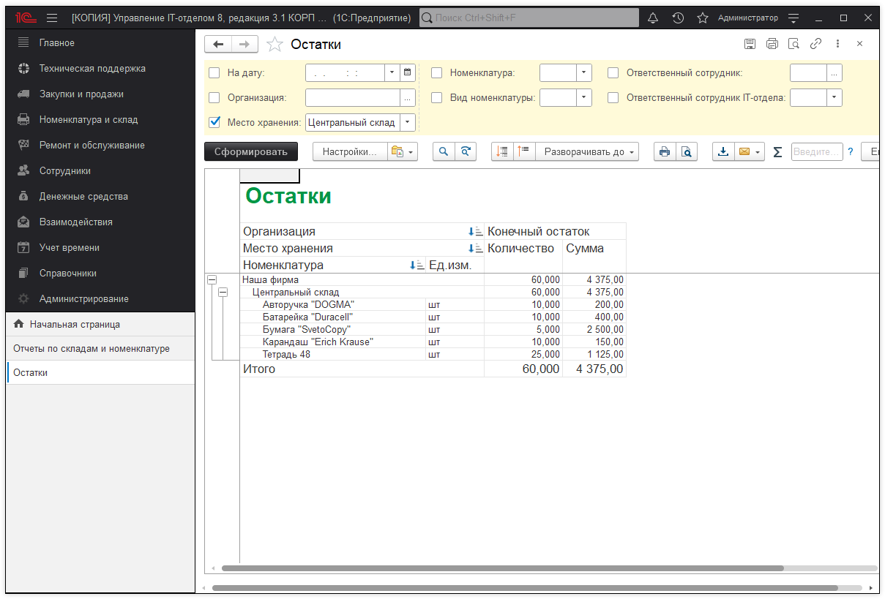

# Учет канцелярских принадлежностей

Учет канцелярских принадлежностей ведется аналогично учету другой номенклатуры. Нужно создать новый вид номенклатуры *(Справочники > Виды номенклатуры)*, указать тип вида номенклатуры **"Расходный материал"**.

!!!
**Важно!** Обратите внимание, что галочка "Вести учет по карточкам номенклатуры" убрана. По канцелярским принадлежностям нам не нужно знать всю историю, где и когда было и у кого, как например, по компьютерным комплектующим. Так как канцелярия - это расходный материал. Снятая галочка позволит менее детализировано вести учет, что нам и нужно.
!!!

Вид номенклатуры создан, можно создавать новый документ "Заказ поставщику", если планируем выполнить заказ, либо документ "Поступление", если номенклатура уже есть в наличии. В примере, пойдём по порядку и создадим "Заказ поставщику".

На основании "Заказа поставщика", создадим документ "Поступление".

Документ создан, заполнилась табличная часть "Накладная".

В накладной можно подкорректировать реквизиты (если требуется) и заполнить табличную часть "Номенклатура".

После проведения, номенклатуру можно увидеть на остатках.

!!!
**Важно!!!** Если документ "Заказ поставщику" не используется, при создании документа "Поступление", табличную часть "Накладная" заполнять НЕ обязательно. Можно заполнять сразу табличную часть "Номенклатура".
!!!

**Список необходимых ролей для работы.**
* [x] Добавление и изменение номенклатуры;
* [x] Добавление и изменение складских документов;
* [x] Добавление и изменение заказов поставщикам;
* [x] Чтение заказов поставщикам;
* [x] Чтение складских документов.

