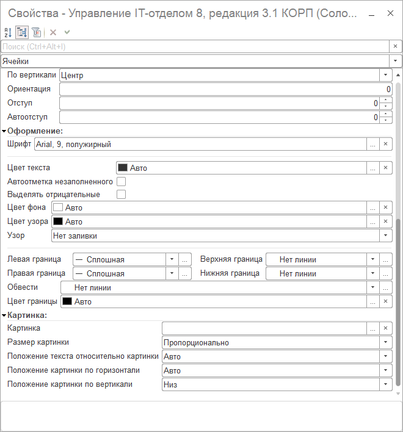

# Учет компьютеров и комплектующих с помощью подключаемого оборудования

В нашем решении можно вести учет этикеток компьютеров для последующего быстрого поиска и идентификации.

**Зачем это нужно?**  

Тут все просто... Этикетка - это как паспорт оборудования или компьютера. Определенному оборудованию присваивается штрихкод, который является уникальный в пределах информационной базы и позволяет отделить оборудование одно от другого. Потом, когда вы увидите этот номер, Вам сразу будет понятно, что это за оборудование и что с ним было до текущего момента.

## С чего начать?

**Шаг 1.** Для начала присвойте компьютеру (номенклатуре) штрихкоды. При оприходовании номенклатуры или в процессе использования присвойте карточкам штрихкоды. Их можно создать автоматически:

Нажимая кнопку "Сгенерировать штрихкод" система сама создаст необходимый уникальный номер. После всех манипуляций запишите штрихкод.

**Шаг 2.** Откройте обработку для печати этикеток. ***Номенклатура и склад > Сервис > Печать этикеток***

**Шаг 3.** В открытой обработке найдите кнопку "Шаблоны этикеток", нажмите ее, откроется список шаблонов. Настройте шаблон этикетки для вашего принтера. Обработка работает с ЛЮБЫМ принтером, причем печатать этикетки можно и не на принтере этикеток (есть и такие), а вообще на ЛЮБОМ принтере. Мы можем в шаблоне задать внешний вид этикетки и количество строк и столбцов при печати. Измените шаблон или создайте свой.

Тут можете изменить размер и вставить переменные, которые бы вы хотели видеть в этикетке (перетащите их на шаблон). При этом имейте ввиду, что прерывистая штрихпунктирная линия - это ограничения вывода ОДНОЙ этикетки, не удаляйте их! В принципе, можно использовать как свой шаблон, так и оставить тот, который по умолчанию. Если Вы создаете свой шаблон и нужно изменять оформление ячеек (провести линию,поменять цвет текста и т.д), тогда необходимо выделить нужную ячейку и нажать ПКМ, после в списке выбрать "Свойства".

!!!
Важно! Если у Вас есть этикетки с определенным размером (например, Avery Zweckform L6009-20) и Вам необходимо подогнать шаблон по миллиметрам, используйте следующий трюк: откройте в конфигураторе нужный шаблон и при изменении размеров строк и колонок внизу отображается размер в миллиметрах:
!!!

Используя этот прием, можно в конфигураторе на пустом макете получать значения в мм, потом правой кнопкой мыши по щелкнуть по изменяемой колонке и получаем размеры в 1С-единицах и уже в режиме предприятия вставлять размеры в 1С-единицах.

Увеличить масштаб в табличном документе можно нажав Ctrl + крутить колесо мыши.
Так же вот необходимые сведения для конвертации из 1С-единиц в мм:
***Ширина ячейки: 1 мм = 0,534759358 в единицах измерения 1с***
***Длина ячейки: 1 мм = 2.857142857 в единицах измерения 1с***

!!!
Важно! Если при сохранении шаблона этикетки возникают ошибки "Максимальное количество по горизонтали: N" или "Максимальное количество по вертикали: N":
!!!

Необходимо убедиться, что параметры страницы установлены верно. Для настройки параметров страниц из формы "Печать документа" вызовем окно "Предварительный просмотр":

и в нем уже окно "Параметры страницы":

Укажем "Ориентация": "Портрет". В этом же окне можно уменьшить поля и указать остальные настройки:

После этого можно сохранять настроенный шаблон этикетки и переходить к следующему шагу.

**Шаг 4.** После настройки шаблона проверьте на своих данных как будут печататься этикетки.

!!!
Важно! Учтите, что выводится номенклатура, по которой есть остатки! Нет смысла распечатывать этикетки для номенклатуры, которой нет. Так же имейте ввиду, что этикетки печатаются не для всего. Действительно, зачем печатать этикетку, скажем, для процессоров? Настройка выводить ли для данной карточки этикетку или нет зависит от того, может ли иметь данный вид номенклатуры штрихкод. Также немаловажный момент, который стоит учесть. Если учет ведется по карточкам номенклатуры, тогда штрихкод должен быть у карточки, а если учет ведется без карточек, тогда штрихкод генерируется для номенклатуры.
!!!

Нажмите кнопку "Заполнить" и при необходимости можете заполнить все по отбору.

**Шаг 5.** Нажмите кнопку "Печать". Вот, что получается:

Обратите внимание в шаблоне было указано количество столбцов 2 и количество строк 5, мы, собственно, и видим это при выводе на печать.

**Шаг 6.** Распечатать полученные результаты очень просто, нажмите на кнопку предварительного просмотра на скриншоте выше, в открывшемся окне выберите принтер печати этикеток, на котором вы хотите распечатать этикетки. После того, как вы настроите здесь все один раз, все настройки на вашем рабочем месте сохранятся. Распечатайте на принтере этикетки.

**Шаг 7.** Если вы недовольны выводом этикеток исправляйте шаблон, т.е. повторите действия Шаг 3. - Шаг 6. Добейтесь результата, когда шаблон этикетки максимально подходит под бумагу принтера этикеток по размерам.

**Шаг 8.** Прикрепите шаблоны на ваше оборудование. Если используется принтер этикеток, то бумагу, на которой вы распечатаете этикетки можно будет приклеить.

После того, как оклеите всю технику удобно быстро искать карточки в рабочем месте кладовщика (РМК) и в любом документе с помощью сканера штрихкода.

-	**Видео, демонстрирующее работу с РМК.** [**Перейти ->**](https://www.youtube.com/watch?v=_pE7t5800jw)	**Как изменить шаблон этикетки на свой?**  [**Перейти ->**](https://softonit.ru/FAQ/courses/?COURSE_ID=1&LESSON_ID=688)

