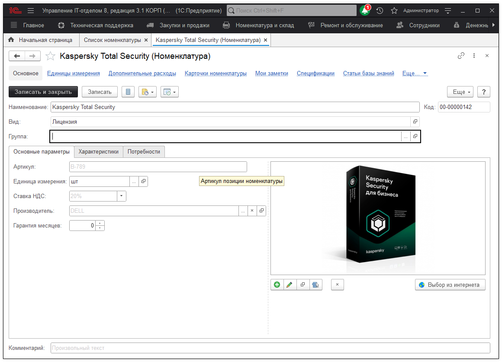

# Учет лицензий и программного обеспечения

Учет лицензий и программного обеспечения компьютера ничем не отличается от обыкновенного складского и бухгалтерского учета. Т.е. для лицензий порядок работы такой же, как и для обычных комплектующих. Заявка поставщику, Поступление, Перемещение, Списание. Для номенклатуры с типом "Лицензия" или "Программное обеспечение" в карточках появляется дополнительная вкладка "Лицензия", в которой указывается, ограничена ли лицензия по сроку действия и если да, то задается период действия лицензии.

***Вот номенклатура с лицензией:***

А вот карточка номенклатуры с лицензией:

Для удобства учета лицензий был создан специальный отчет, который позволяет быстро определить, где стоит та или иная лицензия, как скоро она закончится, период ее действия.

Причем при истечении срока действия лицензии за 30 дней до окончания начинает подсвечиваться синим, когда срок действия лицензии истекает подсвечивается красным.

**Список необходимых ролей для работы.**
* [x] Добавление и изменение номенклатуры;  
* [x] Добавление и изменение складских документов;  
* [x] Чтение складских документов.  
