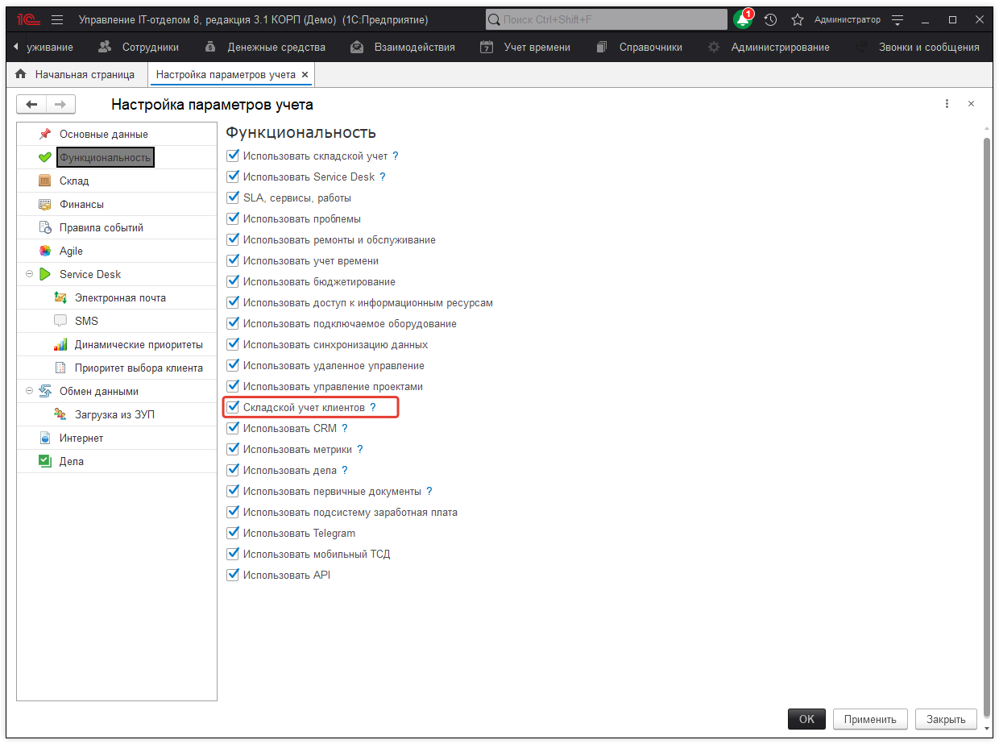

# Учет номенклатуры клиентов для аутсорсинговых компаний

Для аутсорсинговых компаний будет полезной возможность ведения учета оборудования, которое принадлежит клиентам.  
Т.е. вы как бы ведете учет чужих остатков.  
Для активации этой возможности необходимо перейти в **"Администрирование > Настройка параметров учета > Функциональность"**.  
А там активировать флаг "Складской учет клиентов".  

!!!
**Внимание!** Данная возможность доступна только для пользователей версии **КОРП**.
!!!

После этого для всех своих клиентов, по которым вы хотите вести подобный учет необходимо проставить флаг "Учет остатков" (как на рисунке ниже):

Ну, а дальше практически нет никакой разницы при ведении учета, как для собственных номенклатурных позиций, так и для клиентских. Единственное отличие заключается в том, что номенклатура будет привязана к конкретному контрагенту (нашему клиенту).  
Необходимо во всех документах клиентов выбирать в поле "Организация" нужного клиента (если учет клиентского оборудования), или собственную организацию (если учет собственного оборудования). В данном списке будут отражены только те контрагенты, по которым ведется учет по остаткам.   

