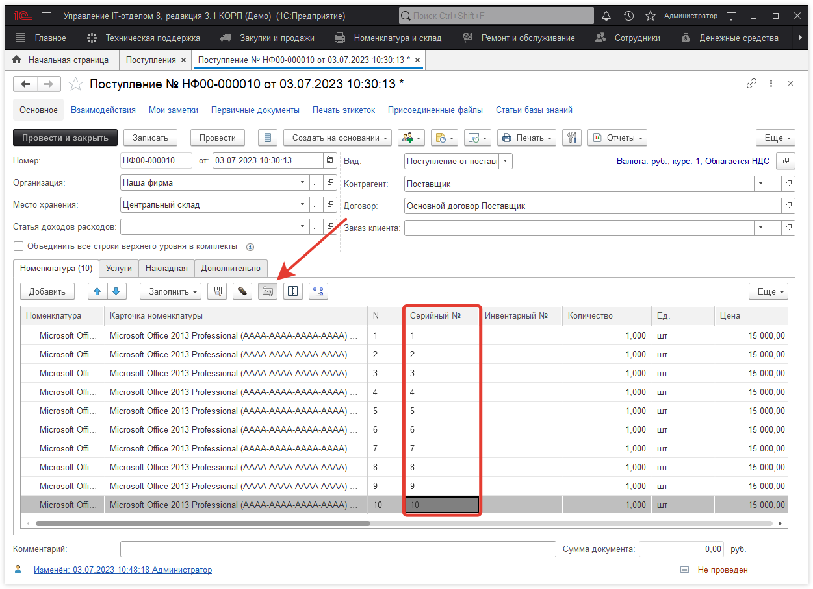

# Учет программного обеспечения с многократной активацией

Рассмотрим ведение учета, на примере:

> **Каким образом следует оприходовать ОДИН ключ продукта многократной активации (MAK) от офисного пакета Microsoft Office 2013 Professional, рассчитанный на 10 ПК (10, можно смело заменить другим числом от этого суть не изменится)**

Итак. У нас есть лицензия на Microsoft Office 2013 Professional, для дальнейшего удобства работы с данным продуктом можно пойти следующим путем

1) Создадим **номенклатуру** и ключ активации так как он одинаков для всех ПК добавим в наименование, так будет в будущем проще понимать, о чем идет речь. Пусть ключ активации будет: АААА-АААА-АААА-АААА. Получим:

2) Оприходуем ПО от поставщика (либо на основании "Заказа поставщику", либо просто отдельным документом "Поступление"). Мы просто сделаем Поступление. Заметьте вбивать сразу 10 карточек можно, но не очень удобно. Если их будет 200, то это будет еще и долго.
В конфигурации, есть групповое добавление в документе "Поступление". В номенклатуру **"Заполнить > Групповое добавление номенклатуры"**:

Нажимаем кнопку **"Добавить"**. Получаем вот такое:

Добавлено 10 строк, но карточки пустые. Есть еще один момент с ценой. Если ведется учет по карточкам такой лицензии, то лучше оприходовать ее без цены, либо разбить ее на равные из покупной (10 лицензий стоит 150 000 руб, значит одна 15 000 руб. при заполнении можно цену указать 15 000 руб.). 

3) Далее, заполним карточки номенклатуры, аналогично:

4) Зададим серийные номера для каждого ПО, что позволит отличать каждую активацию от другой:

Серийный номер нужен для того, чтобы могли лицензии при необходимости переносить между компьютерами, да и вообще отделять их друг от друга. Так проще работать.
После установки серийного номера в документе в каждой из карточек автоматически поменяется наименование.

!!!
Важно! Вы можете сразу не увидеть изменение наименования, но после обновления кэша данных наименование каждой номенклатуры будет вида:
!!!

**Microsoft Office 2013 Professional (АААА-АААА-АААА-АААА) №1**  
**Microsoft Office 2013 Professional (АААА-АААА-АААА-АААА) №2**  
**...**  
**Microsoft Office 2013 Professional (АААА-АААА-АААА-АААА) №10**  

Пример:

При этом поля, которые есть в этой карточке, могут быть заполнены дополнительной информацией такие, как срок действия и т.д.
Сроки действия можно посмотреть отчетом по ПО, а остальные реквизиты играют информативную роль.

При этом эту карточку теперь можно передавать между местами хранения как обычное оборудование, видеть его на остатках и за кем она закреплена.

Вот таким образом ведется учет продуктов многократной активации.

