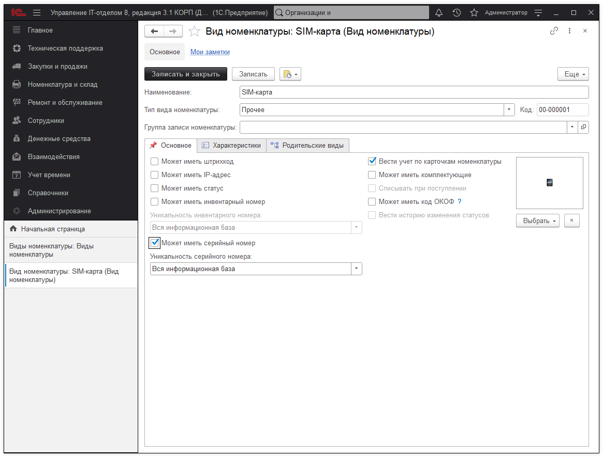
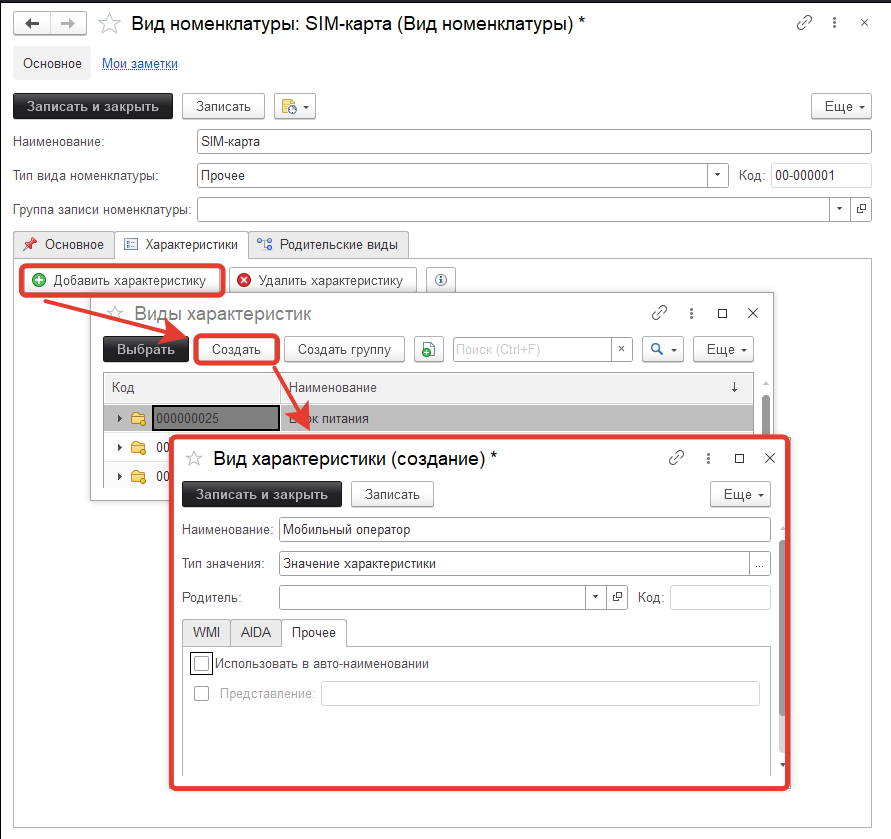
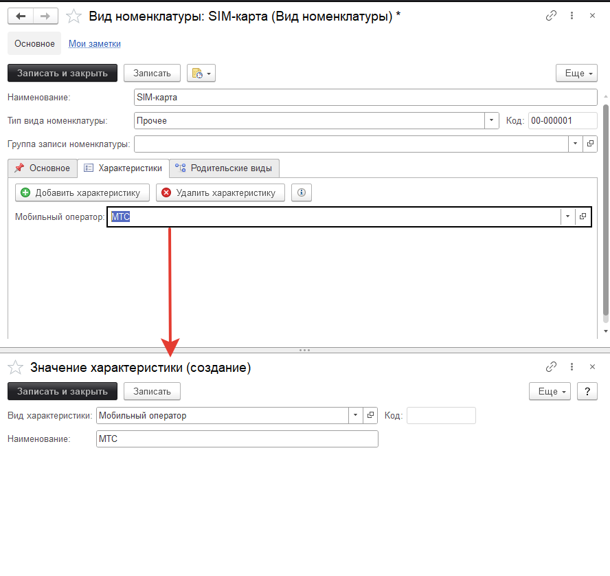
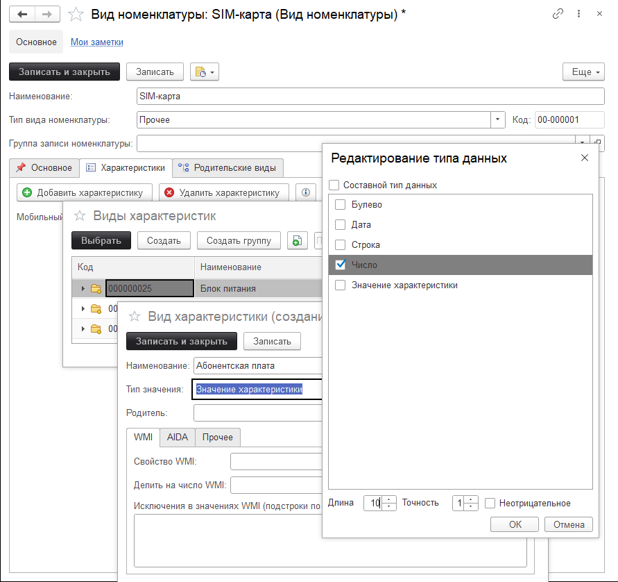
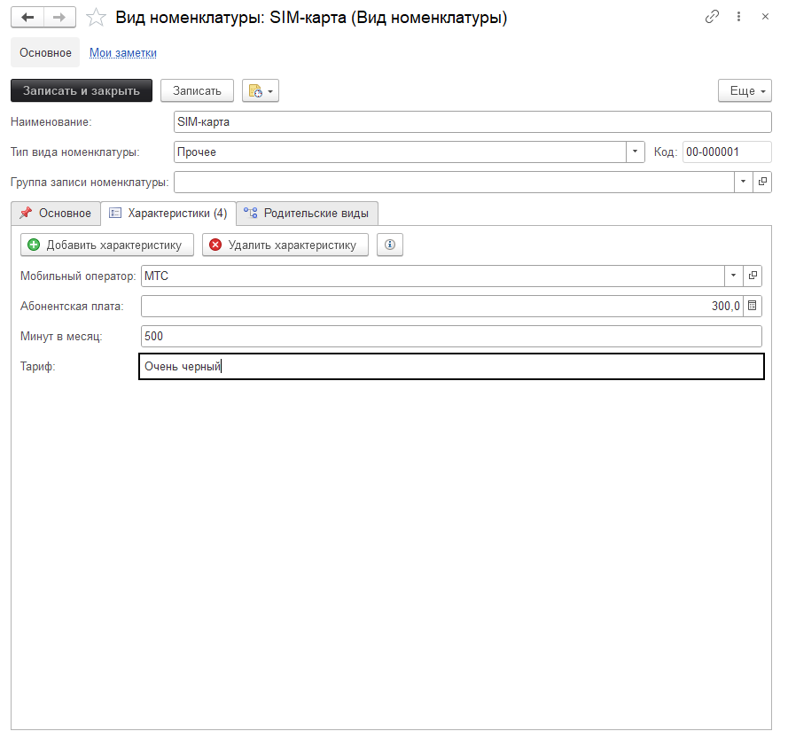
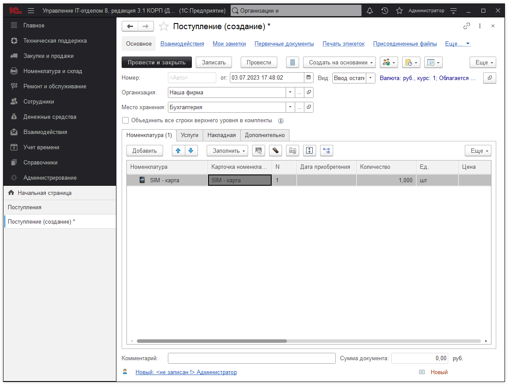
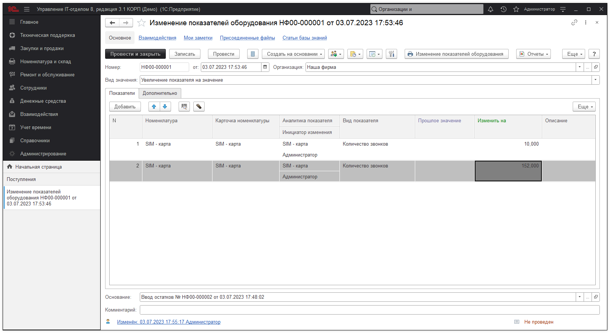
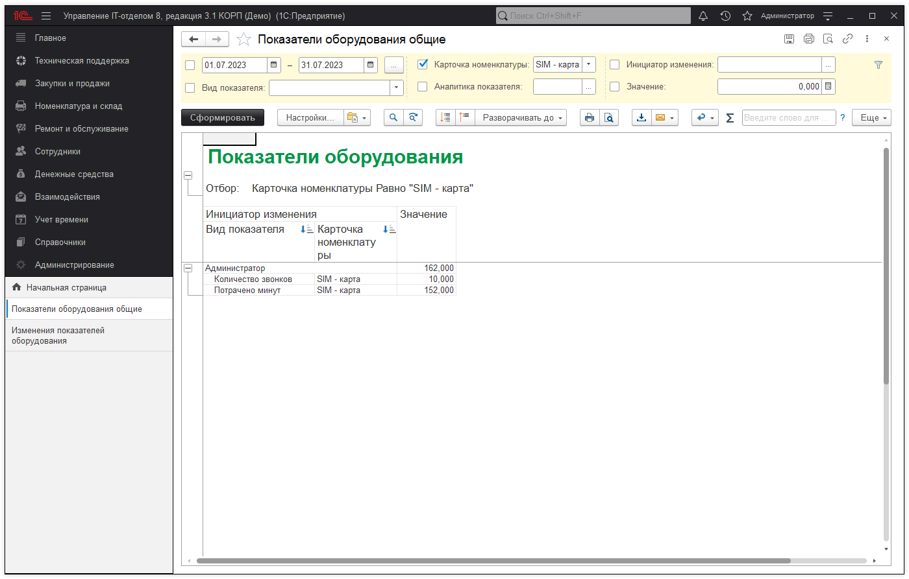

# Учет сотовой связи и SIM-карт в конфигурации

Поставим перед собой следующую задачу:

> **Задача по учету SIM-карт**
> Для учета сотовой связи хотелось бы добавить к сотрудникам сотовые номера с учетом у кого какой тариф, что бы можно было сделать отчет у кого какой тариф: сколько минут, SMS, гигабайт, стоимость тарифа, лимиты по тарифу и т.д. А так же у нас есть потребность в анализе этих самых минут, кому, куда и сколько раз звонил сотрудник.

Итак, начнем.
1. Создадим в справочнике "Виды номенклатуры" элемент и назовем его **SIM-карта:** 

В поле серийный номер мы будем хранить номер телефона и контролировать уникальность по нему будем там же (чтобы не было дублей номеров). Так же обратите внимание, что этот вид номенклатуры может иметь карточки номенклатуры.  
Теперь настроим характеристики у вида: 

Далее, заполняем список мобильных операторов: 

Таким образом добавляем необходимые характеристики. На этом этапе необходимо все хорошо обдумать и добавить все характеристики, иначе потом необходимо будет у созданных характеристик заполнять недостающие.  
Если же какие-то сим-карты абсолютно разные и необходимо учитывать совершенно разные характеристики, то создайте два и более видов номенклатуры по SIM-картам.  
Обратите внимание, что характеристики могут быть разных типов. Например, у абонентской платы имеет смысл поставить число 10 знаков и 2 знака после запятой. 

Добавление характеристики 
Можно добавить строку, галочку, число, выбор из списка и дату.

2. Идем дальше и создадим карточку номенклатуры, которая будет определять SIM-карту и закрепим ее за сотрудником Ивановым. Создадим документ "Поступление" и создадим номенклатуру с созданным видом SIM-карта, и карточку номенклатуры. После записи в карточке нажмем на закладке "Характеристики" "Заполнить > По виду номенклатуры". Получим следующее:

Ну и в документе: 

3. Ну, а дальше, все как с обычной карточкой номенклатуры. Ее можно перемещать, списывать и т.д. Все это будет отображаться на остатках. В любой момент можно открыть карточку и изменить ее, указав верные параметры (тариф, оператор и т.д.)

4. Теперь перейдем к следующему пункту - это анализ звонков и просмотр статистики. Если нам анализ не нужен, то можно пропустить этот шаг. Для целей анализа есть специальный инструмент в подсистеме "Ремонт и обслуживание", документ "Изменение показателей оборудования". Заполним его:

!!!
Важно! Понятное дело, сейчас мы тестируем этот механизм, **в реальной жизни вносить вручную эти данные никто не будет**. Необходимы специальные обработки, которые будут загружать эти данные автоматически. И увы, мы не можем автоматизировать эту часть, так как форматы файлов и необходимые данные у всех разные.
Если вам нужна автоматизация загрузки этих данных, вы должны реализовать ее самостоятельно или мы можем Вам помочь и по вашему техническому заданию сделаем загрузку. Свяжитесь с нами (эта услуга предоставляется платно).
!!!

Мы же сейчас покажем, что получается в общем случае и как будет выглядеть нужные нам данные.

При необходимости настройки этого отчета можно изменить и поставить/снять нужные отборы/группировки/сортировки.

**Список необходимых ролей для работы.**
* [x] Добавление и изменение номенклатуры;
* [x] Добавление и изменение складских документов;
* [x] Чтение складских документов.

