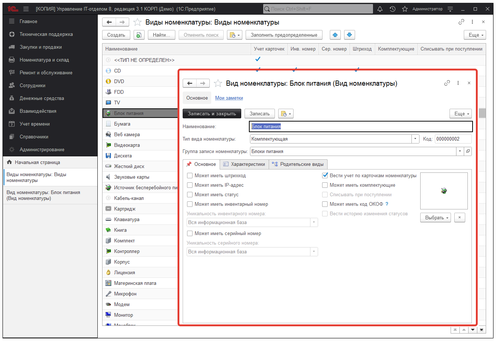

# Виды номенклатуры

Вид номенклатуры является реквизитом справочника номенклатуры и отвечает за все "настройки" конкретной номенклатуры и подчиненных ей карточек.
Список видов номенклатуры заполняется по умолчанию при установке конфигурации (Справочники > Виды номенклатуры ). Вот как выглядит справочник:

**Основное** - основные настройки вида номенклатуры.

* **Тип вида номенклатуры** - отвечает за тип (Комплектующая, Комплект, Оборудование, Программное обеспечение, Услуга, Расходный материал, прочее). Подробнее можно прочесть по ссылке;  
* **Группа записи номенклатуры** - необходима для обработки по импорту оборудования из Everest (AIDA 64) и WMI. В зависимости от того какого вида будет загруженное оборудование туда в такую группу и будет записываться новая номенклатура из обработки;  
* **Может иметь штрихкод** - оборудование данного вида будет иметь возможность иметь штрихкод;  
* **Может иметь IP**-адрес - оборудование данного вида будет иметь возможность иметь IP-адрес;  
* **Может иметь статус** - механизм, который позволит каждой карточке назначать свой статус. Подробнее можно прочесть по ссылке. При установке галочки появляется вкладка "Статусы";  
* **Может иметь инвентарный номер** - актуальна для оборудования с инвентарными номерами;  
* **Уникальность инвентарного номера** - актуальна для оборудования с инвентарными номерами;  
  * **Вся информационная база;**  
  * **В пределах вида номенклатуры;**   
  * **Не контролировать.**  
* **Может иметь серийный номер** - актуальна для оборудования с серийными номерами;  
* **Уникальность серийного номера** - актуальна для оборудования с инвентарными номерами;     
  * **Вся информационная база;**  
  * **В пределах вида номенклатуры;**  
  * **Не контролировать.**  
* **Вести учет по карточкам номенклатуры** - о данной настройке подробнее можно прочесть по ссылке;  
* **Может иметь комплектующие** - может содержать в себе другое оборудование или нет;  
* **Списывать при поступлении** - данный признак может использоваться для номенклатуры, по которой не планируется вести учет, но важен факт отражения поступления и списания, например, для расходных материалов;  
* **Может иметь ОКОФ** - применяется для классификации номенклатуры по группам в бухгалтерии;  
* **Вести историю изменения** статусов - история изменения статусов номенклатуры;  
* **Иконка вида номенклатуры** - находится в правом, нижнем углу, отвечает за отображение номенклатуры данного вида в списках документов, остатках. Иконку можно выбрать как предопределенную, так и из файла.   

**Характеристики** - предназначена для добавления предопределенных характеристик номенклатуры, которые потом можно перенести одной кнопкой в характеристики номенклатуры.

**Родительские виды** - предназначена для быстрой группировки по кнопке в документах "Поступление" и "Сборка (комплектация)".

**Статусы** - механизм, который позволит каждой карточке назначать свой статус. Подробнее можно прочесть по ссылке.

**Список необходимых ролей для работы.**
* [x] Добавление и изменение номенклатуры.