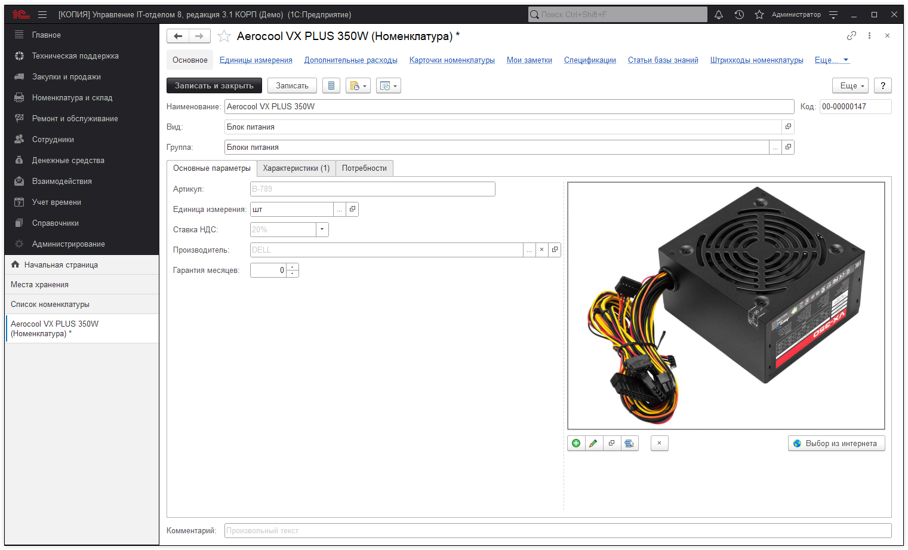

# Номенклатура

**Номенклатура** - это все товары и услуги, которые есть в конфигурации.

[Вид номенклатуры](https://softonit.ru/FAQ/courses/?COURSE_ID=1&LESSON_ID=48&LESSON_PATH=1.44.47.48)  отвечает за основные настройки номенклатуры. Кнопка "Заполнить характеристики" переносит все характеристики вида номенклатуры в характеристики самой номенклатуры.

Группа - родительская папка номенклатуры.

Значение всех остальные реквизитов понятны из названия.

Так же изображение номенклатуры можно загрузить из интернета. Из номенклатуры можно перейти в дочерние [карточки номенклатуры](https://softonit.ru/FAQ/courses/?COURSE_ID=1&CHAPTER_ID=0662&LESSON_PATH=1.44.662).

**Список необходимых ролей для работы.**
* [x] Добавление и изменение номенклатуры;
* [x] Добавление и изменение складских документов;
* [x] Чтение складских документов.