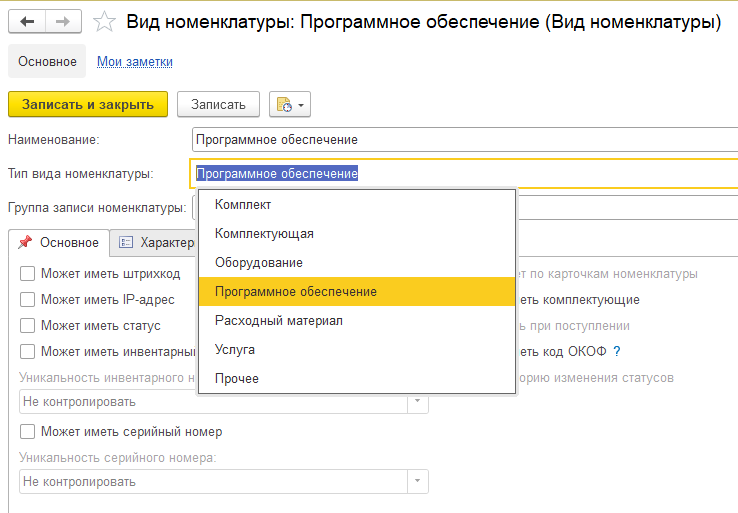

# Типы вида номенклатуры
Тип вида номенклатуры является реквизитом справочника виды номенклатуры и отвечает за нюансы складского учета номенклатуры и подчиненных ей карточек.
Список тип вида номенклатуры постоянен и содержит описанные ниже позиции.

-

> **Комплект, Комплектующая, Оборудование, Расходный материал, Прочее** - Номенклатура и подчиненные ей карточки используются в дереве номенклатуры, их нельзя использовать в дереве услуг в таких документах, как «Поступление», «Перемещение» и т.д. По активам такого типа ведется учет остатков, а также контроль по остаткам. Между собой данные типы не различаются, но только что визуальной информацией.

> **Услуга** - Этот тип можно сказать «противоположность» предыдущим. Номенклатура и подчиненные ей карточки не могут использоваться в дереве номенклатуры складских документов, а только в дереве услуг. По ним не ведется учет остатков и соответственно нет контроля по остаткам. Данный тип необходим для учета затрат по услугам см. «Учет дополнительных расходов».

> **Программное обеспечение** - Тип «Программное обеспечение» учитывается и используется аналогично «Комплекту» и т.п., но имеет расширенный набор данных. В форме карточки номенклатуры с данным типом, во вкладыше «Основное», отображается закладка «Лицензия и обновления» которая содержит реквизиты необходимые для ведения учета программного обеспечения, такие как информация о лицензиях или обновлениях.

