# Остатки на местах хранения

Весь складской учет строится для единственной цели - иметь возможность узнать в любой момент времени, что было/есть на складе, когда купили, установили и т.д.
Для этих целей в конфигурации есть специальные отчеты, которые позволяют узнать всю эту информацию.
Одним из главных отчетов в блоке складского учета является отчет **"Отчет по складам/рабочим местам"** (Номенклатура и склад > Отчет по складам/рабочим местам).

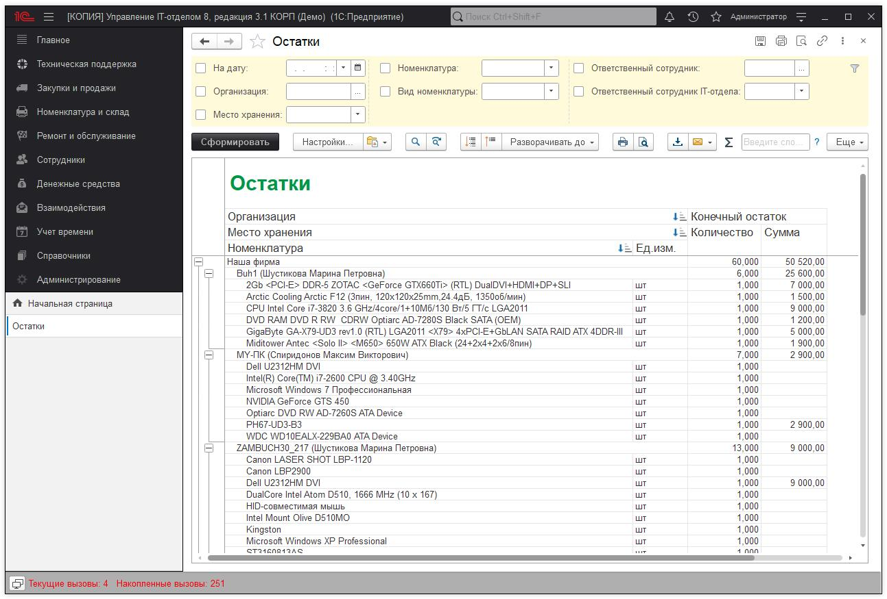

Это очень гибкий отчет, который позволяет получить практически любые данные об остатках в любых аналитических разрезах.
Можно выбрать вариант отчета:

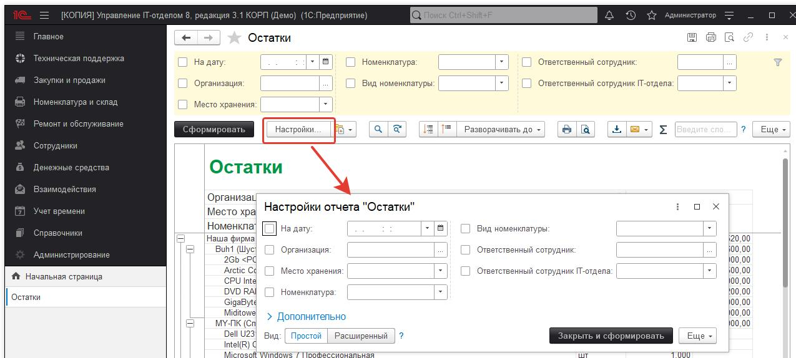

Чтобы понять, насколько гибок данный отчет. Зададимся целью получить информацию о всех картриджах и посмотрим все картриджи, по которым были движения в течении этого месяца. При этом выведем не просто общее число картриджей, а распишем все по карточкам.

Для этого изменим вариант отчета:

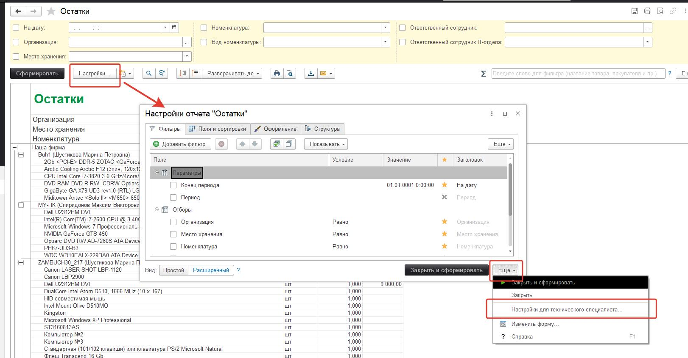

Откроется окно с настройками отчета:

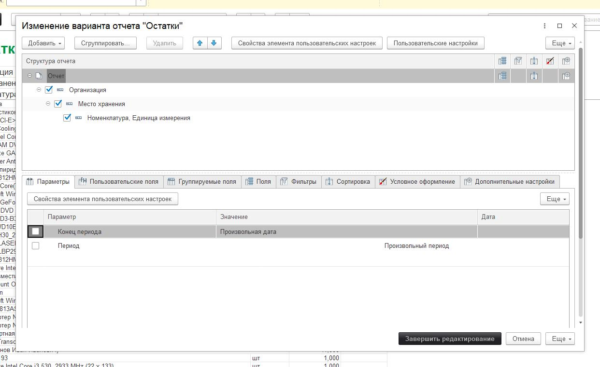

Видим, что в структуре отчета стоят группировки **Организация / Место хранения / Номенклатура**, Единица измерения. Т.е. выводится организация, внутри нее места хранения, а внутри каждого из мест хранения список номенклатуры, по которой показаны остатки. Но нам нужно получить отчет без группировки по местам хранения. Для этого необходимо изменить группировки отчета.
Мышкой перетащим выделенную строку **"Номенклатура, Единица измерения"** из **"Место хранения"** в **"Организация"**. Получим:

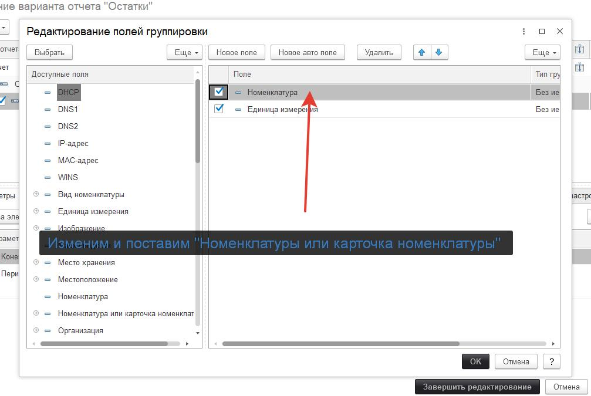

Теперь удалим группировку "Место хранения". Далее два раза щелкаем на строку с группировкой "Номенклатура, Единица измерения" и меняем ее на:

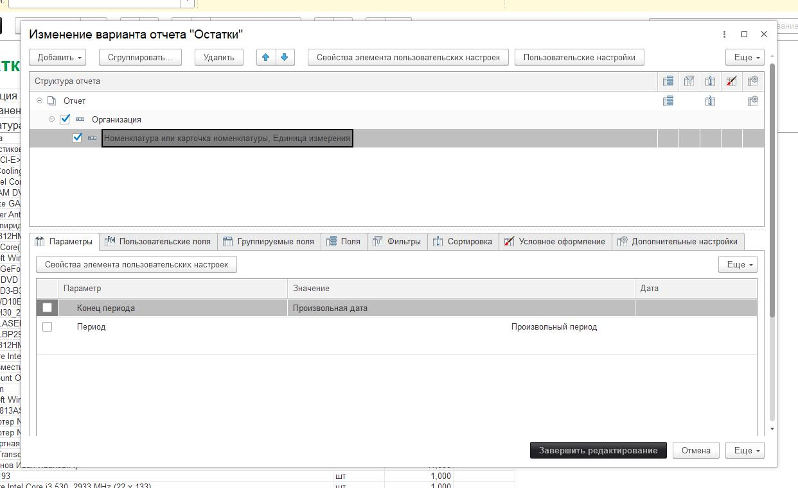

В результате должно получиться следующее:

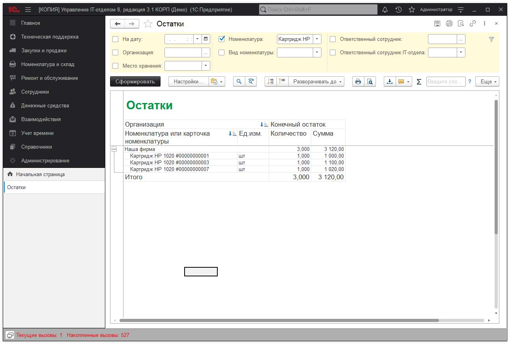

После чего нажимаем "Завершить редактирование" и переходим в отчет. Далее настраиваем его как на картинке ниже и нажимаем **"Сформировать"**:

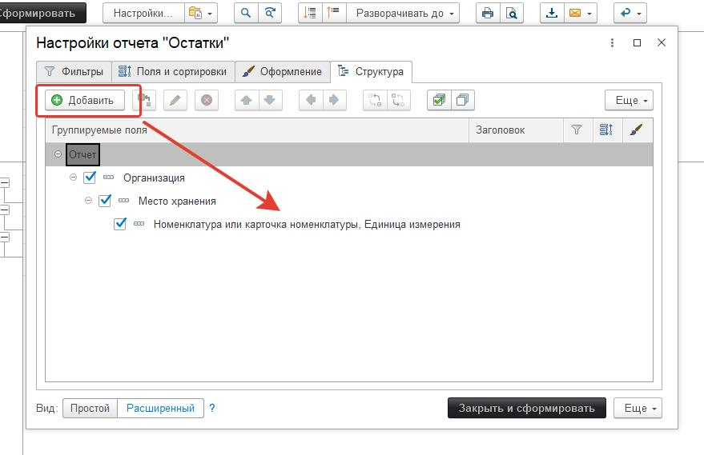

Получаем результат, который мы хотели получить.

Если же необходимо получить движения в разрезе мест хранения вернем настройку с группировкой по месту хранения:

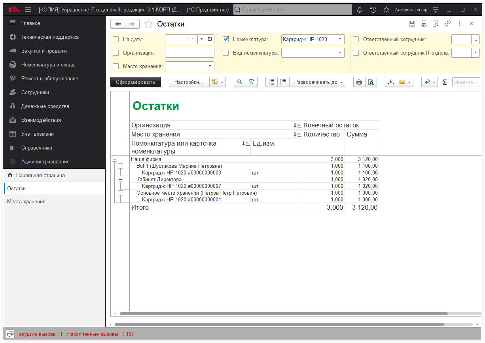

Сформируем отчет снова. Получим:

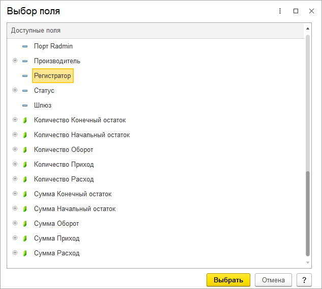

При двойном щелчке на количество или сумму в полях начальный, конечный остаток, приход или расход появится окно с вопросом "Как вы хотите развернуть данные?". Т.е. если мы два раза нажмем на выделенную ячейку конечного остатка с количеством 1. То появится окно:

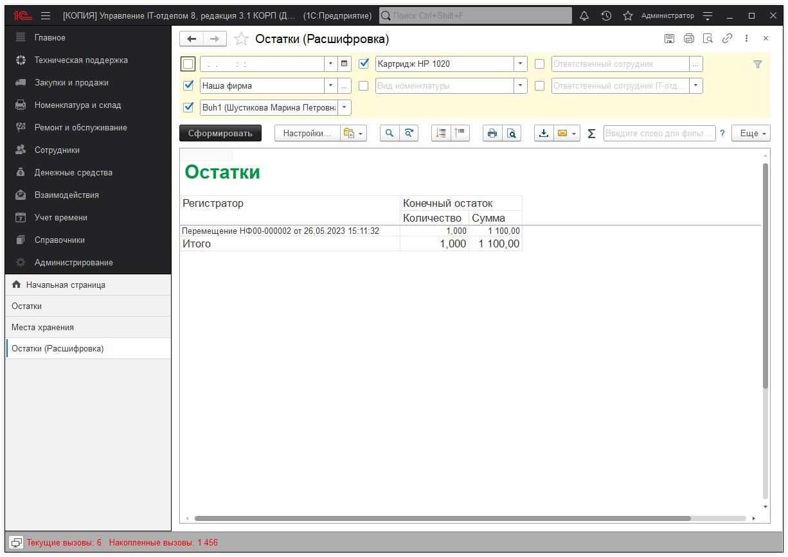

Это окно Вас спрашивает: "Есть число 1 в остатке, я могу его расшифровать из чего оно получилось и предлагаю поля для расшифровки". При выборе Регистратора мы сможем получить данные по расшифровке в разрезе документов, которые получили в остатке число 1.

Вот, что получаем:

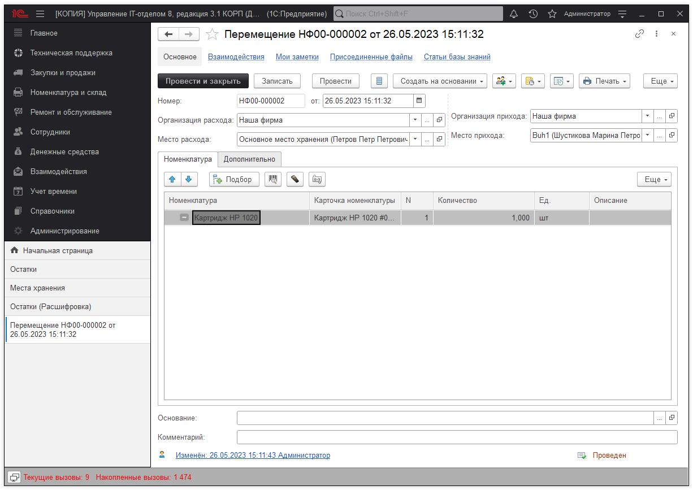