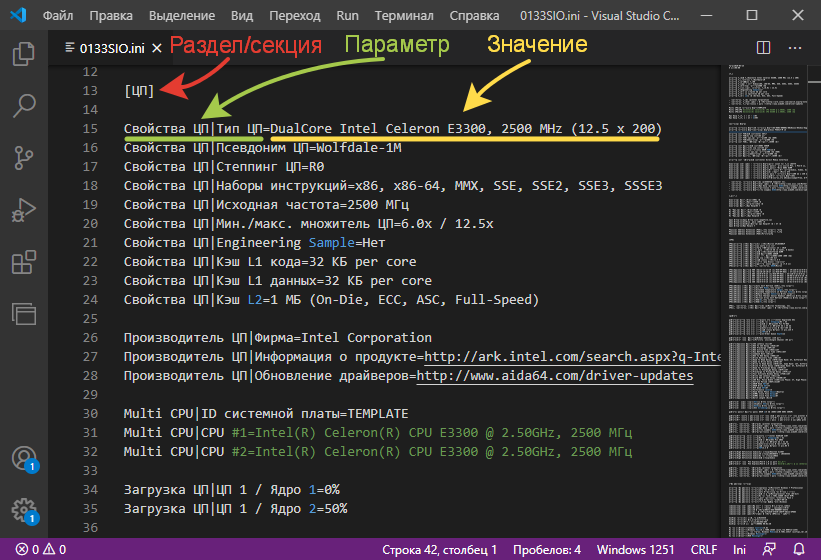
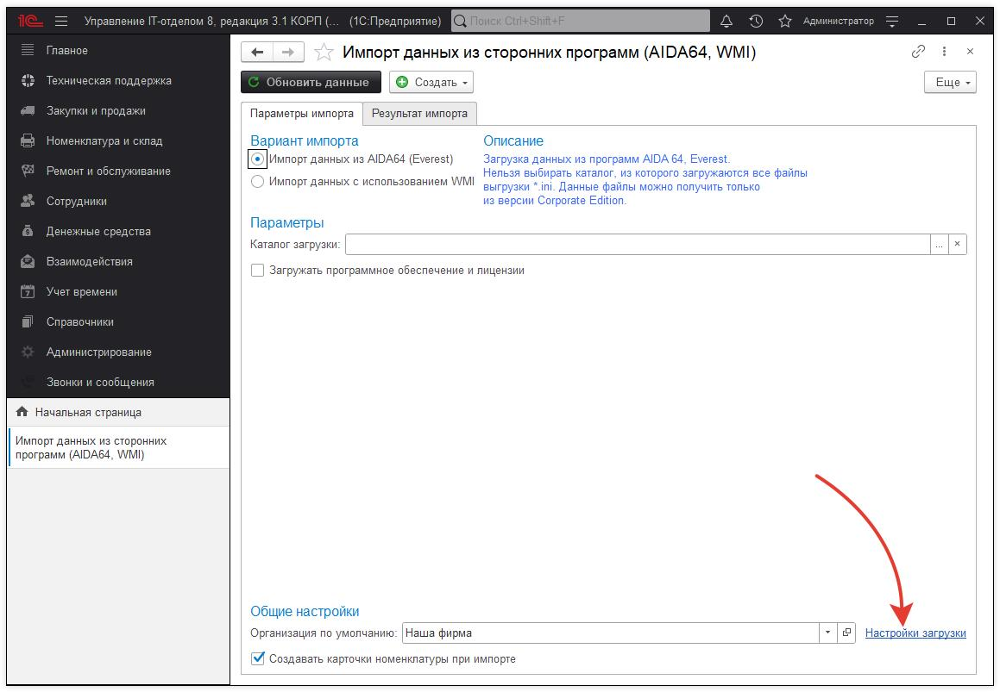
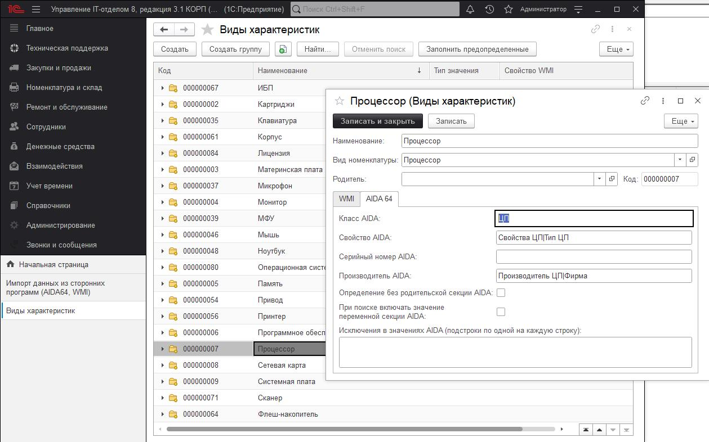
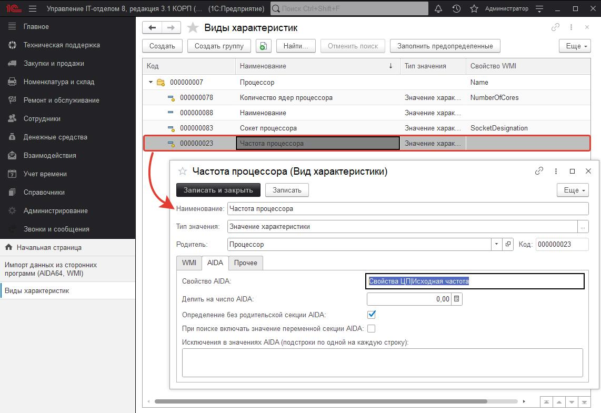

# Описание настроек загрузки данных из AIDA64

Наша конфигурация поддерживает загрузку ini-файлов полученных при экспорте из AIDA64.

## Что из себя представляет ini-файл?

Это обычный текстовый файл, в котором есть секции, переменные и их значения.

INI-файл состоит из разделов (или секций, или классы), которые обрамлены с двух сторон  скобками [ ]. А так же значениями пар **Параметр=Значение.**  
Каждая из секций выгрузки из AIDA 64 описывает какие-то данные. Например, на скриншоте выше описывается какой процессор установлен в компьютере данные по которому мы загружаем. 

## Описание настроек загрузки из INI-файла

Давайте откроем настройки загрузки: *Номенклатура и склад > Сервис > Импорт данных из сторонних программ*

В открывшейся форме откроем Настройки загрузки. Здесь мы найдем предопределенные элементы, которые уже загружаются.

### Папки (или группы) - это секции в ini-файле и их настройки. Опишем, что означает каждая из настроек:

1. **Класс AIDA** - на первом скриншоте у нас отображена секция [ЦП], в поле класс AIDA мы указываем ЦП. Это означает, что все значения этого раздела будут относится к процессору и загрузятся в свойства процессора.  
2. **Свойство AIDA** - тут указывается подстрока (именно подстрока!), которая указывает на параметр, отвечающий за название оборудования. В нашем случае это Свойства ЦП|Тип ЦП. В нашем случае это на первом скриншоте: DualCore Intel Celeron E3300, 2500 MHz (12.5 x 200)  
3. **Серийный номер AIDA** - если оборудование имеет серийный номер, то здесь можно указать подстроку в секции [ЦП], где будет указано значение серийного номера. Если пусто, то оборудование будет без серийного номера  
4. **Производитель AIDA** - у оборудования может быть указан (а может и нет) производитель. Тут указывается подстрока секции, где хранится информация о производителе. В нашем случае это Intel Corporation  
5. **Определение без родительской секции AIDA** - (не используется для секций).  
6. **При поиске включать значение переменной секции AIDA** - (не используется для секций).   
7. **Исключение в значениях AIDA** - в процессе поиска мы можем найти те значения, которые мы бы не хотели бы выводить. Например, при поиске установленных программ мы не хотим учитывать программы типа: Audio Driver, Microsoft Silverlight, Java(TM) и т.д. Поэтому мы можем значения, которые нам не подходят здесь просто перечислить. В этом случае такие программы будут проигнорированы.   

## Описание настроек характеристик номенклатуры

Когда оборудование загружено, необходимо загрузить его свойства и характеристики. Для этого заходим в папку выбранного нами процессора и видим список характеристик, которые мы хотим загрузить:

1. **Свойство AIDA** - подстрока, которая описывает название параметра, где в нашей секции находится значение характеристики. В нашем примере - это 2500 МГц  
2. **Делить на число AIDA** - иногда бывает так, что число, которое находится в значении переменной указано в байтах, а нам нужно в мегабайтах. Поэтому есть возможность его уменьшить путем деления на нужное число. Если равно нулю, то не используется.  
3. **Определение без родительской секции AIDA** - иногда может сложится такая ситуация, что наше значение характеристики находится не в этой секции, а в другой. Тогда будет предпринята попытка найти это значение во всех секциях. Установите этот параметр, если у вас подобная ситуация.  
4. **При поиске включать значение переменной секции AID**A - ищем характеристику только в том случае, когда значение свойства найдено и в названии секции и в названии параметров. В AIDA так представлены, например, программы. Где главная секция [Установленные программы], а внутри Установленные программы1=..., Установленные программы2=... и т.д. Такая настройка позволяет искать в таком ключе.  
5. **Исключение в значениях AIDA** - Не загружать характеристику, если она совпадает с переданной подстрокой.  
