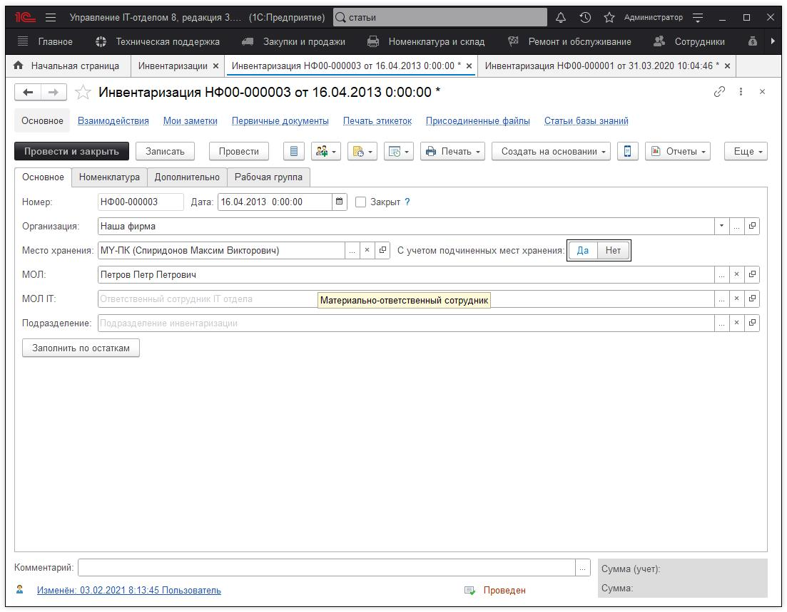
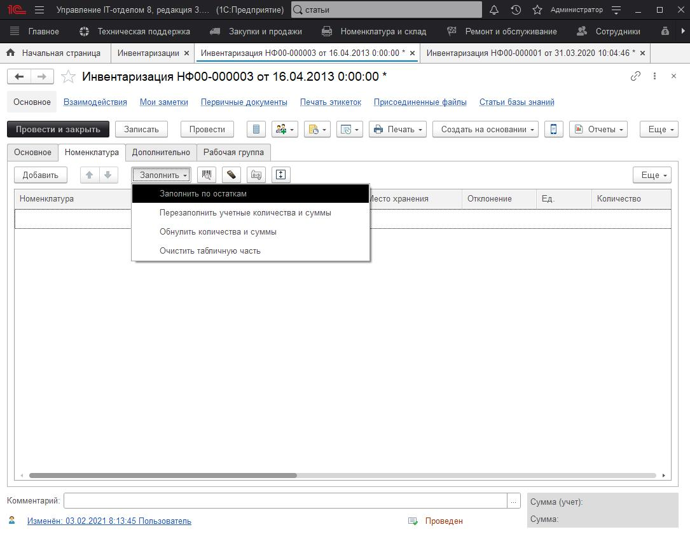
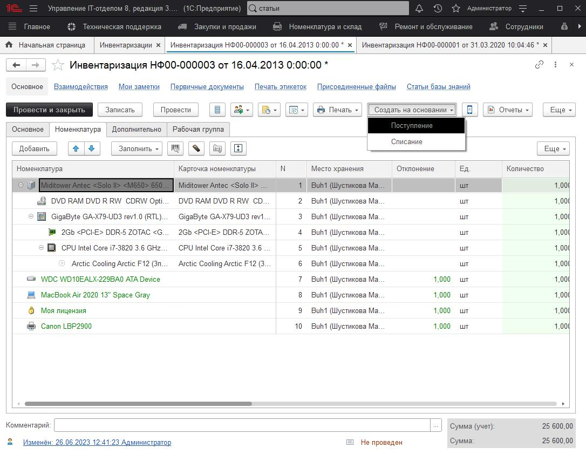
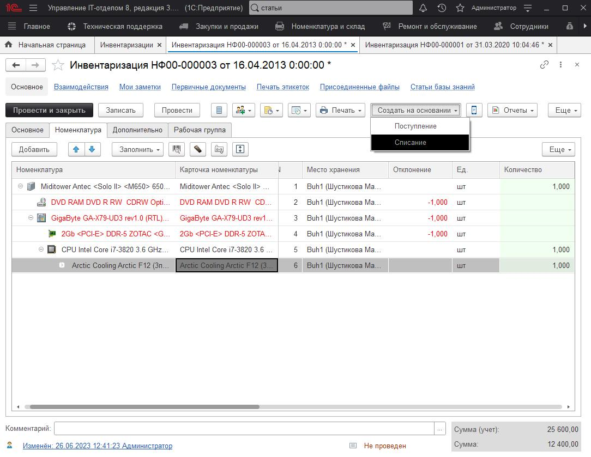

# Документ "Инвентаризация"

Документ **"Инвентаризация"** позволяет произвести инвентаризацию по местам хранения (либо ответственным сотрудникам).

Рассмотрим один из возможных сценариев проведения инвентаризации.

Выбираем свою организацию в поле "Организация". Указываем место хранения (применяемые отборы в документе "складываются", например, при указании и места хранения и МОЛ, в документ попадет только та номенклатура, которая находится на данном месте хранения и ответственным лицом для неё является МОЛ). Переключатель "С учетом подчиненных мест хранения" используется для иерархической структуры мест хранения, если переключен в "Да", номенклатура будет отобрана в документ и по подчиненным местам хранения.

После заполнения реквизитов, перейдем на закладку "Номенклатура" и с помощью кнопки **"Заполнить"->"Заполнить по остаткам"**

Табличная часть будет заполнена остатками номенклатуры. В том числе, столбцы "Количество" и "Сумма", показывающие фактическое наличие номенклатуры.

Дальше возможны варианты развития сценария.

Если есть сканер штрих-кода, мы можем соответствующей командой "Обнулить количества и суммы" очистить фактические показатели по всему списку номенклатуры, и сканером ШК заполнить их обратно (при сканировании, если номенклатура уже есть в табличной части, её фактическое количество увеличится, если нет - будет добавлена в табличную часть).

Если сканера ШК нет, можно распечатать записанный документ, уточнить количество на месте хранения, и откорректировать фактическое количество номенклатуры в документе.

Отдельно хочется обратить внимание на то, что при подборе номенклатуры в документ сканером ШК, если номенклатура является частью комплекта, то в документ будет добавлен весь комплект целиком, либо увеличено фактическое количество у этого комплекта, если он был добавлен в документ ранее. 

Если в ходе проведения инвентаризации были выявлены излишки на данном месте хранения, то тогда в этом случае на основании инвентаризации необходимо создать документ **"Поступление"** и оприходовать излишки.

Если при проведении инвентаризации была выявлена недостача, то для списания этой номенклатуры необходимо создать документ **"Списание"**.

