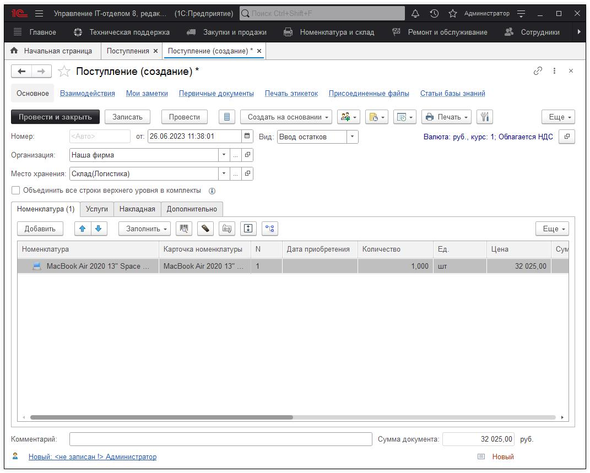
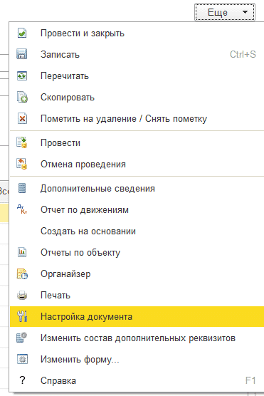

# Документ "Поступление"

При прочтении описания документа Вам необходимо ознакомиться с [концепцией комплектов и комплектующих](https://softonit.ru/FAQ/courses/?COURSE_ID=1&LESSON_ID=664&LESSON_PATH=1.44.662.664).

Документ "Поступление" предназначен для оприходования Номенклатуры от контрагентов, и необходим при введении первоначальных остатков.

## 1. При заведении первоначальных остатков.

Ввести первоначальные остатки можно двумя способами: вручную, с помощью документа "Поступления" и с помощью обработки [Импорт данных из сторонних программ](https://softonit.ru/FAQ/courses/?COURSE_ID=1&LESSON_ID=619&LESSON_PATH=1.2.607.619). Если создавать остатки, то у Вас должно получиться для каждого места хранения следующее:

Данный документ просто оприходует на место хранения "Отдел кадров" организации "Наша фирма" все комплектующие в количественном выражении.

## 2. При оприходовании от контрагентов.

При работе с контрагентами лучше использовать связку документов Заказ поставщику - Поступление в этом случае "Поступление" можно создать на основании "Заказа поставщику", а далее просто заполнить карточки номенклатуры и провести документ. При этом, используя заказы Вы еще получаете механизм контроля, что приехало от поставщика, а что нет, что оплачено, а что нет.
Для создания на основании "Заказа поставщику" зайдите в заказ, нажмите **"Создать на основании > Поступление"**.

Если же Вы хотите внести документ вручную, то опишем реквизиты документа:

* **Организация** - организация, за которой будут закреплены данные комплекты и комплектующие;   
* **Место хранения** - то, куда будут оприходованы комплекты и комплектующие (см. Концепция именования мест хранения);  
* **Статья доходов расходов** - статья доходов и расходов для бюджетирования;  
* **Вид** - вид документа "Поступление" может иметь следующие значения:  
* ***Ввод остатков*** - позволяет оприходовать имеющеюся номенклатуру;  
* ***Возврат от покупателя*** - позволяет отражать возврат клиента;  
* ***Поступление от поставщика*** - позволяет отражать приход остатков приобретенных у поставщика;  
* **Контрагент** - поставщик, от которого поступило оборудование (может быть не заполнено);  
* **Договор** - договор между нами и контрагентом, по которому пришло оборудование;  
* **Заказ поставщику** - заказ, по которому поступают запасы;  
* **Заказ клиента** - документ, по которому отражаем поступивший заказ от клиента;  
* **Объединить все строки верхнего уровня в комплекты** - эта важная настройка позволяет в остатках увидеть только строки верхнего уровня в дереве номенклатуры. Если галочка стоит, то в остатках будут отражены только: BenQ G925HDA, Canon LASER SHOT, Компьютер №2 на Рис.1, все остальные комплектующие будут объединены в родительские комплекты (их при желании можно восстановить документом Разбиение комплектации).  

**Номенклатура** - предназначена для внесения комплектов и комплектующих, которые будут оприходованы на место хранения. При заполнении документа мышкой можно перетащить комплектующие в другие комплектующий для создания дерева комплектующих, т.е. что во что входит, а так же заполнить количество и цену с некоторыми дополнительными реквизитами. На этом этапе может возникнуть вопрос: [В документе "Поступление" поле Количество нельзя изменить, оно равно 1. В чем может быть дело?](https://softonit.ru/FAQ/courses/?COURSE_ID=1&LESSON_ID=64)

**Услуги** - предназначена для внесения дополнительных расходов при поступлении, например, Доставка или Перевозка эти данные тоже можно контролировать. Они влияют на бюджеты, а так же на взаиморасчеты с контрагентами.

**Накладная** - шаблон, на основании, которого можно заполнить табличную часть "Номенклатура".

Дополнительно - если в организации активно ведется [бюджетирование](https://softonit.ru/FAQ/courses/?COURSE_ID=1&LESSON_ID=80&LESSON_PATH=1.78.79.80) и хочется знать сколько было потрачено по той или иной статье затрат, то данная вкладка поможет разносить дополнительную аналитику по затратам.  
* **Бюджет** - бюджет по документу. Заполняется автоматически от даты и выбранной организации;  
* **Период бюджета** - период бюджета, на который будут отнесены доходы и расходы. Заполняется автоматически, от даты и выбранной организации;  
* **Подразделение** - куда покупалось оборудование;  
* **№ вх. документа** - номер входящего документа;  
* **от** - дата входящего документа;  
* **Основание** - документ основание;  
* **Комиссия** - позволяет гибко назначать и изменять членов комиссии по оприходованию/списанию/инвентаризации;  
* **При сканировании ШК суммировать количество для одинаковой номенклатуры** - суммирование количества одинаковой номенклатуры.  

Так же обратите внимание на кнопку *Ещё > Настройка документа.*

Это настройки в документе. Можно сделать так, чтобы статья затрат была общим реквизитом для документа или для каждой комплектующей отдельно, положение заказа поставщику общим реквизитом или, аналогично, для каждой комплектующей.
