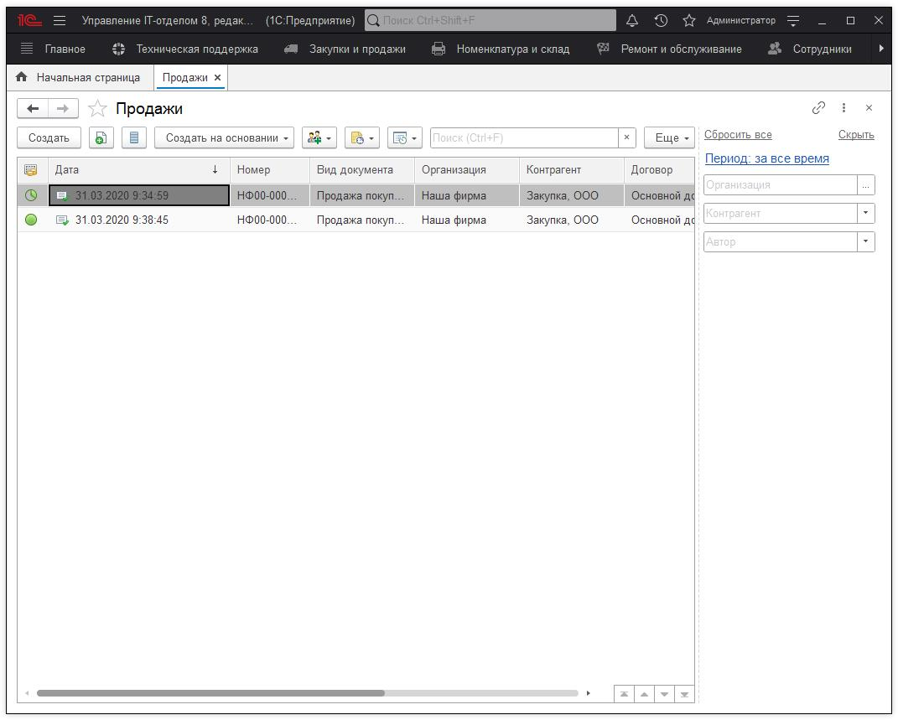
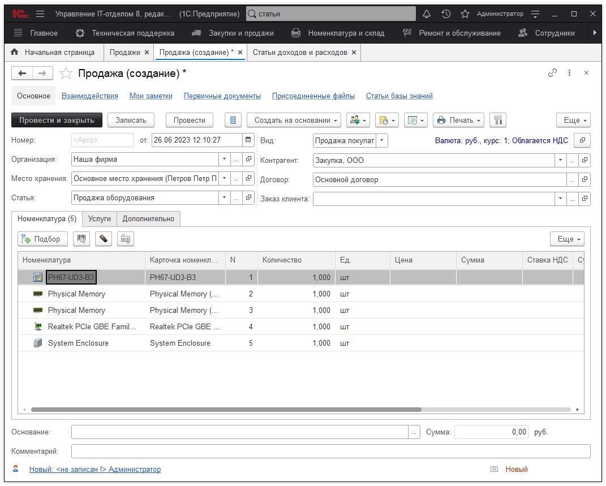
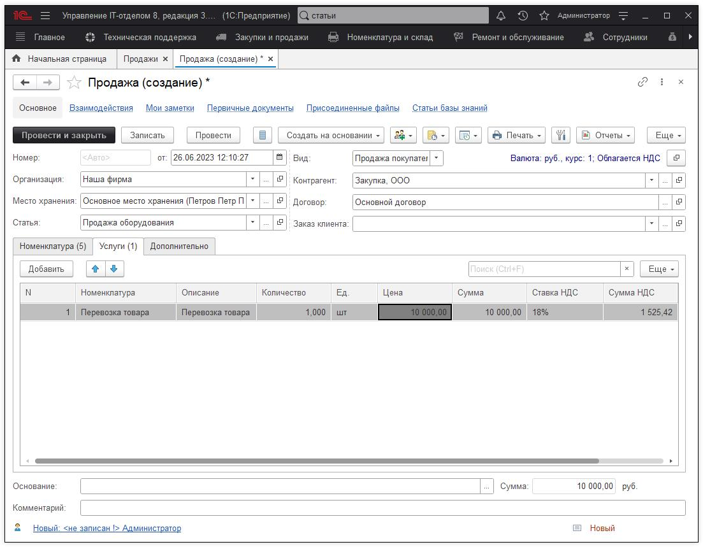

# Документ "Продажа"

Документ позволяет произвести продажу оборудования.

Список документов продажи.

Форма создания документа **"Продажа"**.

Реквизиты "Организация" и "Место хранения" будут заполняться автоматически, если они указаны в настройках пользователя. После заполнения этих реквизитов, при нажатии кнопки **"Подбор"** мы увидим окно, где показано все оборудование, закрепленное за указанным местом хранения. В нем галочками выбираются элементы, которые мы хотим продать. Если Вы хотите продать оборудование, являющееся частью комплекта, но не комплект полностью, то перед этим необходимо провести **разбиение комплекта.**

Также документ позволяет отражать получение дохода не только от продажи номенклатуры, но и услуги с точки зрения продажной/закупочной позиции, например перевозка товара.

