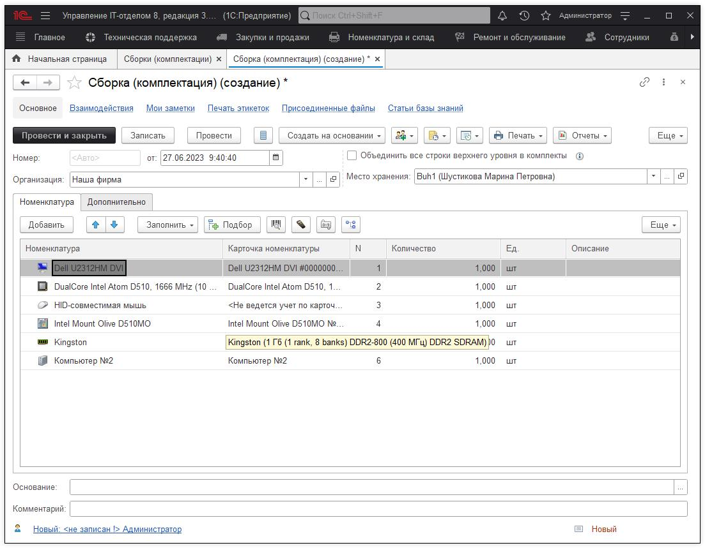
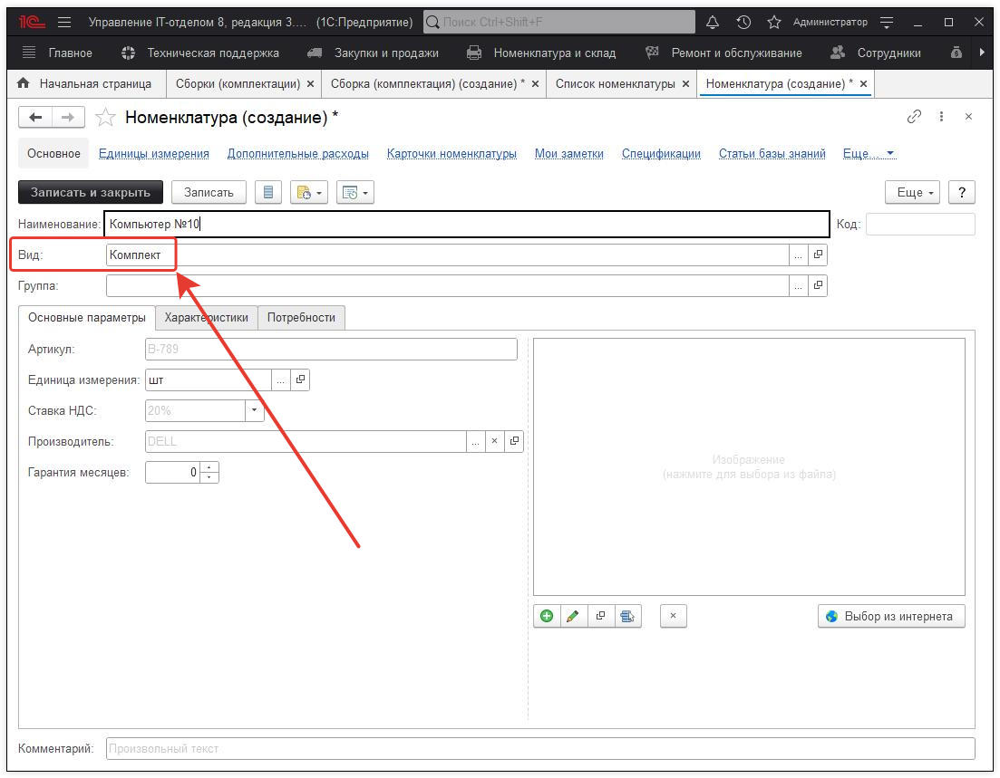
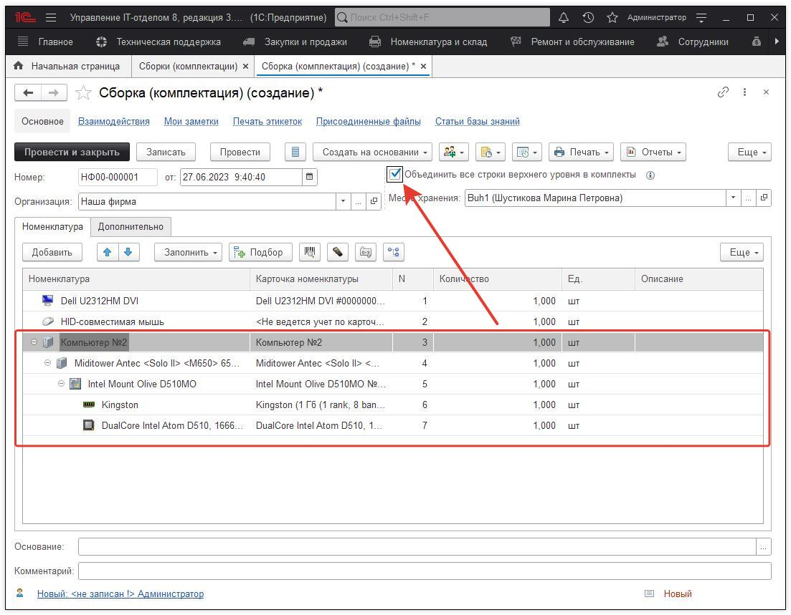
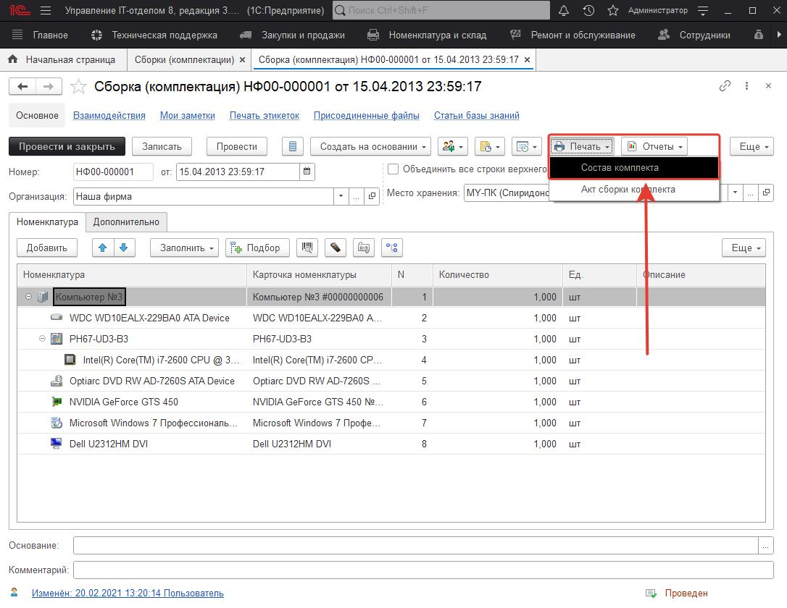
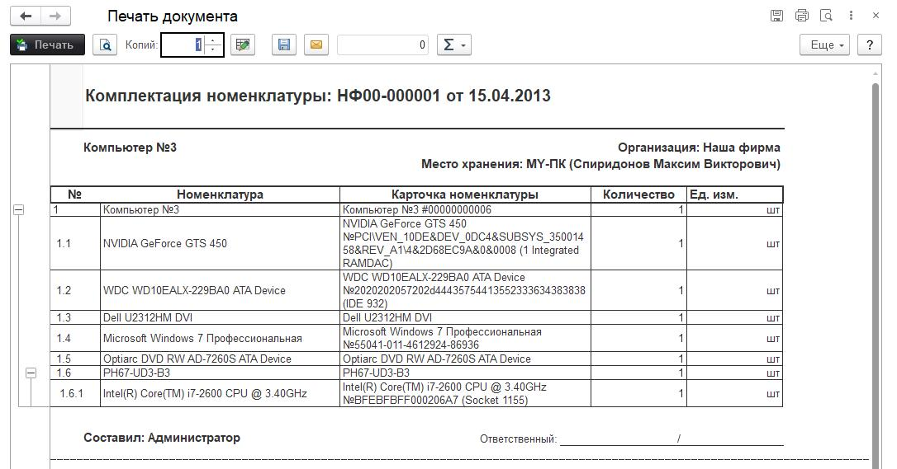
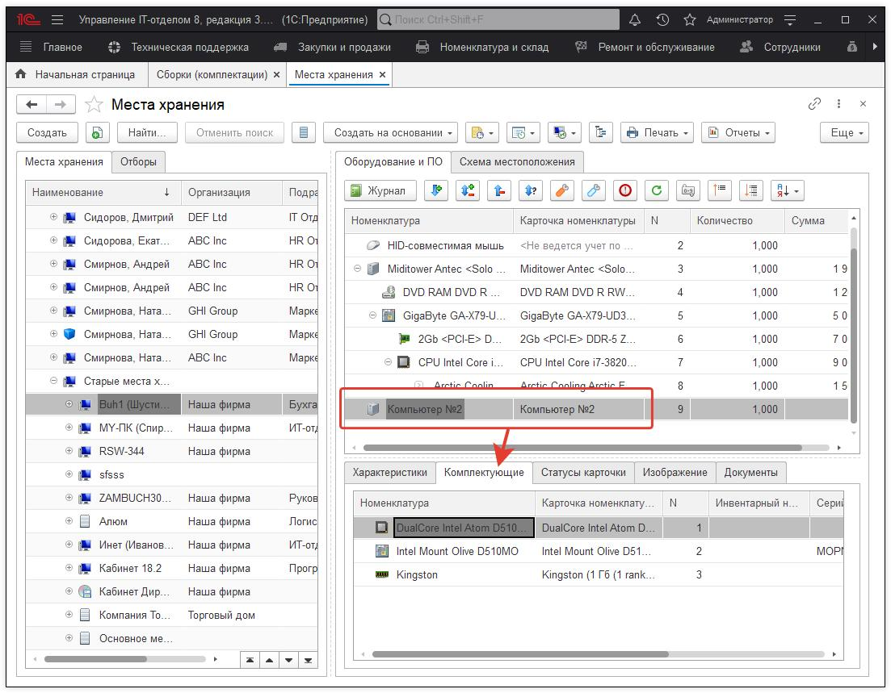
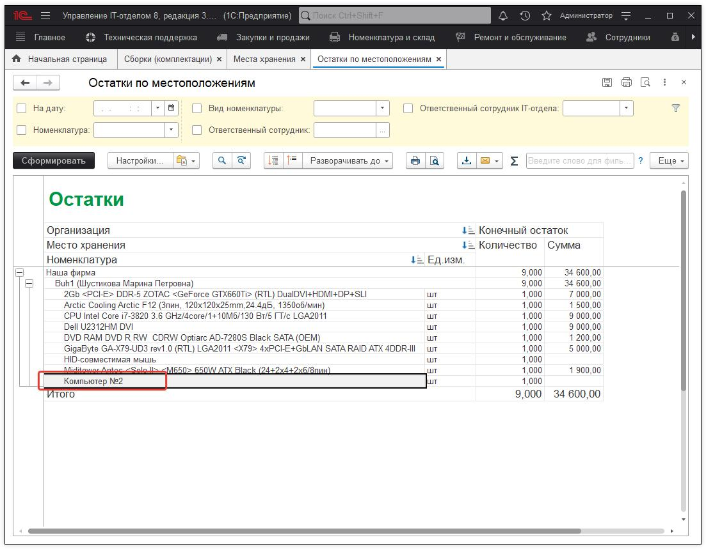
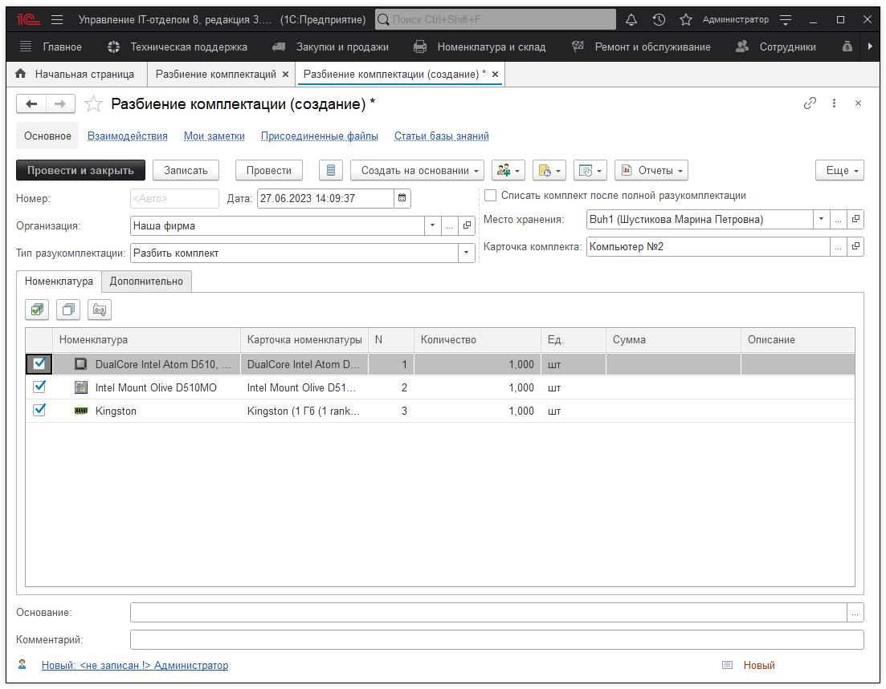
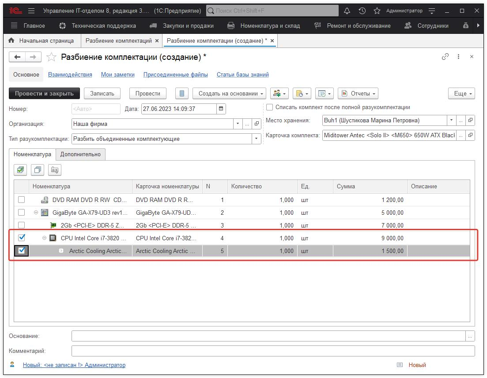

# Документы "Сборка(комплектация) и Разбиение комплектации"

В конфигурации предусмотрена возможность ведения складского учета по комплектам и комплектующим. Подробнее о данной возможности можно ознакомиться в статье: "Концепция комплектов и комплектующих". 
Для создания комплекта необходимо использовать документ "Сборка(комплектация)" с помощью, которого осуществляется объединение комплектующих ПК в единый комплект. Соответственно, чтобы разобрать комплект необходимо использовать одноименный документ "Разбиение комплектации". 

## 1. Сборка (Комплектация).
Наглядно рассмотрим возможности и предназначение данного документа. Для этого перейдем в раздел "Номенклатура и склад" - подраздел "Складской учет" - "Сборки (комплектации)" и создадим новый документ.

*Предназначение реквизитов документа:*
* **Организация** - указывается организация, по которой ведется складской учет;  
* **Место хранение** - указывается место хранение, где на остатках числится номенклатура, которая будет использована для создания сборки;  
* **Объединить все строки верхнего уровня в комплекты** - при активации данного чек-бокса номенклатура верхнего уровня объединяется в один единый комплект без иерархического дерева комплектующих.   

Заполним все необходимые реквизиты и с помощью кнопки "Подбор" добавим в табличную часть номенклатуру, которую будем объединять в комплект.

!!!
При этом стоит отметить, что номенклатуру можно добавлять и с помощью кнопки "Добавить". Отличия между этими способами добавления номенклатуры, заключается в том, что "Подбор" массово подбирает номенклатуру сразу с указанного места хранения, а "Добавить" единично добавляет позиции из справочника "Список номенклатуры".
!!!

В результате заполнения получаем следующего вида документ:

Теперь, чтобы создать комплект нужно добавить номенклатуру, которая будет выступать в качестве строки верхнего уровня и объединять в себе комплектующие. Создадим новую номенклатуру с видом номенклатуры "Комплект", при этом дадим ей нейтральное название, например, "Компьютер №10". После создания этой номенклатуры ее обязательно необходимо оприходовать документом [Поступление](https://softonit.ru/FAQ/courses/?COURSE_ID=1&LESSON_ID=54), иначе получится ситуация, которая описана в статье: ["После сборки комплекта, комплектация не отображается на месте хранения"](https://softonit.ru/FAQ/courses/?COURSE_ID=1&LESSON_ID=471).

После того, как создали номенклатуру вида "Комплект", в табличной части документа **"Сбора(комплектация)"** с помощью простого перетаскивания (***drag-and-drop***), помещаем в "Компьютер №10" комплектующие. В результате получается в табличной части видим комплект хранящий в себе иерархию комплектующих. Последним шагом в создании комплектации является активирование чек-бокса "Объединить все строки верхнего уровня в комплекты" и провести документ.

Печатная форма для документа **"Сборка (комплектация)"** позволяет распечатать весь список номенклатуры комплекта с указанием вложенных комплектующих. Чтобы открыть печатную форму, необходимо нажать на кнопку "Состав комплекта".

В открывшейся форме Вы увидите сформированный раннее комплект. Если комплектов несколько, то они будут печататься на разных листах.

В результате проделанных манипуляций получается, что на месте хранения отображается только номенклатура верхнего уровня, то есть "Компьютер №10". Остальные составляющие комплекта отражены на закладке "Комплектующие". Если при создании документа "Сбора(комплектация)" не активировать чек-бокс "Объединить все строки верхнего уровня в комплекты", тогда номенклатура будет отражена в виде, в котором была представлена в табличной части документа "Сборка", то есть иерархическим деревом без закладки "Комплектующие". 

В сформированном отчете по остаткам данная номенклатура, также будет отражена как комплект без комплектующих нижнего уровня. Если у Вас возникает вопрос о целесообразности скрытия комплектующих, тогда рекомендую ознакомиться со статьей на эту тему: "[Скрывать комплектующие у комплектов или нет?](https://softonit.ru/FAQ/courses/?COURSE_ID=1&LESSON_ID=658)".

## 2. Разбиение комплектации.

После создания сборки и будущего использования данного комплекта в документах "Начало и Окончание обслуживание", обязательным шагом является разбиение комплектации с помощью одноименного документа. Это необходимо, чтобы отразить изменение состава комплектующих текущей сборки. Поэтому перейдем в раздел "Номенклатура и склад" и создадим документ "Разбиение комплектации". 

***Предназначение реквизитов документа:***

**Организация** - указывается организация, по которой ведется складской учет;  
**Тип разукомплектации** - указывается конкретный тип, по которому будет осуществляться разбиение. Тип "Разбить комплект" подходит в том случае, если сборка была осуществлена с объединением строк верхнего уровня в комплект. Тип "Разбить объединенные комплектующие" если сборка была собрана с иерархическим деревом комплектующих;  
**Место хранение** - указывается место хранение, откуда будет браться комплект для осуществления разбиения;  
**Карточка комплекта** - указывается карточка номенклатуры, которая относится к данному комплекту;  
**Списать комплект после полной разукомплектации** - чек-бокс, который позволяется сразу же списать номенклатуру, которая была в качестве верхнего уровня сборки (например, компьютер №10).  

При указании правильного типа разукомплектации и нужной карточки комплекта, в табличную часть документа автоматически добавляются все составляющие комплекта.

Документ "Разбиение комплектации" позволяет разбивать комплект частями. То есть, можно отметить только те комплектующие, которые необходимо вытащить из состава сборки(комплектации). Это полезно, когда необходимо к примеру, заменить одну-две детали комплекта на новые и чтобы не разбивать весь комплект можно вытащить только нужные составляющие.

После записи и проведения документа "Разбиение комплектации", данный комплект можно использоваться в документах [Начало обслуживания](https://softonit.ru/FAQ/courses/?COURSE_ID=1&LESSON_ID=75) и [Окончание обслуживания](https://softonit.ru/FAQ/courses/?COURSE_ID=1&LESSON_ID=76), чтобы отражать факт ремонта или замену комплектующих. После замены неисправных деталей на новые и приведение комплекта в начальное состояние (собранный комплект), необходимо заново собрать комплектацию соответствующим документом.

