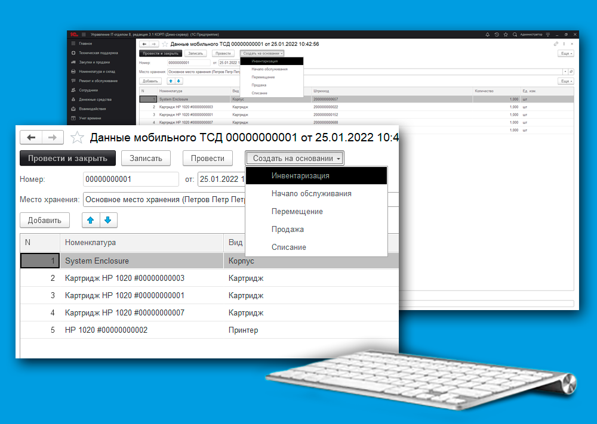

# Инвентаризация и другие складские документы на основании Мобильного ТСД

## Функционал «Мобильный терминал сбора данных»

В разделе **[Администрирование] – [Настройка параметров учета] – [Функциональность]** включаем функционал «Использовать мобильный ТСД».

> При использовании мобильного ТСД, в разделе [Номенклатура и склад] появится подраздел [Мобильный ТСД] в котором открывается доступ к документу «Данные мобильного ТСД».

Документ «Данные мобильного ТСД» формируется с помощью [мобильного приложения](https://softonit.ru/FAQ/courses/?COURSE_ID=7&CHAPTER_ID=0844).

### Роли для работы с документом «Данные мобильного ТСД»:
 
* [x] **«Полные права»** – просмотр и редактирование, создание других документов на основании данного;  
* [x] **«Базовые права мобильное приложение»**  - просмотр и создание других документов на основании данного;  
* [x] **«Добавление и изменение складских документов»** - просмотр и создание других документов на основании данного.     

На основании документа «Данные мобильного ТСД» можно создать следующие документы:
• Инвентаризация;  
• Перемещение;   
• Начало обслуживания;  
• Продажа;  
• Списание.  

Видео: ["Мобильный ТСД"](https://www.youtube.com/watch?v=forJhaiwxbs)
