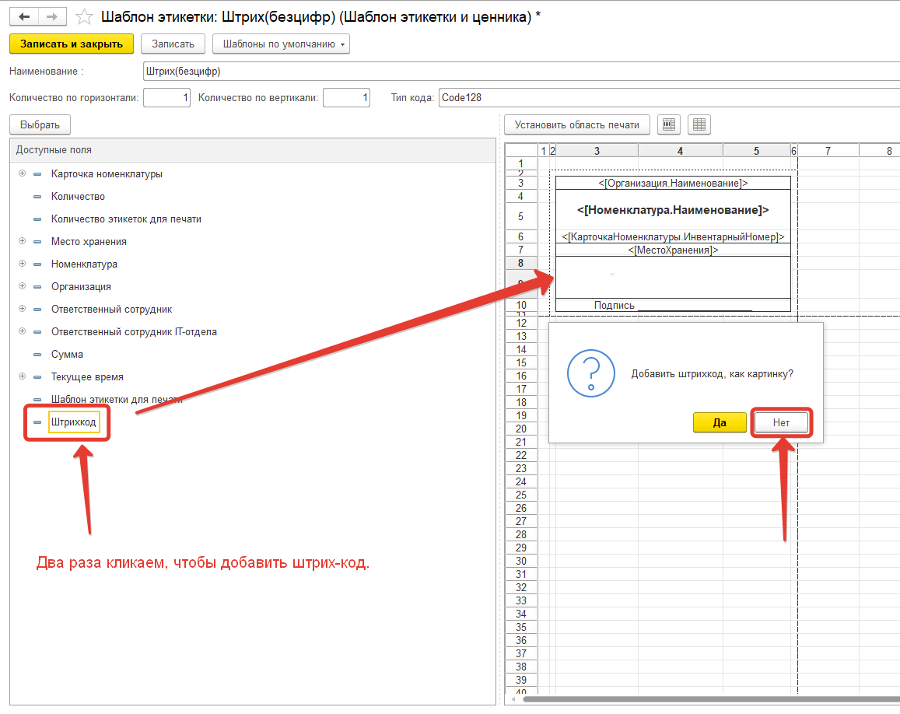
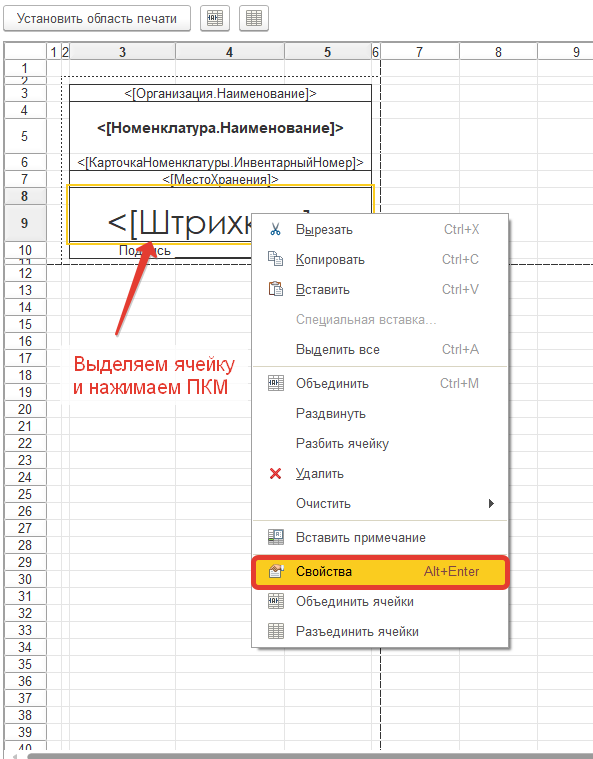
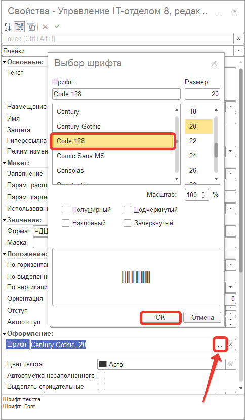
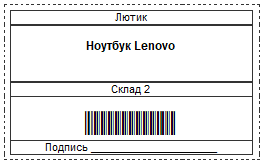

# Изменение шаблона этикетки, чтобы не отображались символы штрих-кода

Зачастую в организации имеется стандарт этикетки, например, Code 128, который не должен отображает символьную кодировку штрих-кода. Разберем поэтапно, как создать подобного рода этикетку.

Для работы с печатью этикеток, используется стандартная подсистема поставляемая от фирмы "1С", которая называется "Библиотека подключаемого оборудования".

Эта библиотека содержит внешнюю компоненту и работает по принципу "подмены картинки вместо штрих-кода".

Когда вы редактируете шаблон Вы видите картинку (которая выглядит как штрих-код, но на самом деле это картинка).

Когда она выводится в табличный документ для печати она трансформируется (подменяется) в штрих-код внешней компонентой. Рассмотрим детально, чтобы больше в этой части не возникло вопросов.

Внешняя компонента имеет ряд ограничений, которые накладываются на работу. Список видов штрих-кодов, который выводится при создании шаблона этикетки, берется из внешней компоненты и поправить его, к сожалению, не получится.

Есть другой способ вывода штрих-кода, основанный на использовании нужного шрифта, который устанавливается самостоятельно.

Как вариант можем предложить поискать в интернете самостоятельно нужный шрифт, установить его на клиентской машине и изменить в шаблоне. Но этот способ будет не универсальным и он будет работать только на той машине, где будет установлен этот шрифт.

Скачать шрифт можно в интернете, например вот отсюда: https://ru.fonts2u.com/category.html?id=70

Мы не используем этот способ повсеместно, т.к. он не универсальный и не будет работать без предварительных манипуляций, требующий прав администратора (для установки шрифтов) и т.д.

## Шаг 1.

Скачиваем необходимый шрифт и устанавливаем его в шрифты Windows.

## Шаг 2.

Переходим в "Шаблоны этикеток" и создаем новый шаблон. Выбираем ячейку, где будет находится штрих-код этикетки и два раза кликаем на доступное поле "Штрих-код". После чего программа выдаст сообщение "Добавить штрих-код, как картинку?", выбираем "Нет" (рис 1).

## Шаг 3.
Выделяем ячейку, где находится штрих-код и нажимаем правую кнопку мыши, после чего переходим в свойства ячейки (рис 2).

## Шаг 4.
В свойствах ячейки, в поле "Шрифт" необходимо указать установленный ранее шрифт штрих-кода (рис 3).

В результате получаем этикетку с необходимым форматом штрих-кода (без указания цифр) (рис 4).

!!!
ВАЖНО! Данный способ не является универсальным, так как требует установки ряда дополнительных шрифтов в операционную систему Windows. 
!!!

[Ссылка на видео](https://youtu.be/HZcXqeumJes)