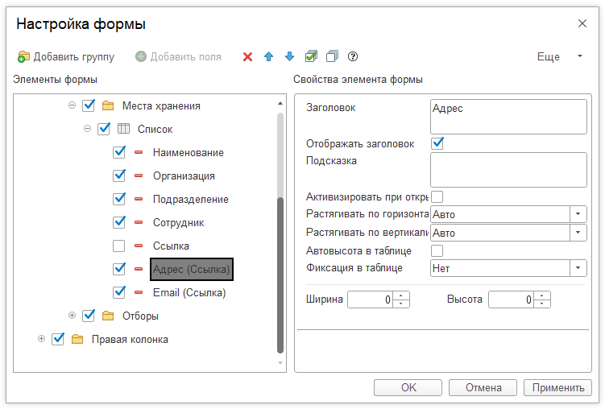

# Как добавить в формах списка контактную информацию?

Для добавления контактной информации в форме списка необходимо сделать следующее:  

Откройте форму списка, например для мест хранения, далее **Еще > Изменить форму** и станьте на элемент Ссылка и нажмите **"Добавить поля"**:

Далее добавим нужные нам поля из контактных данных:

Получаем результат:

Теперь список отображается вместе с контактной информацией.
