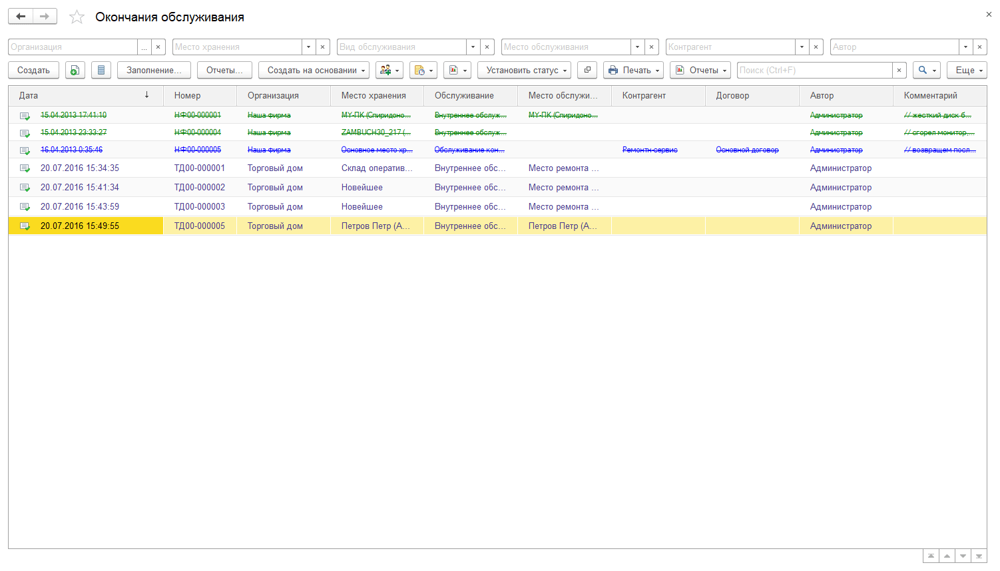
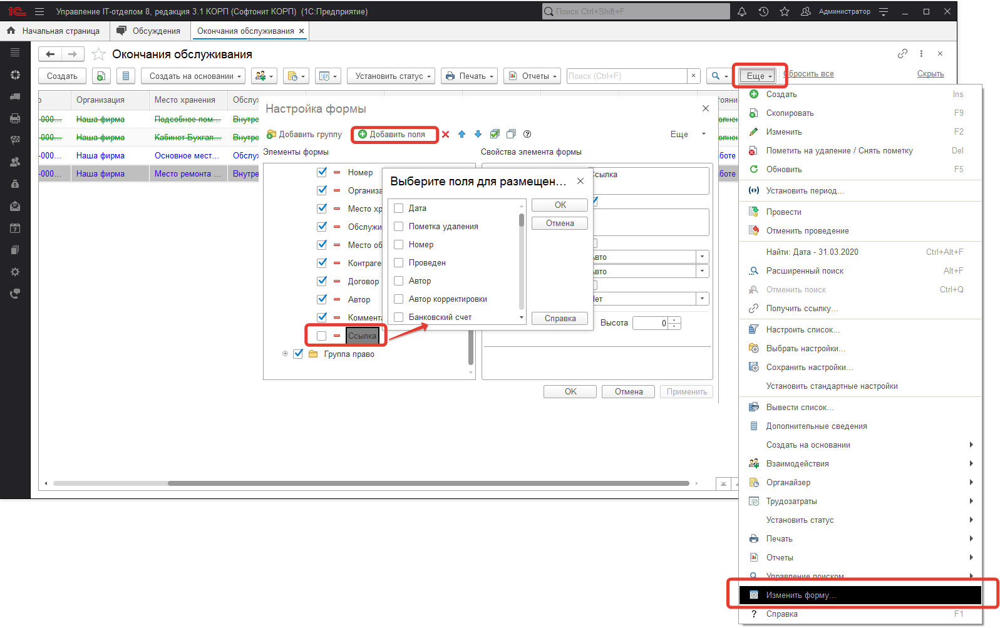
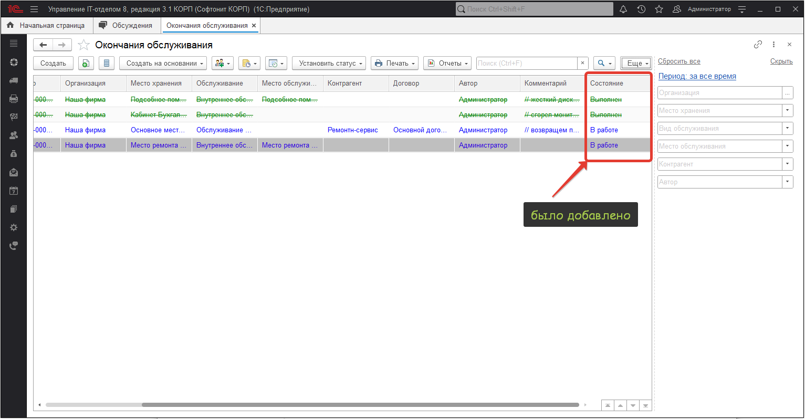

# Как добавить в форму списка документов свой столбец из документа?

Очень часто возникает необходимость добавить реквизиты, которые нет в списке, но они есть в документах. Например, для документа **"Окончание обслуживания"** хочется вывести текущий статус:

Видим, что поля в динамическом списке не хватает.

Добавим нужное поле. Для этого нажмем в форме "Еще" и найдем в списке **"Изменить форму..."** ну и далее как на рисунке ниже:

Выберем нужный реквизит из списка (5) и после его добавления нажмем ОК и применим все настройки. Получим следующий список:

